<div align="center">
  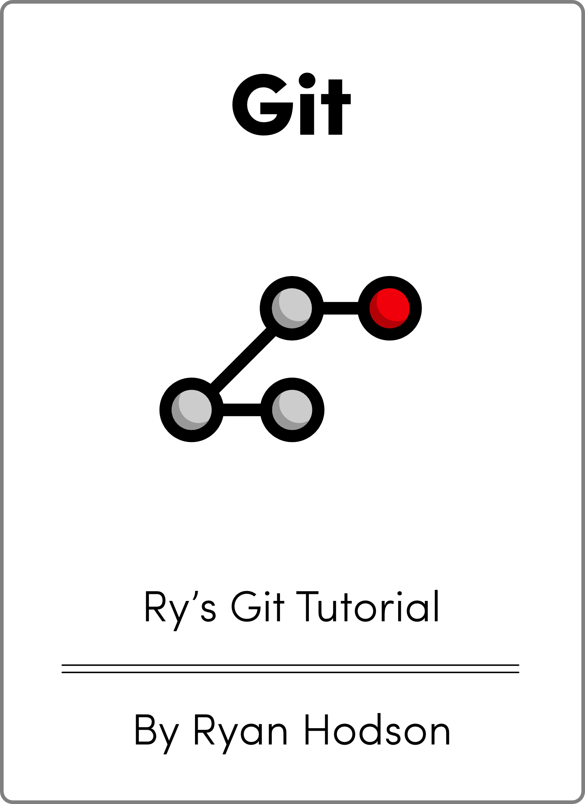
  <br>
</div>
<br>

### Оглавление

1. [Введение](#1%20введение)
    1. [Краткая история контроля версий](#1%20краткая%20история%20контроля%20версий)
    2. [Рождение Git](#2%20рождение%20git)
    3. [Установка](#3%20установка)
    4. [Приготовьтесь!](#4%20приготовьтесь!)

2. [Основы](#2%20основы)
    1. [Создание сайта для примера](#1%20создание%20сайта%20для%20примера)
    2. [Инициализация репозитория Git](#2%20инициализация%20репозитория%20git)
    3. [Просмотр статуса репозитория](#3%20просмотр%20статуса%20репозитория)
    4. [Создание снимка (Stage a Snapshot)](#4%20создание%20снимка%20(stage%20a%20snapshot))
    5. [Фиксация снимка](#5%20фиксация%20снимка)
    6. [Просмотр истории репозитория](#6%20просмотр%20истории%20репозитория)
    7. [Настройка Git](#7%20настройка%20git)
    8. [Создание новых HTML-файлов](#8%20создание%20новых%20html-файлов)
    9. [Добавление новых файлов в индекс](#9%20добавление%20новых%20файлов%20в%20индекс)
    10. [Фиксация новых файлов](#10%20фиксация%20новых%20файлов)
    11. [Изменение HTML-страницы](#11%20изменение%20html-страницы)
    12. [Добавление и фиксация снимка](#12%20добавление%20и%20фиксация%20снимка)
    13. [Изучение истории  репозитория](#13%20изучение%20истории%20репозитория)
    14. [Заключение](#14%20заключение)
    15. [Краткий справочник](#15%20краткий%20справочник%20(Основы))

3. [Отмена изменений](#3%20отмена%20изменений)
	1. [Отображение контрольных сумм коммитов](#1%20отображение%20контрольных%20сумм%20коммитов)
	2. [Просмотр более старой редакции](#2%20просмотр%20более%20старой%20редакции)
	3. [Возврат к текущей версии](#3%20возврат%20к%20текущей%20версии)
	4. [Создание тега для релиза](#4%20создание%20тега%20для%20релиза)
	5. [Проведение эксперимента](#5%20проведение%20эксперимента)
	6. [Добавление и фиксация снимка](#6%20добавление%20и%20фиксация%20снимка)
	7. [Просмотр стабильного коммита](#7%20просмотр%20стабильного%20коммита)
	8. [Отмена зафиксированных изменений](#8%20отмена%20зафиксированных%20изменений)
	9. [Начало небольшого эксперимента](#9%20начало%20небольшого%20эксперимента)
	10. [Отмена незафиксированных изменений](#10%20отмена%20незафиксированных%20изменений)
	11. [Вывод](#11%20вывод)
	12. [Краткий справочник](#12%20краткий%20справочник%20(Отмена%20изменений))

4. [Ветки I](#4%20ветки%20i)
    1. [Просмотр существующих веток](#1%20просмотр%20существующих%20веток)
    2. [Переключение на сумасшедший эксперимент](#2%20переключение%20на%20сумасшедший%20эксперимент)
    3. [Создание новой ветки](#3%20создание%20новой%20ветки)
    4. [Создание радуги](#4%20создание%20радуги)
    5. [Фиксация и сохранение радуги](#5%20фиксация%20и%20сохранение%20радуги)
    6. [Переименование радуги](#6%20переименование%20радуги)
    7. [Возвращение к основной ветке](#7%20возвращение%20к%20основной%20ветке)
    8. [Создание ветки CSS](#8%20создание%20ветки%20css)
    9. [Добавление таблицы стилей CSS](#9%20добавление%20таблицы%20стилей%20css)
    10. [Привязка таблицы стилей](#10%20привязка%20таблицы%20стилей)
    11. [Возвращение к основной ветке (снова)](#11%20возвращение%20к%20основной%20ветке%20(снова))
    12. [Слияние ветки CSS](#12%20слияние%20ветки%20css)
    13. [Удаление ветки CSS](#13%20удаление%20ветки%20css)
    14. [Вывод](#14%20вывод)
    15. [Краткий справочник](#15%20краткий%20справочник%20(Ветки%20I))

5. [Ветки II](#5%20ветки%20ii)
    1. [Продолжение сумасшедшего эксперимента](#1%20продолжение%20сумасшедшего%20эксперимента)
    2. [Слияние обновлений CSS](#2%20слияние%20обновлений%20css)
    3. [Стилизация страницы радуги](#3%20стилизация%20страницы%20радуги)
    4. [Ссылка на страницу радуги](#4%20ссылка%20на%20страницу%20радуги)
    5. [Форк альтернативной радуги](#5%20форк%20альтернативной%20радуги)
    6. [Изменение радуги](#6%20изменение%20радуги)
    7. [Срочное обновление!](#7%20срочное%20обновление!)
    8. [Публикация горячих новостей](#8%20публикация%20горячих%20новостей)
    9. [Завершение сумасшедшего эксперимента](#9%20завершение%20сумасшедшего%20эксперимента)
    10. [Публикация сумасшедшего эксперимента](#10%20публикация%20сумасшедшего%20эксперимента)
    11. [Решение конфликтов слияния](#11%20решение%20конфликтов%20слияния)
    12. [Очистка тематических веток](#12%20очистка%20тематических%20веток)
    13. [Заключение](#13%20заключение)
    14. [Краткий справочник](#14%20краткий%20справочник%20(Ветки%20II))

6. [Перебазирование](#6%20перебазирование)
    1. [Создание раздела "О нас"](#1%20создание%20раздела%20"о%20нас")
    2. [Добавление страницы "О нас"](#2%20добавление%20страницы%20"о%20нас")
    3. [Очередное экстренное обновление!](#3%20очередное%20экстренное%20обновление!)
    4. [Публикация исправления новостей](#4%20публикация%20исправления%20новостей)
    5. [Перебазирование ветки "О нас"](#5%20перебазирование%20ветки%20"о%20нас")
    6. [Добавление личной биографии](#6%20добавление%20личной%20биографии)
    7. [Добавление фиктивной страницы для Мэри](#7%20добавление%20фиктивной%20страницы%20для%20мэри)
    8. [Ссылка на раздел "О нас"](#8%20ссылка%20на%20раздел%20"о%20нас")
    9. [Очистка истории коммитов](#9%20очистка%20истории%20коммитов)
    10. [Остановка для изменения коммита](#10%20остановка%20для%20изменения%20коммита)
    11. [Продолжение интерактивного перебазирования](#11%20продолжение%20интерактивного%20перебазирования)
    12. [Публикация раздела "О нас"](#12%20публикация%20раздела%20"о%20нас")
    13. [Заключение](#13%20заключение)
    14. [Краткий справочник](#14%20краткий%20справочник%20(Перебазирование))

7. [Переписывание истории](#7%20переписывание%20истории)
    1. [Создание красной страницы](#1%20создание%20красной%20страницы)
    2. [Создание желтой страницы](#2%20создание%20желтой%20страницы)
    3. [Ссылка и коммит новых страниц](#3%20ссылка%20и%20коммит%20новых%20страниц)
    4. [Создание и коммит зеленой страницы](#4%20создание%20и%20коммит%20зеленой%20страницы)
    5. [Начало интерактивного перебазирования](#5%20начало%20интерактивного%20перебазирования)
    6. [Отмена общего коммита](#6%20отмена%20общего%20коммита)
    7. [Разделение общего коммита](#7%20разделение%20общего%20коммита)
    8. [Удаление последнего коммита](#8%20удаление%20последнего%20коммита)
    9. [Открываем Reflog (Журнал Ссылок)](#9%20открываем%20reflog%20(Журнал%20Ссылок))
    10. [Восстановление потерянного коммита](#10%20восстановление%20потерянного%20коммита)
    11. [Фильтрация истории коммитов](#11%20фильтрация%20истории%20коммитов)
    12. [Слияние с восстановленной веткой](#12%20слияние%20с%20восстановленной%20веткой)
    13. [Заключение](#13%20заключение)
    14. [Краткий справочник](#14%20краткий%20справочник%20(Переписывание%20истории))

8. [Удаленные репозитории](#8%20удаленные%20репозитории)
    1. [Клонирование  репозитория (Мэри)](#1%20клонирование%20репозитория%20(мэри))
    2. [Настройка репозитория (Мэри)](#2%20настройка%20репозитория%20(мэри))
    3. [Начало рабочего дня Мэри (Мэри))](#3%20начало%20рабочего%20дня%20мэри%20(мэри))
    4. [Создать биографическую страницу (Мэри)](#4%20создать%20биографическую%20страницу%20(мэри))
    5. [Опубликовать биографическую страницу (Мэри)](#5%20опубликовать%20биографическую%20страницу%20(мэри))
    6. [Просмотреть удаленные репозитории (Мэри)](#6%20просмотреть%20удаленные%20репозитории%20(мэри))
    7. [Вернуться к своему репозиторию (Вы)](#7%20вернуться%20к%20своему%20репозиторию%20(вы))
    8. [Добавить Мэри как удаленный репозиторий (Вы)](#8%20добавить%20мэри%20как%20удаленный%20репозиторий%20(вы))
    9. [Получить ветки Мэри (Вы)](#9%20получить%20ветки%20мэри%20(вы))
    10. [Проверка удаленной ветки](#10%20проверка%20удаленной%20ветки)
    11. [Найти изменения Мэри](#11%20найти%20изменения%20мэри)
    12. [Применить изменения Мэри](#12%20применить%20изменения%20мэри)
    13. [Отправить фиктивную ветку](#13%20отправить%20фиктивную%20ветку)
    14. [Отправить новый тег](#14%20отправить%20новый%20тег)
    15. [Заключение](#15%20заключение)
    16. [Краткий справочник](#16%20краткий%20справочник%20(Удаленные%20репозитории))

9. [Централизованные рабочие процессы](#9%20централизованные%20рабочие%20процессы)
    1. [Создать пустой репозиторий (Центральный)](#1%20создать%20пустой%20репозиторий%20(центральный))
    2. [Обновить удаленные репозитории (Мэри и Вы)](#2%20обновить%20удаленные%20репозитории%20(мэри%20и%20вы))
    3. [Отправить основную ветку (Вы)](#3%20отправить%20основную%20ветку%20(вы))
    4. [Добавить новости (Вы)](#4%20добавить%20новости%20(вы))
    5. [Опубликовать новость (Вы)](#5%20опубликовать%20новость%20(вы))
    6. [Обновить CSS-стили (Мэри)](#6%20обновить%20css-стили%20(мэри))
    7. [Обновить другой CSS-стиль (Мэри)](#7%20обновить%20другой%20css-стиль%20(мэри))
    8. [Привести код в порядок перед публикацией (Мэри)](#8%20привести%20код%20в%20порядок%20перед%20публикацией%20(мэри))
    9. [Опубликовать изменения CSS (Мэри)](#9%20опубликовать%20изменения%20css%20(мэри))
    10. [Внести изменения (Мэри)](#10%20внести%20изменения%20(мэри))
    11. [Внести изменения (Вы)](#11%20внести%20изменения%20(вы))
    12. [Заключение](#12%20заключение)
    13. [Краткий справочник](#13%20краткий%20справочник%20(централизованные%20рабочие%20процессы))

10. [Распределенные рабочие процессы](#10%20распределенные%20рабочие%20процессы)
    1. [Создать учётную запись Bitbucket](#1%20создать%20учётную%20запись%20bitbucket)
    2. [Создать публичный репозиторий (Вы)](#2%20создать%20публичный%20репозиторий%20(вы))
    3. [Загрузить в публичный репозиторий (Вы)](#3%20загрузить%20в%20публичный%20репозиторий%20(вы))
    4. [Просмотреть публичный репозиторий (Вы)](#4%20просмотреть%20публичный%20репозиторий%20(вы))
    5. [Клонировать репозиторий (John)](#5%20клонировать%20репозиторий%20(john))
    6. [Добавить розовую страницу (John)](#6%20добавить%20розовую%20страницу%20(john))
    7. [Опубликовать розовую страницу (John)](#7%20опубликовать%20розовую%20страницу%20(john))
    8. [Посмотреть вклад John (Вы)](#8%20посмотреть%20вклад%20john%20(вы))
    9. [Интегрировать вклад John (Вы)](#9%20интегрировать%20вклад%20john%20(вы))
    10. [Опубликовать вклад John (Вы)](#10%20опубликовать%20вклад%20john%20(вы))
    11. [Обновить репозиторий Mary (Mary)](#11%20обновить%20репозиторий%20mary%20(mary))
    12. [Обновить репозиторий John (John)](#12%20обновить%20репозиторий%20john%20(john))
    13. [Заключение](#13%20заключение)

11. [Процессы создания патчей](#11%20процессы%20создания%20патчей)
    1. [Изменить розовую страницу (Mary)](#1%20изменить%20розовую%20страницу%20(mary))
    2. [Создать патч (Mary)](#2%20создать%20патч%20(mary))
    3. [Добавить розовый блок (Mary)](#3%20добавить%20розовый%20блок%20(mary))
    4. [Создать патч для всей ветки (Mary)](#4%20создать%20патч%20для%20всей%20ветки%20(mary))
    5. [Отправить патчи по почте (Mary)](#5%20отправить%20патчи%20по%20почте%20(mary))
    6. [Применить патчи (Вы)](#6%20применить%20патчи%20(вы))
    7. [Интегрировать патчи (Вы)](#7%20интегрировать%20патчи%20(вы))
    8. [Обновить репозиторий Mary (Mary)](#8%20обновить%20репозиторий%20mary%20(mary))
    9. [Заключение](#9%20заключение)
    10. [Краткий справочник](#10%20краткий%20справочник%20(Процессы%20создания%20патчей))

12. [Советы и хитрости](#12%20советы%20и%20хитрости)
    1. [Архивировать репозиторий](#1%20архивировать%20репозиторий)
    2. [Создать пакет репозитория](#2%20создать%20пакет%20репозитория)
    3. [Игнорировать файл](#3%20игнорировать%20файл)
    4. [Сохранить незакоммиченные изменения](#4%20сохранить%20незакоммиченные%20изменения)
    5. [Вникнуть во внутренние механизмы Git](#5%20вникнуть%20во%20внутренние%20механизмы%20git)
    6. [Просмотреть различия между коммитами](#6%20просмотреть%20различия%20между%20коммитами)
    7. [Сброс и проверка файлов](#7%20сброс%20и%20проверка%20файлов)
    8. [Псевдонимы и другие настройки](#8%20псевдонимы%20и%20другие%20настройки)
    9. [Заключение](#9%20заключение)
    10. [Краткий справочник](#10%20краткий%20справочник%20(Советы%20и%20хитрости))

13. [Низкоуровневые механизмы](#13%20низкоуровневые%20механизмы)
    1. [Изучение подробностей коммита](#1%20изучение%20подробностей%20коммита)
    2. [Изучение дерева](#2%20изучение%20дерева)
    3. [Изучение BLOB-объекта](#3%20изучение%20blob-объекта)
    4. [Изучаем тег](#4%20изучаем%20тег)
    5. [Изучение внутреннего представления веток в Git](#5%20изучение%20внутреннего%20представления%20веток%20в%20git)
    6. [Изучение базы данных объектов](#6%20изучение%20базы%20данных%20объектов)
    7. [Сбор мусора](#7%20сбор%20мусора)
    8. [Добавление файлов в индекс](#8%20добавление%20файлов%20в%20индекс)
    9. [Сохранение индекса в базе данных](#9%20сохранение%20индекса%20в%20базе%20данных)
    10. [Создание объекта коммита](#10%20создание%20объекта%20коммита)
    11. [Обновление HEAD](#11%20обновление%20head)
    12. [Заключение](#12%20заключение)
    13. [Краткий справочник](#13%20краткий%20справочник%20(Низкоуровневые%20механизмы))  
    <br>
<div style="page-break-after: always;"></div>

# 1 Введение 

Git — это система контроля версий (VCS), созданная для решения единственной задачи: управления изменениями в ваших файлах. Она позволяет отслеживать каждое изменение, происходящее с проектом, а также откуда оно поступило. Это делает Git незаменимым инструментом для управления крупными проектами, а также открывает широкий спектр возможностей для вашей персональной работы.  
<br>

### 1 Краткая История Контроля Версий

Мы подробнее поговорим об основной философии Git чуть позже, но сначала давайте рассмотрим эволюцию систем контроля версий в целом.  
<br>

### Файлы и Папки

До появления программного обеспечения для контроля версий существовали только файлы и папки. Единственным способом отслеживать версии проекта было копировать весь проект и присваивать ему новое имя. Достаточно вспомнить, сколько раз вы сохраняли «резервную копию» под именем my-term-paper-2.doc. Это простейшая форма контроля версий.

  <div align="center">
  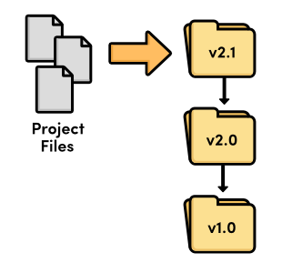
  <br>
  <em>Контроль версий файлов и папок</em>
</div>

Но легко видеть, что копирование файлов из папки в папку может оказаться катастрофическим для разработчиков программного обеспечения. Что произойдёт, если вы неправильно назовёте папку? Или если вы перезапишете не тот файл? Как бы вы узнали, что потеряли важный фрагмент кода? Не прошло много времени, прежде чем разработчики программного обеспечения поняли, что им нужно что-то более надёжное.  
<br>

### Локальные системы VCS

Итак, разработчики начали писать служебные программы, предназначенные для управления изменениями файлов. Вместо того, чтобы хранить старые версии в виде независимых файлов, эти новые системы контроля версий хранили их в базе данных. Когда вам нужно было просмотреть старую версию, вы использовали систему VCS, вместо того чтобы обращаться к файлу напрямую. Таким образом, у вас была бы только одна «извлечённая» копия проекта в любой момент времени, что исключало возможность путаницы или потери изменений.

  <div align="center">
  
  <br>
  <em>Локальный контроль версий</em>
</div>

На данном этапе контроль версий осуществлялся исключительно на локальном компьютере разработчика — не существовало способа эффективно делиться кодом между несколькими программистами.
<br>

### Централизованные системы контроля версий (CVCS)

Появились централизованные системы контроля версий (ЦСКВ). Вместо того, чтобы хранить историю проекта на жестком диске разработчика, эти новые программы CVCS хранили все данные на сервере. Разработчики проверяли файлы, вносили изменения и сохраняли их обратно в проект через сеть. Такая схема позволяла нескольким программистам совместно работать над проектом, предоставляя единую точку входа.

<div align="center">
  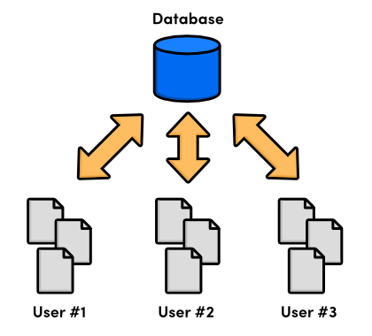
  <br>
  <em>Централизованный контроль версий</em>
</div>

Хотя централизованные системы были значительным улучшением по сравнению с локальными системами VCS, они создали новый набор проблем: как нескольким пользователям работать с одними и теми же файлами одновременно? Представьте себе ситуацию, когда два человека исправляют одну и ту же ошибку и пытаются зафиксировать свои изменения на центральном сервере. Чьи изменения должны быть приняты?

Системы CVCS решили эту проблему, предотвращая перезапись изменений одних пользователей другими. Если два изменения конфликтовали, кому-то приходилось вручную устранять разногласия и объединять различия. Это решение работало для проектов с относительно небольшим количеством обновлений (что означало мало конфликтов), но оказалось неудобным для проектов с десятками активных участников, вносящих несколько обновлений ежедневно. Разработка не могла продолжаться, пока все конфликты слияния не были разрешены и изменения не становились доступными для всей группы разработчиков.
<br>

### Распределенная система контроля версий

Следующее поколение программ контроля версий отошло от идеи единого централизованного репозитория, предпочитая вместо этого давать каждому разработчику свою собственную локальную копию всего проекта. Результирующая распределенная сеть репозиториев позволяла каждому разработчику работать изолированно, во многом как локальная система контроля версий, но теперь проблема разрешения конфликтов централизованной системы контроля версий имела гораздо более элегантное решение.
<div align="center">
  
  <br>
  <em>Распределенный контроль версий</em>
</div>

Поскольку больше не было центрального репозитория, каждый мог вести разработку в своем собственном темпе, хранить обновления локально и откладывать разрешение конфликтов слияния до более удобного момента. Кроме того, системы распределенного контроля версий (DVCS) были ориентированы на эффективное управление различными ветвями разработки, что значительно упрощало обмен кодом, слияние изменений и эксперименты с новыми идеями.

Локальный характер DVCS также значительно ускорял разработку, поскольку больше не было необходимости выполнять действия через сеть. Кроме того, поскольку у каждого пользователя была полная копия проекта, риск сбоя сервера, повреждения репозитория или любой другой потери данных был гораздо ниже, чем у их предшественников на основе CVCS.
<br>

### 2 Рождение Git

Итак, мы пришли к Git, распределенной системе контроля версий, созданной для управления ядром Linux. В 2005 году сообщество Linux потеряло бесплатную лицензию на программное обеспечение BitKeeper, коммерческую DVCS, которую они использовали с 2002 года. В ответ Линус Торвальдс выступил за разработку новой DVCS с открытым исходным кодом в качестве замены. Так родился Git.

В качестве менеджера исходного кода для всего ядра Linux Git имел несколько уникальных ограничений, включая:

-   Надёжность
-   Эффективное управление большими проектами
-   Поддержка распределенной разработки
-   Поддержка нелинейной разработки

Хотя в то время существовали и другие DVCS (например, Arch от GNU или Darcs от David Roundy), ни одна из них не могла удовлетворить эту совокупность характеристик. Руководствуясь этими целями, Git активно разрабатывался в течение нескольких лет и теперь пользуется большой стабильностью, популярностью и участием сообщества.

Git изначально был программой командной строки, но с годами были выпущены различные визуальные интерфейсы. Графические инструменты маскируют некоторую сложность Git и часто упрощают визуализацию состояния репозитория, но они по-прежнему требуют прочной основы в распределенном контроле версий. С учетом этого мы будем придерживаться интерфейса командной строки, который по-прежнему является наиболее распространенным способом взаимодействия с Git.
<br>

### 3 Установка

Предстоящие модули будут изучать возможности Git, применяя команды в сценариях реального мира. Но сначала вам понадобится рабочая установка Git для экспериментов. Загружаемые файлы для всех поддерживаемых платформ доступны на [официальном сайте Gi](https://git-scm.com/)
Для пользователей Windows это установит специальную командную оболочку под названием Git Bash. Вам следует использовать эту оболочку вместо родной командной строки для выполнения команд Git. Пользователи OS X и Linux могут обращаться к Git из обычной командной оболочки. Чтобы проверить установку, откройте новое окно терминала и выполните команду `git --version`. В результате должно быть выведено что-то вроде `git version 1.7.10.2 (Apple Git-33)`.
<br>

### 4 Приготовьтесь!

Помните, что Ry's Git Tutorial предназначен для демонстрации возможностей Git, а не просто для поверхностного обзора наиболее распространенных команд. Чтобы извлечь максимальную пользу из этого руководства, важно фактически выполнять команды, о которых вы читаете. Итак, обязательно сядьте перед компьютером и приступим!
<br>
<div style="page-break-after: always;"></div>

# 2 Основы

Теперь, когда у вас есть базовое понимание систем контроля версий в целом, мы можем начать экспериментировать с Git. Использование Git в качестве VCS очень похоже на работу с обычным программным проектом. Вы по-прежнему пишете код в файлах и храните эти файлы в папках, только теперь у вас есть доступ к множеству команд Git для манипулирования этими файлами.

Например, если вы хотите вернуться к предыдущей версии вашего проекта, все, что вам нужно сделать, это выполнить простую команду Git. Эта команда погрузится во внутреннюю базу данных Git, выяснит, как выглядел ваш проект в желаемом состоянии, и обновит все существующие файлы в папке вашего проекта (также известной как рабочий каталог). С внешней точки зрения, будет казаться, что ваш проект магически вернулся в прошлое.

Этот модуль исследует фундаментальный рабочий процесс Git: создание репозитория, индексирование и фиксация снимков, настройка параметров и просмотр состояния репозитория. Он также представляет веб-сайт на HTML, который служит рабочим примером для всего этого руководства. Очень базовые знания HTML и CSS помогут вам глубже понять назначение различных команд Git, но они не являются строго необходимыми.
<br>

### 1 Создание сайта для примера

Прежде чем мы сможем выполнить какие-либо команды Git, нам нужно создать пример проекта. Создайте новую папку под названием `my-git-repo` для хранения проекта, затем добавьте в нее файл с именем `index.html`. Откройте `index.html` в вашем любимом текстовом редакторе и добавьте следующий HTML-код.

```html
<!DOCTYPE html>
<html lang="en">
    <head>
        <title>A Colorful Website</title>
        <meta charset="utf-8" />
    </head>
    <body>
        <h1 style="color: #07F">A Colorful Website</h1>
        <p>This is a website about color!</p>
        <h2 style="color: #C00">News</h2>
        <ul>
            <li>Nothing going on (yet)</li>
        </ul>
    </body>
</html>
```

Сохраните файл, когда закончите. Он послужит основой для нашего примера проекта. Не стесняйтесь открыть index.html в веб-браузере, чтобы посмотреть, какой сайт из этого получается. Он не особо красив, но для наших целей подходит.
<br>

### 2 Инициализация репозитория Git

Теперь мы готовы создать наш первый репозиторий Git. Откройте командную строку (или Git Bash для пользователей Windows) и перейдите в директорию проекта, выполнив команду:

```
cd /path/to/my-git-repo
```

где `/path/to/my-git-repo` — это путь к папке, созданной на предыдущем шаге. Например, если вы создали `my-git-repo` на рабочем столе, нужно выполнить:

```
cd ~/Desktop/my-git-repo
```

Далее выполните следующую команду, чтобы превратить директорию в репозиторий Git.

```
git init
```

Эта команда инициализирует репозиторий, что позволяет использовать все остальные мощные функции Git. Обратите внимание, что теперь в my-git-repo есть директория .git, в которой хранятся все отслеживаемые данные для нашего репозитория (возможно, вам потребуется включить отображение скрытых файлов, чтобы увидеть эту папку). Папка .git — единственное, что отличает репозиторий Git от обычной папки, поэтому удаление ее превратит ваш проект обратно в неверсионную коллекцию файлов.
<br>

### 3 Просмотр статуса репозитория

Прежде чем мы попытаемся начать создание ревизий, было бы полезно просмотреть статус нашего нового репозитория. Выполните следующее в командной строке:

```
git status
```

Это должно вывести что-то вроде:

```bash
# On branch master
#
# Initial commit
#
# Untracked files:
#   (use "git add <file>..." to include in what will be committed)
#
#       index.html
nothing added to commit but untracked files present (use "git add" to track)
```

Игнорируя на время часть сообщения "On branch master", это сообщение говорит нам, что мы находимся в состоянии первого коммита и что нам нечего коммитить, кроме "неотслеживаемых файлов".

**Неотслеживаемый файл** — это файл, который не находится под контролем версий. Git автоматически не отслеживает файлы, потому что часто есть файлы проекта, которые нам не нужно держать под контролем версий. К ним относятся двоичные файлы, созданные программой на С, скомпилированные модули Python (файлы _.pyc_), и любое другое содержимое, которое без необходимости будет раздувать репозиторий. Чтобы проект оставался небольшим и эффективным, следует отслеживать только исходные файлы и не включать всё, что может быть сгенерировано из этих файлов. Последнее относится к процессу сборки, а не к контролю версий.
<br>

### 4 Создание снимка (Stage a Snapshot)

Итак, нам нужно явно указать Git добавить _index.html_ в репозиторий. Уместно названная команда `git add` указывает Git начать отслеживать _index.html_:

```
git add index.html
git status
```

Вместо списка «Untracked files», вы увидите следующий статус:

```
# Changes to be committed:
#   (use "git rm --cached <file>..." to unstage)
#
#   new file:   index.html
```

Мы только что добавили _index.html_ в снимок для следующего коммита. Снимок представляет состояние вашего проекта в определённый момент времени. В данном случае мы создали снимок с одним файлом: _index.html_. Если мы когда-нибудь прикажем Git вернуться к этому снимку, он заменит всю папку проекта с этим единственным файлом, содержащим точно такой же HTML, который в нём сейчас.

Термин Git для создания снимка называется **индексация** (staging), потому что мы можем добавить или удалить несколько файлов, прежде чем фактически зафиксировать их в истории проекта. Индексация дает нам возможность сгруппировать связанные изменения в отдельные снимки — практика, которая позволяет отслеживать _осмысленное_ развитие программного проекта (вместо просто произвольных строк кода).
<br>

### 5 Фиксация снимка

Мы проиндексировали снимок, но нам все еще нужно **зафиксировать** его в истории проекта. Следующая команда откроет текстовый редактор и предложит вам ввести сообщение для коммита.

```
git commit
```

Введите «Create index page» в качестве сообщения, оставьте оставшийся текст, сохраните файл и выйдите из редактора. Вы должны увидеть сообщение 1 files changed среди мешанины довольно двусмысленного вывода. Измененным файлом является наш `index.html`.

Как мы только что продемонстрировали, сохранение версии вашего проекта - это двухэтапный процесс:

1. **Staging (Индексация)**. Указание Git, какие файлы включить в следующий коммит.
2. **Committing (Фиксация)**. Запись проиндексированного снимка с информативным сообщением.

Индексация файлов с помощью команды `git add` сама по себе фактически не изменяет репозиторий каким-либо значимым образом - она просто подготавливает наши файлы для следующего коммита. Только после выполнения команды `git commit` наш снимок будет зафиксирован в репозитории.

Зафиксированные снимки можно рассматривать как «безопасные» версии проекта. Git никогда не изменит их, а это значит, что вы можете делать с вашим проектом почти всё, что угодно, не теряя эти «безопасные» версии. В этом заключается основная цель любой системы контроля версий.
<div align="center">
  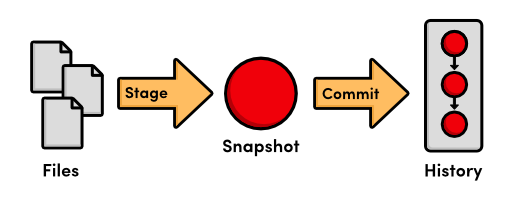
  <br>
  <em>Процесс индексирования/коммита</em>
</div>
<br>

### 6 Просмотр истории репозитория

Обратите внимание, что теперь git status говорит нам, что нечего коммитить,
это означает, что наше текущее состояние соответствует тому, что хранится в репозитории.
Команда git status покажет нам только несохранённые изменения — чтобы просмотреть историю проекта,
нам нужна новая команда:

```
git log
```

Когда вы выполните эту команду, Git выведет информацию о нашем единственном коммите,
которая должна выглядеть примерно так:

```git
commit b650e4bd831aba05fa62d6f6d064e7ca02b5ee1b
Author: unknown <user@computer.(none)>
Date:   Wed Jan 11 00:45:10 2012 -0600

Create index page
```

Давайте разберём это. Во-первых, коммит идентифицируется с помощью очень большой, очень случайной на вид строки (b650e4b...). Это контрольная сумма SHA-1 содержимого коммита, которая гарантирует, что коммит никогда не будет повреждён без ведома Git. Все ваши контрольные суммы SHA-1 будут отличаться от тех, которые показаны в этом руководстве, из-за разных дат и авторов в ваших коммитах. В следующем модуле мы увидим, как контрольная сумма также служит уникальным идентификатором коммита.

Далее Git отображает автора коммита. Но поскольку мы ещё не сообщили Git наше имя, он просто отображает "unknown" с сгенерированным именем пользователя. Git также выводит дату, время и часовой пояс (-0600) момента, когда был сделан коммит. Наконец, мы видим сообщение коммита, которое было введено на предыдущем шаге.
<br>

### 7 Настройка Git

Прежде чем фиксировать какие-либо снимки, нам, вероятно, следует сказать Git, кто мы такие. Мы можем сделать это с помощью команды `git config`:

```
git config --global user.name "Ваше Имя"
git config --global user.email ваш.email@example.com
```

Обязательно замените `Ваше Имя` и `ваш.email@example.com` своим настоящим именем и электронной почтой. Флаг `--global` указывает Git использовать эту конфигурацию по умолчанию для всех ваших репозиториев. Если его опустить, вы сможете указать другую информацию о пользователе для отдельных репозиториев, что пригодится позже.
<br>

### 8 Создание новых HTML-файлов

Давайте продолжим немного развивать наш веб-сайт. Начните с создания файла под названием `orange.html` со следующим содержимым.

```html
<!DOCTYPE html>
<html lang="en">
    <head>
        <title>The Orange Page</title>
        <meta charset="utf-8" />
    </head>
    <body>
        <h1 style="color: #F90">The Orange Page</h1>
        <p>
            Orange is so great it has a
            <span style="color: #F90">fruit</span> named after it.
        </p>
    </body>
</html>
```

Затем добавьте страницу `blue.html`:

```html
<!DOCTYPE html>
<html lang="en">
    <head>
        <title>The Blue Page</title>
        <meta charset="utf-8" />
    </head>
    <body>
        <h1 style="color: #00F">The Blue Page</h1>
        <p>Blue is the color of the sky.</p>
    </body>
</html>
```

<br>

### 9 Добавление новых файлов в индекс

Далее мы можем добавить файлы в индекс таким же образом, как мы создавали первый снимок.

```
git add orange.html blue.html
git status
```

Обратите внимание, что мы можем передать команде `git add` более одного файла. После добавления файлов вывод команды `status` должен выглядеть следующим образом:

```
# On branch master
# Changes to be committed:
#   (use "git reset HEAD <file>..." to unstage)
#
#       new file:   blue.html
#       new file:   orange.html
#
```

Попробуйте выполнить команду `git log`. Она выводит только первый коммит, что говорит нам о том, что файлы `blue.html` и `orange.html` ещё не были добавлены в историю репозитория. Помните, что мы можем просмотреть **_проиндексированные_** изменения с помощью команды `git status`, но не с помощью `git log`. Последняя используется только для просмотра **_зафиксированных_** изменений.
<div align="center">
  
  <br>
  <em></em>
</div>
_Вывод `Status` в сравнении с выводом `Log`_
<br>

### 10 Фиксация новых файлов

Давайте зафиксируем подготовленный снимок состояния:

```bash
git commit
```

Используйте `Create blue and orange pages` (Создать синюю и оранжевую страницы) в качестве сообщения коммита, затем сохраните и закройте файл. Теперь команда `git log` должна вывести два коммита, второй из которых отражает нашу конфигурацию имени и адреса электронной почты. История этого проекта может быть представлена следующим образом:
<div align="center">
  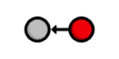
  <br>
  <em>История текущего проекта</em>
</div>

Каждый круг представляет собой коммит, красный круг обозначает коммит, который мы сейчас просматриваем, а стрелка указывает на предыдущий коммит. Последняя часть может показаться нелогичной, но она отражает внутреннюю связь между коммитами (то есть новый коммит ссылается на родительский коммит). Вы будете встречать такой тип диаграмм множество раз на протяжении всего этого руководства.
<br>


### 11 Изменение HTML-страницы

Команда `git add`, которую мы использовали для добавления новых файлов, также может быть использована для добавления измененных файлов. Добавьте следующее в конец файла `index.html`, прямо перед закрывающим тегом `</body>`:

```html
<h2>Navigation</h2>
<ul>
    <li style="color: #F90">
        <a href="orange.html">The Orange Page</a>
    </li>
    <li style="color: #00F">
        <a href="blue.html">The Blue Page</a>
    </li>
</ul>
```

Затем добавьте ссылку на главную страницу в конец файлов `orange.html` и `blue.html` (опять же, перед строкой `</body>`):

```html
<p><a href="index.html">Return to home page</a></p>
```

Теперь вы можете перемещаться между страницами при просмотре их в веб-браузере.
<br>

### 12 Добавление и фиксация снимка

Ещё раз проиндексируем изменения, а затем зафиксируем снимок состояния.

```bash
git status
git add index.html orange.html blue.html
git status
git commit -m "Add navigation links"
```

Опция `-m` позволяет указать сообщение коммита в командной строке, вместо открытия текстового редактора. Это просто удобное сокращение (оно имеет точно такой же эффект, как и наши предыдущие коммиты).

Теперь нашу историю можно представить следующим образом. Обратите внимание на красный круг, который представляет текущий коммит и автоматически перемещается вперёд каждый раз, когда мы коммитим новый снимок состояния.
<div align="center">
  
  <br>
  <em>История текущего проекта</em>
</div>
<br>

### 13 Изучение истории репозитория

Команда `git log` имеет множество опций форматирования, некоторые из которых будут представлены в этом руководстве. Пока же воспользуемся удобным флагом `--oneline`:

`git log --oneline`

Сокращение вывода до одной строки — отличный способ получить высокоуровневый обзор репозитория. Другая полезная конфигурация — передача имени файла в `git log`:

`git log --oneline blue.html`

Отображается только история `blue.html`. Обратите внимание, что начальный коммит _Create index page_ отсутствует, поскольку `blue.html` не существовал в этом снимке.
<br>

### 14 Заключение

В этом модуле мы рассмотрели основной рабочий процесс Git: редактирование файлов, индексацию снимка и фиксирование снимка. Также мы получили практический опыт работы с компонентами, задействованными в этом процессе:
<div align="center">
  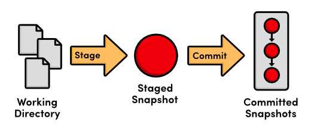
  <br>
  <em>Основной рабочий процесс Git</em>
</div>

Различие между рабочим каталогом, подготовленным снимком и зафиксированным снимком лежит в самой основе контроля версий Git. Почти все остальные команды Git так или иначе изменяют один из этих компонентов, поэтому понимание взаимодействия между ними является отличной основой для освоения Git.

Следующий модуль использует нашу существующую историю проекта, чтобы вернуться к предыдущим снимкам. Этого достаточно, чтобы начать использовать Git в качестве простого инструмента контроля версий для ваших собственных проектов.
<br>
<a id="1"></a>
### 15 Краткий справочник (Основы)

`git init`  
Создать репозиторий Git в текущей папке.

`git status`  
Просмотреть статус каждого файла в репозитории.

`git add <file>`  
Подготовить файл для следующего коммита.

`git commit`  
Зафиксировать подготовленные файлы с информативным сообщением.

`git log`  
Просмотреть историю коммитов репозитория.

`git config --global user.name "<name>"`  
Задать имя автора, которое будет использоваться во всех репозиториях.

`git config --global user.email <email>`  
Задать email автора, который будет использоваться во всех репозиториях.

---

<br>
<div style="page-break-after: always;"></div>

# 3 Отмена изменений

В последнем модуле мы научились записывать версии проекта в репозиторий Git.
Смысл ведения этих «безопасных» копий в том, чтобы иметь спокойную голову:
если наш проект внезапно сломается, мы будем знать, что у нас есть легкий доступ к рабочей версии,
и мы сможем точно определить, где была введена проблема.

С этой целью хранение «безопасных» версий не окажет большой пользы без возможности их восстановить.
Наша следующая задача — научиться просматривать предыдущие состояния проекта,
возвращаться к ним и сбрасывать незакоммиченные изменения.

Если вы следовали за материалом из предыдущего модуля, то у вас уже есть все необходимое. В противном случае скачайте заархивированный репозиторий Git по ссылке выше, разархивируйте его, и вы готовы к работе.
<br>

### 1 Отображение контрольных сумм коммитов

В качестве быстрого повторения давайте отобразим историю нашего репозитория. Перейдите в командную строку (или Git Bash) в папку my-git-repo и выполните следующее.

```bash
git log --oneline
```

Вывод должен выглядеть примерно так же, как показано ниже, но содержать разные контрольные суммы коммитов.

```bash
1c310d2 Add navigation links
54650a3 Create blue and orange pages
b650e4b Create index page
```

Git выводит только первые 7 символов контрольной суммы (помните, что полную версию можно увидеть с форматированием по умолчанию в `git log`). Эти первые несколько символов фактически служат уникальным идентификатором для каждого коммита.
<br>

### 2 Просмотр более старой редакции

Используя новую команду `git checkout`, мы можем просмотреть содержимое предыдущего снимка. Убедитесь, что изменили `54650a3` в следующей команде на ID вашего второго коммита.

```bash
git checkout 54650a3
```

Эта команда выведет много информации о состоянии _detached HEAD_. Сейчас вы можете игнорировать её. Всё, что вам нужно знать, это то, что указанная выше команда превратит ваш каталог **my-git-repo** в точную копию второго снимка, который мы сделали в разделе _The Basics_.

Откройте HTML-файлы в текстовом редакторе или веб-браузере, чтобы убедиться, что навигационные ссылки, добавленные нами в третьем коммите, исчезли. Выполнение команды `git log` также покажет нам, что третий коммит больше не является частью проекта. После перехода ко второму коммиту история нашего репозитория выглядит следующим образом (красный круг представляет собой текущий коммит).

<div align="center">
  
  <br>
  <em>Переключение на второй коммит</em>
</div>

Давайте вернёмся ещё дальше в историю. Убедитесь, что заменили `b650e4b` на ID вашего первого коммита.

```bash
git checkout b650e4b
```

Теперь файлы `blue.html` и `orange.html` исчезли, как и бо́льшая часть истории `git log`.

<div align="center">
  
  <br>
  <em>Проверка первого коммита</em>
</div>

В последнем модуле мы сказали, что `Git` устроен так, чтобы никогда не терять зафиксированный снимок. Итак, куда же делись наш второй и третий снимки? Простая команда `git status` ответит на этот вопрос за нас. Она должна вернуть следующее сообщение:

```
# Not currently on any branch.
nothing to commit (working directory clean)
```

Сравните это с результатом выполнения команды `status` из предыдущего модуля:

```
# On branch master
nothing to commit (working directory clean)
```

Все наши действия в разделе "Основы" происходили в ветке `master`, где до сих пор находятся наш второй и третий коммиты. Чтобы получить полную историю, нам просто нужно извлечь эту ветку. Это очень краткое введение в ветки, но этого достаточно, чтобы ориентироваться между коммитами. В следующем модуле мы подробно обсудим ветки.
<br>

### 3 Возврат к текущей версии

Мы можем использовать ту же команду `git checkout`, чтобы вернуться обратно в ветку `master`.

```bash
git checkout master
```

Это приведёт к тому, что `Git` обновит наш рабочий каталог, чтобы он отражал снимок состояния (`snapshot`) ветки `master`. Для нас будут вновь созданы файлы `blue.html` и `orange.html`, а содержимое `index.html` тоже будет обновлено. Теперь мы вернулись к текущему состоянию проекта, а история выглядит так:

<div align="center">
  
  <br>
  <em>Текущая история проекта</em>
</div>
<br>

### 4 Создание тега для релиза

Назовем это стабильной версией сайта. Мы можем сделать ее официальной, пометить крайний коммит **присвоив** ему номер версии.

```bash
git tag -a v1.0 -m "Stable version of the website"
```

Метки - удобные ссылки на официальные релизы и другие важные вехи в проекте. Они позволяют разработчикам легко просматривать и извлекать важные редакции. Например, теперь мы можем ссылаться на `v1.0` вместо случайного идентификатора. Чтобы посмотреть список существующих меток, выполните `git tag` без аргументов.

В приведенном выше фрагменте флаг `-a` указывает `Git` создать **_аннотированную метку_**, что позволяет записать имя автора, дату и сообщение (указывается с помощью флага `-m`). Мы будем использовать эту метку, чтобы найти стабильную версию после того, как попробуем выполнить несколько экспериментов.
<br>

### 5 Проведение эксперимента

Теперь мы можем свободно добавлять экспериментальные изменения на пример сайта, не затрагивая при этом любое зафиксированное содержимое. Создайте новый файл под названием `crazy.html` и добавьте в него следующий код HTML.

```html
<!DOCTYPE html>
<html lang="en">
    <head>
        <title>A Crazy Experiment</title>
        <meta charset="utf-8" />
    </head>
    <body>
        <h1>A Crazy Experiment</h1>
        <p>
            We're trying out a <span style="color: #F0F">crazy</span>
            <span style="color: #06C">experiment</span>!
        </p>
        <p><a href="index.html">Return to home page</a></p>
    </body>
</html>
```

<br>

### 6 Добавление и фиксация снимка

Добавьте в индекс и зафиксируйте новый файл как обычно.

```bash
git add crazy.html
git status
git commit -m "Add a crazzy experiment"
git log
```

Хорошей практикой считается запускать `git status`, чтобы точно видеть, что вы фиксируете перед выполнением команды `git commit -m`. Это поможет избежать случайного добавления в коммит файлов, которые не относятся к текущему снимку состояния.

Как и ожидалось, новый снимок состояния появляется в истории репозитория. Если журнал занимает более одного экрана, вы можете прокрутить его вниз, нажимая **Space**, и вернуться в командную строку, нажав букву **q**.
<br>

### 7 Просмотр стабильного коммита

Давайте вернёмся назад и посмотрим на нашу стабильную ревизию. Помните, что тег `v1.0` теперь служит удобным ярлыком для `ID` третьего коммита.

```bash
git checkout v1.0
```

После просмотра стабильной версии сайта мы решаем отказаться от сумасшедшего эксперимента. Но прежде чем отменить изменения, нам нужно вернуться к ветке `master`. Если мы этого не сделаем, все наши обновления будут в некоторой недействующей ветке. Как мы узнаем в следующем модуле, никогда не следует вносить изменения напрямую в предыдущую ревизию.

```bash
git checkout master
git log --oneline
```

На данный момент наша история должна выглядеть следующим образом:

```
514fbe7 Add a crazzzy experiment
1c310d2 Add navigation links
54650a3 Create blue and orange pages
b650e4b Create index page
```

<br>

### 8 Отмена зафиксированных изменений

Мы готовы восстановить наш стабильный тег, удалив последнюю фиксацию. Убедитесь, что заменили `514fbe7` на ID фиксации _сумасшедшего эксперимента_ перед выполнением следующей команды.

```bash
git revert 514fbe7
```

Эта команда предложит ввести сообщение для коммита, по умолчанию будет использовано "Revert 'Add a crazzzy experiment'...". Вы можете оставить это сообщение по умолчанию и закрыть файл. После проверки, что файла `crazy.html` больше нет, просмотрите историю с помощью команды `git log --oneline`.

```
506bb9b Revert "Add a crazzzy experiment"
514fbe7 Add a crazzzy experiment
1c310d2 Add navigation links
54650a3 Create blue and orange pages
b650e4b Create index page
```

Обратите внимание, что вместо удаления коммита "crazzzy experiment", Git выясняет, как отменить изменения, которые он содержит, а затем добавляет еще один коммит с полученным содержимым. Таким образом, наш пятый коммит и наш третий представляют один и тот же снимок, как показано ниже. Опять же, Git устроен так, чтобы никогда не терять историю: четвертый снимок все еще доступен, на случай, если мы захотим продолжить его разработку.
<div align="center">
  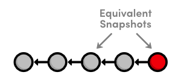
  <br>
  <em>История текущего проекта</em>
</div>

При использовании `git revert` помните, что нужно указывать коммит, который вы хотите _отменить_, а не стабильный коммит, к которому вы хотите вернуться. Полезно думать об этой команде как о «отменить этот коммит», а не как о «восстановить эту версию».
<br>

### 9 Начало небольшого эксперимента

Давайте попробуем провести эксперимент, но на этот раз поменьше. Создайте `dummy.html` и оставьте его пустым. Затем добавьте ссылку в раздел «Навигация» файла `index.html`, чтобы он стал похож на следующий.

```html
<h2>Navigation</h2>
<ul>
    <li style="color: #F90">
        <a href="orange.html">The Orange Page</a>
    </li>
    <li style="color: #00F">
        <a href="blue.html">The Blue Page</a>
    </li>
    <li>
        <a href="dummy.html">The Dummy Page</a>
    </li>
</ul>
```

В следующем разделе мы откажемся от этого незакоммиченного эксперимента. Но поскольку команда `git revert` требует коммит для отмены, мы не можем использовать метод, рассмотренный выше.
<br>

### 10 Отмена незафиксированных изменений

Прежде чем мы начнем отменять действия, давайте посмотрим на статус нашего репозитория.

```
git status
```

У нас есть отслеживаемый файл и неотслеживаемый файл, которые необходимо изменить. Сначала займемся _index.html_:

```
git reset --hard
```

Эта команда изменяет все _отслеживаемые_ файлы, приводя их в соответствие с последним коммитом. Обратите внимание, что именно флаг `--hard` фактически обновляет файл. Выполнение команды `git reset` без каких-либо флагов просто отменит индексирование файла `index.html`, оставив его содержимое неизменным. В любом случае, `git reset` работает только с рабочим каталогом и областью подготовки, поэтому история `git log` остается неизменной.

Далее давайте удалим файл `dummy.html`. Конечно, мы могли бы сделать это вручную, но использование `Git` для сброса изменений исключает человеческие ошибки при работе с несколькими файлами в больших командах. Выполните следующую команду:

```
git clean -f
```

Эта команда удалит все _неотслеживаемые_ файлы. После удаления `dummy.html`, команда `git status` теперь должна показать нам, что у нас "чистый" рабочий каталог, то есть наш проект соответствует последнему коммиту.

**_Будьте осторожны_** с `git reset` и `git clean`. Обе команды оперируют на рабочем каталоге, а не на зафиксированных снимках. В отличие от `git revert`, они **бесповоротно** отменяют изменения, поэтому убедитесь, что вы действительно хотите удалить то, над чем работаете, прежде чем использовать их.
<br>

### 11 Вывод

Как отмечалось в предыдущем модуле, большинство команд Git работает с одним из трех основных компонентов репозитория Git: рабочим каталогом, снимком индекса или зафиксированных снимков. Команда `git reset` отменяет изменения в рабочем каталоге и снимке индекса, в то время как `git revert` отменяет изменения, содержащиеся в зафиксированных снимках. Неудивительно, что `git status` и `git log` работают схожим образом.

<div align="center">
  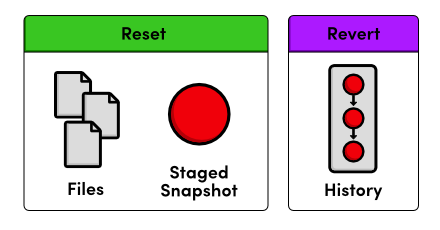
  <br>
  <em>Сброс против Отката</em>
</div>

Я упоминал, что вместо полного удаления коммита, `git revert` сохраняет коммит на случай, если вы захотите вернуться к нему позже. Это лишь одна из причин сохранения зафиксированных снимков. Когда мы начнем работать с удаленными репозиториями, мы увидим, что изменение истории путем удаления коммита имеет серьезные последствия для совместной работы с другими разработчиками.

Этот модуль также знакомит с понятием переключения между различными коммитами и ветками с помощью `git checkout`. Ветки завершают наше обсуждение основных компонентов Git и предлагают элегантный вариант оптимизации рабочего процесса разработки. В следующем модуле мы рассмотрим основные команды Git для работы с ветками.
<br>

### 12 Краткий справочник (Отмена изменений)

`git checkout <идентификатор коммита>`  
Просмотр предыдущего коммита.

`git tag -a <имя тега> -m "<описание>"`  
Создание аннотированного тега, указывающего на последний коммит.

`git revert <идентификатор коммита>`  
Отмена указанного коммита путем применения нового коммита.

`git reset --hard`  
Сброс отслеживаемых файлов для соответствия последнему коммиту.

`git clean -f`  
Удаление неотслеживаемых файлов.

`git reset --hard / git clean -f`  
Окончательная отмена несохраненных изменений.
<div style="page-break-after: always;"></div>

# 4 Ветки I

Ветвления являются последним компонентом системы контроля версий Git. Это дает нам четыре основных элемента, с которыми мы будем работать на протяжении всего этого руководства:

-   Рабочий каталог
-   Подготовленный снимок
-   Зафиксированные снимки
-   Ветви разработки

В Git **ветка** представляет собой независимую линию разработки. Например, если вы хотите поэкспериментировать с новой идеей без использования Git, вы можете скопировать все файлы проекта в другой каталог и начать вносить изменения. Если вам понравится результат, вы сможете скопировать измененные файлы обратно в исходный проект. В противном случае вы просто удалите весь эксперимент и забудете о нем.

Именно эту функциональность предоставляют ветки Git — с некоторыми ключевыми улучшениями. Во-первых, ветки предлагают безошибочный способ включения изменений из эксперимента. Во-вторых, они позволяют хранить все ваши эксперименты в одном каталоге, что значительно упрощает их отслеживание и обмен ими с другими. Ветки также способствуют использованию нескольких стандартизированных рабочих процессов как для индивидуальной, так и для совместной разработки, что будет рассмотрено во второй половине этого руководства.

Если вы следовали за материалом предыдущего модуля, у вас уже есть всё необходимое. В противном случае скачайте заархивированный репозиторий Git по ссылке выше, разархивируйте его, и вы готовы к работе.
<br>

### 1 Просмотр существующих веток

Давайте начнём наше исследование с перечисления существующих веток для нашего проекта.

```bash
git branch
```

Эта команда отобразит нашу единственную ветку: `* master`. Ветка `master` является веткой по умолчанию в Git, а звёздочка рядом с ней указывает на то, что она сейчас извлечена. Это означает, что последний снимок в ветке `master` находится в рабочем каталоге:
<div align="center">
  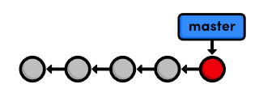
  <br>
  <em>Ветка master</em>
</div>

Обратите внимание, что поскольку для каждого проекта существует только один рабочий каталог, за раз можно извлечь только одну ветку.
<br>

### 2 Переключение на сумасшедший эксперимент

В предыдущем модуле были опущены некоторые детали о том, как на самом деле работает извлечение предыдущих коммитов. Теперь мы готовы углубиться в эту тему. Сначала нам нужны контрольные суммы наших зафиксированных снимков.

```bash
git log --oneline
```

Эта команда выводит следующую историю:

```bash
506bb9b Revert "Add a crazzzy experiment"
514fbe7 Add a crazzzy experiment
1c310d2 Add navigation links
54650a3 Create blue and orange pages
b650e4b Create index page
```

Извлеките сумасшедший эксперимент из последнего модуля, не забудьте заменить `514fbe7` на идентификатор вашего четвертого коммита.

```bash
git checkout 514fbe7
```

Эта команда возвращает сообщение о том, что мы находимся в состоянии `detached HEAD` (отсоединенный HEAD) и что HEAD теперь находится на `514fbe7`. `HEAD` - это внутренний способ `Git` указать снимок, который извлечен в данный момент. Это означает, что красный круг на каждой из наших диаграмм истории на самом деле представляет `HEAD` в Git. На следующей диаграмме показано состояние нашего репозитория до и после того, как мы извлекли старый коммит.
<div align="center">
  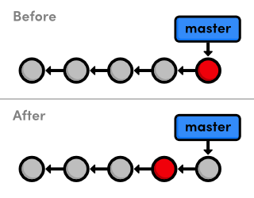
  <br>
  <em>Проверка 4-го коммита</em>
</div>

Как показано на диаграмме "до", HEAD обычно располагается на конце ветки разработки. Но когда мы проверяли предыдущий коммит, HEAD переместился в середину ветки. Теперь мы больше не можем сказать, что мы на ветке master, поскольку она содержит более поздние снимки, чем HEAD. Это отражено в выводе команды git branch, которая сообщает нам, что мы в данный момент не находимся ни на одной ветке (no branch).
<br>

### 3 Создание новой ветки

Мы не можем добавлять новые коммиты, не находясь на какой-либо ветке, поэтому давайте создадим новую. Это возьмёт наш текущий рабочий каталог и ответвит его в новую ветку.

```bash
git branch crazy
```

Обратите внимание, что git branch - это универсальная команда, которую можно использовать либо для вывода списка веток, либо для их создания. Однако вышеуказанная команда только создаёт ветку crazy - она не переключается на неё.

```bash
git checkout crazy
```

Теперь мы можем свободно экспериментировать в рабочем каталоге, не нарушая ничего в ветке master. Ветка crazy представляет собой полностью изолированную среду разработки, которую можно представить следующим образом.
<div align="center">
  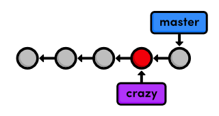
  <br>
  <em>Создание новой ветки</em>
</div>

Сейчас `crazy` ветка, $HEAD$ и рабочий каталог абсолютно идентичны четвертому коммиту. Но как только мы добавим еще один снимок, мы увидим ответвление в истории нашего проекта.
<br>

### 4 Создание радуги

Мы продолжим развивать наш сумасшедший эксперимент изменив crazy.html следующим образом.

```html
<!DOCTYPE html>
<html lang="en">
    <head>
        <title>A Crazy Experiment</title>
        <meta charset="utf-8" />
    </head>
    <body>
        <h1>A Crazy Experiment</h1>
        <p>Look! A Rainbow!</p>

        <ul>
            <li style="color: red">Red</li>
            <li style="color: orange">Orange</li>
            <li style="color: yellow">Yellow</li>
            <li style="color: green">Green</li>
            <li style="color: blue">Blue</li>
            <li style="color: indigo">Indigo</li>
            <li style="color: violet">Violet</li>
        </ul>

        <p><a href="index.html">Return to home page</a></p>
    </body>
</html>
```

<br>

### 5 Фиксация и сохранение радуги

Будем надеяться, что к этому времени вы уже достаточно хорошо знакомы с подготовкой и коммитом снимков:

```bash
git add crazy.html
git status
git commit -m "Add a rainbow to crazy.html"
```

После коммита в ветке `crazy`, мы можем увидеть две независимые линии разработки в нашем проекте:
<div align="center">
  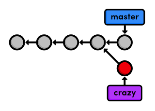
  <br>
  <em>История развилки проекта</em>
</div>

Также обратите внимание, что `HEAD` (обозначенный красным кругом) автоматически переместился к новому коммиту, что интуитивно является тем, чего мы хотим при разработке проекта.

Приведенная выше диаграмма представляет полное состояние нашего репозитория, но `git log` отображает только историю текущей ветки:

```git
677e0e0 Add a rainbow to crazy.html
514fbe7 Add a crazzzy experiment
*1c310d2 Add navigation links
*54650a3 Create blue and orange pages
*b650e4b Create index page
```

Обратите внимание, что история до момента ветвления считается частью новой ветки (выделенной выше звёздочками). Это означает, что история ветки `crazy` простирается вплоть до первого коммита:
<div align="center">
  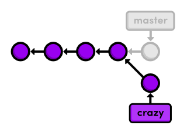
  <br>
  <em>История ветки crazy</em>
</div>

Теперь проект в целом имеет сложную историю; однако каждая отдельная ветка всё ещё имеет линейную историю (снимки следуют один за другим). Это означает, что мы можем взаимодействовать с ветками точно так же, как мы учились в первых двух модулях.
<br>

### 6 Переименование радуги

Давайте добавим еще один снимок состояния в ветку `crazy`. Переименуйте `crazy.html` в `rainbow.html`, затем используйте следующие команды Git для обновления репозитория.

```bash
git status
git rm crazy.html
git status
git add rainbow.html
git status
```

Команда `git rm` указывает Git прекратить отслеживать `crazy.html` (и удалить его, если необходимо), а `git add` начинает отслеживать `rainbow.html`.

Сообщение `renamed: crazy.html -> rainbow.html` в выводе последней команды `git status` показывает нам, что Git достаточно умён, чтобы понять, когда мы переименовываем файл.

Наш снимок подготовлен к коммиту:

```bash
git commit -m "Rename crazy.html to rainbow.html"
git log --oneline
```

После этого добавления полная история репозитория выглядит следующим образом. Помните, что ветка `crazy` не включает в себя коммиты из `master`, сделанные после ответвления.  
<div align="center">
  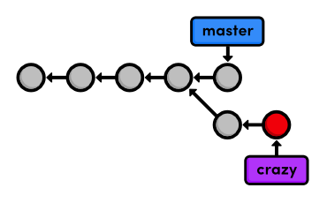
  <br>
  <em>Текущая история проекта</em>
</div>
<br>

### 7 Возвращение к основной ветке

Давайте переключимся обратно на `master` ветку:

```bash
git checkout master
git branch
git log --oneline
```

После переключения, файла _crazy.html_ не существует в рабочем каталоге, а коммиты из последних нескольких шагов не отображаются в истории. Эти две ветки стали полностью независимыми средами разработки после того, как они разошлись. Вы можете думать о них как об отдельных папках проекта, между которыми вы переключаетесь с помощью команды `git checkout`. Однако у них есть общий фрагмент истории первых четырёх коммитов.
<div align="center">
  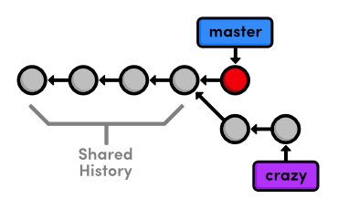
  <br>
  <em>Общая история веток</em>
</div>
<br>

### 8 Создание ветки CSS

Сейчас мы отложим наш сумасшедший эксперимент и сосредоточимся на оформлении HTML-страниц с помощью каскадных таблиц стилей (_CSS_). Опять же, если вы не слишком хорошо разбираетесь в _HTML_ и _CSS_, содержимое предстоящих файлов не так важно, как команды _Git_, используемые для управления ими.

Давайте создадим и переключимся на новую ветку с названием _css_.

```bash
git branch css
git checkout css
```

Новая ветка указывает на снимок состояния, который сейчас извлечён, что, как оказалось, совпадает с основной веткой.
<div align="center">
  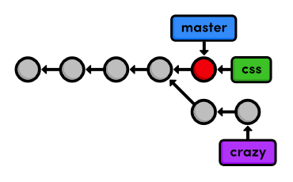
  <br>
  <em>Создание ветки css</em>
</div>
<br>

### 9 Добавление таблицы стилей CSS

Затем создайте файл под названием `style.css` со следующим содержимым. Этот CSS используется для применения форматирования к HTML в наших других файлах.

```css
body {
    padding: 20px;
    font-family: Verdana, Arial, Helvetica, sans-serif;
    font-size: 14px;
    color: #111;
}

p,
ul {
    margin-bottom: 10px;
}

ul {
    margin-left: 20px;
}
```

Зафиксируйте таблицу стилей обычным способом.

```bash
git add style.css
git status
git commit -m "Add CSS stylesheet"
```

<br>

### 10 Привязка таблицы стилей

Нам все еще нужно указать HTML-страницам использовать форматирование из файла `style.css`. Добавьте следующий текст на отдельной строке после тега `<title>` в файлах `index.html`, `blue.html` и `orange.html` (помните, что `rainbow.html` существует только в сумасшедшей ветке). Вы сможете увидеть CSS-форматирование, открыв `index.html` в веб-браузере.

```html
<link rel="stylesheet" href="style.css" />
```

Зафиксируйте изменения.

```bash
git add index.html blue.html orange.html
git status
git commit -m "Link HTML pages to stylesheet"
git log --oneline
```

Это приведёт к тому, что история хранилища будет выглядеть следующим образом:

<div align="center">
  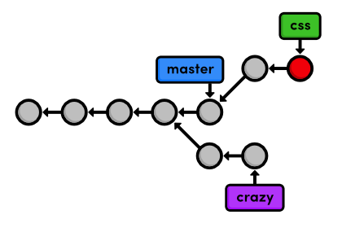
  <br>
  <em>Текущая история проекта</em>
</div>
<br>

### 11 Возвращение к основной ветке (снова)

Ветка css позволила нам создать и протестировать наше форматирование без угрозы стабильности основной ветки master. Но теперь нам нужно объединить эти изменения с основным проектом. Прежде чем попытаться сделать слияние, нам нужно вернуться в ветку master.

```bash
git checkout master
```

Проверьте, что style.css не существует и что HTML-страницы не связаны с ним. История нашего репозитория остается неизменной, но рабочий каталог теперь соответствует снимку, на который указывает ветка master.
<div align="center">
  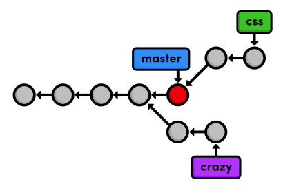
  <br>
  <em>Текущая история проекта</em>
</div>

Посмотрите также на вывод git log --oneline.

```bash
af23ff4 Revert "Add a crazzzy experiment"
a50819f Add a crazzzy experiment
4cd95d9 Add navigation links
dcb9e07 Create blue and orange pages
f757eb3 Create index page
```

Как и ожидалось, в истории **_master_** нет упоминания о добавлении CSS, но сейчас мы это изменим.
<br>

### 12 Слияние ветки CSS

Используйте команду `git merge`, чтобы взять снимки из ветки `css` и добавить их в ветку `master`.

```bash
git merge css
```

Обратите внимание, что эта команда всегда сливается в текущую ветку: `css` остается неизменной. Проверьте историю, чтобы убедиться, что история `css` была добавлена в `master`.

```bash
git log --oneline
```

Следующая диаграмма визуализирует слияние.
<div align="center">
  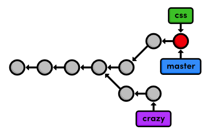
  <br>
  <em>Слияние ветки css в master</em>
</div>

Вместо того, чтобы заново создавать коммиты в `css` и добавлять их в историю `master`, Git повторно использует существующие снимки и просто перемещает вершину `master`, чтобы она соответствовала вершине `css`. Такой вид слияния называется **_fast-forward merge_**, поскольку Git «пересылает» новые коммиты в ветке `css`.

После слияния обе ветки имеют одинаковую историю, что делает их избыточными. Если только мы не хотим продолжать разработку в ветке `css`, мы можем просто избавиться от нее.
<br>

### 13 Удаление ветки CSS

Мы можем безопасно удалить ветку, передав флаг `-d` в `git branch`.

```bash
git branch -d css
git branch
```

Поскольку `css` и `master` представляют одну и ту же ветку, наша история выглядит одинаково, хотя ветка `css` была удалена. Я также расположил коммиты ветки `master` в прямую линию на следующей визуализации, что облегчит отслеживание в предстоящих модулях.  
<div align="center">
  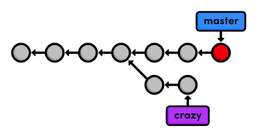
  <br>
  <em>Удаление ветки css</em>
</div>

Удаление веток - относительно "безопасная" операция в том смысле, что Git предупредит вас, если вы удаляете ветку, не слитую с другими. Это ещё один пример приверженности Git никогда не терять вашу работу.  
<br>

### 14 Вывод

Этот модуль использовал две ветки для экспериментов с новыми дополнениями. В обоих случаях ветки обеспечили нам среду, полностью изолированную от "стабильной" версии нашего веб-сайта (`master` ветка).

Один из наших экспериментов ожидает нас в следующем модуле, пока наши изменения CSS были объединены в стабильный проект, и его ветка, таким образом, устарела. Использование ветвей для разработки небольших функций, подобных этим, является одной из характерных черт управления программным обеспечением на основе Git.

Хотя этот модуль сильно полагался на диаграммы ветвей, чтобы показать полное состояние репозитория, вам не нужно держать этот высокоуровневый обзор в голове во время вашей повседневной разработки. Создание новой ветки — это просто способ запросить независимый рабочий каталог, промежуточное состояние и историю. Вы можете думать о ветвях как о способе умножить функциональность, представленную в первых двух модулях.

Далее мы будем практиковать наши навыки управления ветвями, изучая типичный рабочий процесс опытных пользователей Git. Мы также откроем для себя более сложные слияния, чем быстрый перенос, представленный выше.
<br>

### 15 Краткий справочник (Ветки I)

`git branch`  
Список всех ветвей.

`git branch <имя-ветки>`  
Создать новую ветку, используя текущий рабочий каталог в качестве её базы.

`git checkout <имя-ветки>`  
Сделать рабочий каталог и HEAD соответствующими указанной ветке.

`git merge <имя-ветки>`  
Объединить ветку с текущей извлечённой веткой.

`git branch -d <имя-ветки>`  
Удалить ветку.

`git rm <файл>`  
Удалить файл из рабочего каталога (если применимо) и прекратить отслеживание файла.
<div style="page-break-after: always;"></div>

# 5 Ветки II

Теперь, когда мы рассмотрели механизмы, лежащие в основе веток Git, мы можем обсудить практическое влияние, которое они оказывают на процесс разработки программного обеспечения. Вместо введения новых команд, этот модуль охватывает то, как типичный пользователь Git применяет этот рабочий процесс к реальным проектам, а также некоторые проблемы, возникающие в среде с ветвями.

Для Git ветка — это просто ветка, но часто бывает полезно придавать особый смысл разным веткам. Например, мы использовали `master` в качестве стабильной ветки для нашего примера проекта, а также использовали временную ветку для добавления некоторого форматирования CSS. Временные ветки, подобные последним, называются **тематическими ветками**, потому что они существуют для разработки определенной темы, после чего они удаляются. Мы будем работать с двумя типами тематических веток в этом модуле.

В ходе нашего исследования веток Git мы также обнаружим, что некоторые слияния не могут быть выполнены «fast-forward». Когда история двух веток расходится, для объединения ветвей требуется специальный коммит. Эта ситуация также может привести к конфликту слияния, который необходимо разрешить вручную, прежде чем что-либо можно будет зафиксировать в репозитории.

Скачать репозиторий для этого модуля

Если вы следовали предыдущему модулю, у вас уже есть все необходимое. В противном случае скачайте заархивированный репозиторий Git по ссылке выше, разархивируйте его, и вы готовы к работе.
<br>

### 1 Продолжение сумасшедшего эксперимента

Давайте начнем с проверки ветки `crazy`.

```bash
git branch
git checkout crazy
git log --oneline
```

Ветка _crazy_ — это более долгосрочный тип тематической ветки, называемый **feature branch (ветвью для разработки нового функционала)**. Это подходящее название, поскольку она была создана с целью разработки определенного функционала. Это также термин, который делает вклад Git в рабочий процесс разработки более очевидным: ветки позволяют сосредоточиться на разработке одного четко определенного функционала за раз.

Это приводит нас к моим основным правилам использования веток Git:

-   Создавайте новую ветку для каждого крупного дополнения к вашему проекту.
-   Не создавайте ветку, если не можете дать ей конкретное имя.

Соблюдение этих простых рекомендаций окажет существенное влияние на эффективность вашей работы.
<br>

### 2 Слияние обновлений CSS

Обратите внимание, что внесённые в ветку `master` изменения форматирования CSS нигде не отображаются. Это представляет собой определённую проблему, если мы хотим, чтобы наш эксперимент отражал эти обновления. Удобно, что Git позволяет нам сливать изменения в любую ветку (а не только в `master`). Итак, мы можем включить обновления с помощью знакомой команды `git merge`. Помните, что слияние затрагивает только извлечённую ветку.

```bash
git merge master
git log --oneline
```

По состоянию на Git версии $1.7.10$, эта команда откроет ваш редактор и предложит вам ввести сообщение, объясняющее, почему было необходимо слияние. Вы можете использовать сообщение по умолчанию `Merge branch 'master' into crazy`. Когда вы сохраните и закроете файл, вы заметите дополнительный коммит в истории вашего проекта. Напомним, что наше первое слияние не добавило новых коммитов; оно просто «переместило» вершину ветки `master`. В этот раз слияние было не таким.

В результате слияния появился новый коммит слияния, который показан ниже.

<div align="center">
  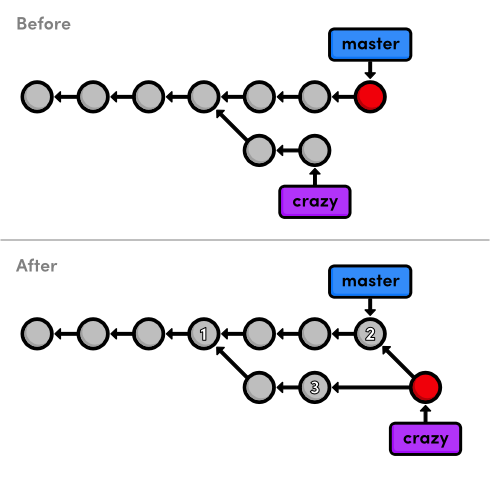
  <br>
  <em>Слияние <b>master</b> в ветку <b>crazy</b></em>
</div>

Стоит уделить время и разобраться, почему текущее слияние не могло быть fast-forward. Как Git мог бы перейти указателем crazy к вершине ветки master? Это невозможно без backtracking, что, в свою очередь, противоречит самой идее **_fast-forward_**. Таким образом, у нас остаётся новый способ комбинирования веток: 3-way merge.

Трехстороннее слияние происходит, когда вы пытаетесь слить две ветки, история которых разошлась. Оно создает **merge commit** (коммит слияния), который выступает в качестве ссылки между двумя ветками. В результате у него есть два родительских коммита. На приведенном выше рисунке это визуализируется двумя стрелками, исходящими из вершины crazy. Это как сказать: «этот коммит получен и из ветки crazy, и из master». После слияния ветка crazy получает доступ как к своей собственной истории, так и к истории master.

Название происходит от внутреннего метода, используемого для создания коммита слияния. Git рассматривает **три коммита** (пронумерованных на рисунке выше), чтобы сгенерировать конечное состояние слияния.

Такого рода взаимодействие между ветками — это важная часть того, что делает Git столь мощным инструментом разработки. Мы можем не только создавать независимые линии разработки, но также можем делиться информацией между ними, связывая их истории с помощью трехстороннего слияния.
<br>

### 3 Стилизация страницы радуги

Теперь, когда у нас есть доступ к обновлениям CSS из master, мы можем продолжить разработку нашего эксперимента crazy. Свяжите таблицу стилей CSS с rainbow.html, добавив следующий HTML-код после элемента `<title>`:

```html
<link rel="stylesheet" href="style.css" />
```

Подготовьте и закоммитите обновление, затем проверьте, что оно отражено в истории.

```bash
git status
git commit -a -m "Add CSS stylesheet to rainbow.html"
git log --oneline
```

Обратите внимание, что на этот раз мы пропустили этап индексации. Вместо использования команды git add, мы передали флаг -a команде git commit. Этот удобный параметр указывает Git автоматически включать все отслеживаемые файлы в подготовленный снимок. В сочетании с флагом -m мы можем подготовить и зафиксировать снимки одной командой. Однако будьте осторожны и не включайте непреднамеренные файлы при использовании флага -a.
<br>

### 4 Ссылка на страницу радуги

Нам все еще нужно добавить навигационную ссылку на главную страницу. Измените раздел "Навигация" в файле index.html следующим образом.

```html
<h2>Navigation</h2>
<ul>
    <li style="color: #F90">
        <a href="orange.html">The Orange Page</a>
    </li>
    <li style="color: #00F">
        <a href="blue.html">The Blue Page</a>
    </li>
    <li>
        <a href="rainbow.html">The Rainbow Page</a>
    </li>
</ul>
```

Как обычно, добавьте в индекс и зафиксируйте снимок состояния.

```
git commit -a -m "Link index.html to rainbow.html"
git log --oneline
```

<br>

### 5 Форк альтернативной радуги

Далее мы придумаем альтернативу текущей странице rainbow.html. Сейчас самое подходящее время создать еще одну тематическую ветку:

```
git branch crazy-alt
```

```
git checkout crazy-alt
```

Помните, здесь мы можем делать все, что угодно, не беспокоясь ни о ветке `crazy`, ни о `master`. Когда `git branch` создает ветку, он использует текущий `HEAD` в качестве отправной точки для новой ветки.
Это означает, что мы начинаем с тех же файлов, что и в ветке `crazy` (если бы мы вызвали `git branch` из ветки `master`, нам пришлось бы заново создавать `rainbow.html`).

После создания новой ветки история нашего репозитория выглядит следующим образом:

<div align="center">
  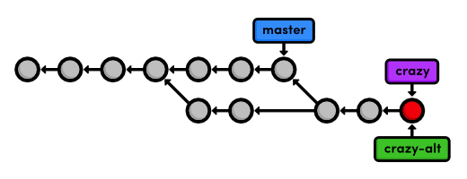
  <br>
  <em>Создание ветки crazy-alt</em>
</div>
<br>

### 6 Изменение радуги

Измените радужный список в `rainbow.html` с этой версии:

```html
<ul>
    <li style="color: red">Red</li>
    <li style="color: orange">Orange</li>
    <li style="color: yellow">Yellow</li>
    <li style="color: green">Green</li>
    <li style="color: blue">Blue</li>
    <li style="color: indigo">Indigo</li>
    <li style="color: violet">Violet</li>
</ul>
```

на эту:

```html
<div style="background-color: red"></div>
<div style="background-color: orange"></div>
<div style="background-color: yellow"></div>
<div style="background-color: green"></div>
<div style="background-color: blue"></div>
<div style="background-color: indigo"></div>
<div style="background-color: violet"></div>
```

Затем добавьте немного CSS-форматирования в `<head>` в строке после тега `<meta>` :

```html
<style>
    div {
        width: 300px;
        height: 50px;
    }
</style>
```

Если вы откроете `rainbow.html` в браузере, вы увидите разноцветные блоки вместо разноцветного текста. Не забудьте закоммитить изменения:

```bash
git commit -a -m "Make a REAL rainbow"
```

Результирующая история проекта показана ниже, причем первые четыре коммита опущены для краткости.

<div align="center">
  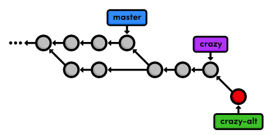
  <br>
  <em>Фиксация изменений в ветке crazy-alt</em>
</div>
<br>

### 7 Срочное обновление!

Наш босс позвонил с неожиданными новостями! Ему нужно немедленно обновить сайт, но что делать с нашей разработкой _rainbow.html_? К счастью, прелесть веток в Git в том, что мы можем просто оставить их там, где они есть, и добавить новые обновления в master.

Мы будем использовать так называемую **ветку hotfix**, чтобы создать и протестировать новости. В отличие от нашей относительно долгосрочной _feature branch (crazy)_, ветки hotfix используются для быстрого исправления релиза. Например, вы можете использовать ветку hotfix, чтобы исправить чувствительную ко времени ошибку в публичном программном проекте. Это различие полезно для демонстрации того, когда целесообразно создать новую ветку, но это чисто концептуально — ветка есть ветка согласно Git.

```bash
git checkout master
git branch news-hotfix
git checkout news-hotfix
```

Измените список «News» в index.html, чтобы он соответствовал следующему.

```html
<h2 style="color: #C00">News</h2>
<ul>
    <li><a href="news-1.html">Blue Is The New Hue</a></li>
</ul>
```

И создайте новую HTML-страницу с именем news-1.html со следующим содержимым.

```html
<!DOCTYPE html>
<html lang="en">
    <head>
        <title>Blue Is The New Hue</title>
        <link rel="stylesheet" href="style.css" />
        <meta charset="utf-8" />
    </head>
    <body>
        <h1 style="color: #079">Blue Is The New Hue</h1>
        <p>
            European designers have just announced that
            <span style="color: #079">Blue</span> will be this year's hot color.
        </p>
        <p><a href="index.html">Return to home page</a></p>
    </body>
</html>
```

Мы не можем использовать `git commit -a`, чтобы автоматически добавить news-1.html, потому что это неотслеживаемый файл (как показано в `git status`).
Поэтому давайте воспользуемся явной командой `git add`:

```bash
git add index.html news-1.html
git status
git commit -m "Add 1st news item"
```

Проверьте эти дополнения в браузере, чтобы убедиться, что ссылки работают, в них нет опечаток и т. д. Если всё выглядит хорошо, мы можем «опубликовать» изменения, объединив их в стабильную основную ветку. В нашем тривиальном примере изоляция изменений в отдельной ветке на самом деле не нужна, но в реальном мире это даст вам возможность запускать тесты сборки, не затрагивая стабильный проект.
<br>

### 8 Публикация горячих новостей

Помните, что для слияния в основную ветку нам сначала нужно её проверить.

```
git checkout master
git merge news-hotfix
```

Поскольку master теперь содержит обновление новостей, мы можем удалить ветку исправления:

```
git branch -d news-hotfix
git branch
```

Следующая диаграмма отражает историю нашего репозитория до и после слияния.
Сможете ли вы понять, почему это было прямое слияние, а не трёхстороннее?

<div align="center">
  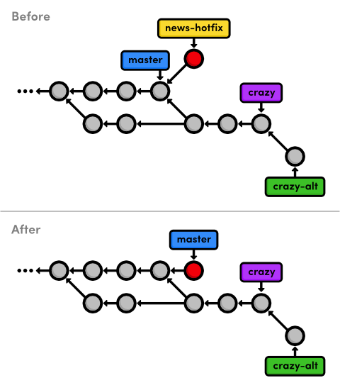
  <br>
  <em>Перенаправление master в ветку news-hotfix</em>
</div>

Также обратите внимание, что в нашей истории есть еще один форк (коммит перед ответвлением master в двух направлениях), а значит в ближайшем будущем следует ожидать еще один коммит слияния.  
<br>

### 9 Завершение сумасшедшего эксперимента

Итак, давайте завершим наш сумасшедший эксперимент еще одним коммитом.

```
git checkout crazy
```

Обратите внимание, что новостная статья нигде не найдена, как и должно быть (эта ветка представляет собой совершенно изолированную среду разработки).

Мы закончим наш сумасшедший эксперимент, добавив элемент новости на главную страницу. Измените список новостей в `index.html` на следующий:

```html
<h2 style="color: #C00">News</h2>
<ul>
    <li><a href="rainbow.html">Our New Rainbow</a></li>
</ul>
```

Внимательные читатели, вероятно, заметили, что это напрямую конфликтует с тем, что мы изменили в ветке `news-hotfix`. Мы не должны вручную добавлять другой элемент новостей, потому что он не имеет отношения к текущей ветке. Кроме того, нельзя быть уверенным, что ссылка работает, потому что `news-1.html` не существует в этой ветке. Это может показаться тривиальным, но представьте себе ошибки, которые могли бы быть допущены, если бы `news-hotfix` вносил десятки различных изменений.

Мы просто проиндексируем и закоммитим снимок, как будто не было конфликтов:

```bash
git commit -a -m "Add news item for rainbow"
git log --oneline
```

Посмотрите на все экспериментальные коммиты (отмеченные звёздочками ниже)!

```bash
* 42fa173 Add news item for rainbow
* 7147cc5 Link index.html to rainbow.html
* 6aa4b3b Add CSS stylesheet to rainbow.html
b9ae1bc Merge branch 'master' into crazy
aе4e756 Link HTML pages to stylesheet
98cd46d Add CSS stylesheet
* 33е25c9 Rename crazy.html to rainbow.html
* 677e0e0 Add a rainbow to crazy.html
* 506bb9b Revert "Add a crazzy experiment"
* 514fbe7 Add a crazzy experiment
1c310d2 Add navigation links
54650a3 Create blue and orange pages
b650e4b Create index page
```

<br>

### 10 Публикация сумасшедшего эксперимента

Наконец-то мы готовы слить нашу сумасшедшую ветку (`crazy`) обратно в основную (`master`).

```bash
git checkout master
git merge crazy
```

Вы должны получить следующее сообщение:

```bash
Auto-merging index.html
CONFLICT (content): Merge conflict in index.html
Automatic merge failed; fix conflicts and then commit the result.
```

Перед нами первый конфликт слияния. Конфликты возникают при попытке слияния веток, где был изменён один и тот же контент. Git не знает, как объединить два изменения, поэтому он останавливается и спрашивает, что делать. Мы можем увидеть, что именно произошло, с помощью команды `git status`:

```bash
# On branch master
# Changes to be committed:
#
#   new file:   rainbow.html
#
# Unmerged paths:
#   (use "git add/rm <file>..." as appropriate to mark resolution)
#
#   both modified:      index.html
#
```

Мы видим проиндексированный снимок (`staged snapshot`) коммита слияния. Ранее мы никогда не видели подобного, так как у нас не было конфликтов для разрешения. Но сейчас Git остановился, чтобы мы могли изменить файлы и разрешить конфликт перед коммитом снимка. Раздел `Unmerged paths` содержит файлы с конфликтом.

Откройте файл `index.html` и найдите секцию, которая выглядит следующим образом:

```bash
<<<<<<< HEAD
<li><a href="news-1.html">Blue Is The New Hue</a></li>
=======
<li><a href="rainbow.html">Our New Rainbow</a></li>
>>>>>>> crazy
```

Git самостоятельно изменил конфликтный файл, чтобы показать, какие именно строки конфликтуют. Формат приведённого выше текста показывает разницу между двумя версиями файла. Секция, отмеченная как `<<<<<<< HEAD`, показывает версию из текущей ветки, а секция после `=======` показывает версию из ветки `crazy`.
<br>

### 11 Решение конфликтов слияния

Мы можем изменить затронутые строки так, как нам нужно, чтобы разрешить конфликт. Отредактируйте раздел новостей в `index.html`, чтобы сохранить изменения из обеих версий:

```html
<h2 style="color: #C00">News</h2>
<ul>
    <li><a href="news-1.html">Blue Is The New Hue</a></li>
    <li><a href="rainbow.html">Our New Rainbow</a></li>
</ul>
```

Метки `<<<<<<`, `=======` и `>>>>>>>` используются только для указания конфликта и должны быть удалены. Далее нам нужно сообщить `Git`, что мы завершили разрешение конфликта:

```bash
git add index.html
git status
```

Это правильно, всё, что вам нужно сделать, это добавить `index.html` в промежуточное состояние (staged snapshot), чтобы отметить его как разрешенный. Наконец, завершите слияние в три этапа:

```bash
git commit
```

Мы не использовали флаг `-m`, чтобы указать сообщение, потому что `Git` уже предоставляет нам сообщение по умолчанию для коммитов слияния. Он также предоставляет список `Conflicts` (конфликтов), который может быть особенно полезен при попытке выяснить, где что-то пошло не так в проекте. Сохраните и закройте файл, чтобы создать коммит слияния.

Итоговое состояние нашего проекта выглядит следующим образом.

<div align="center">
  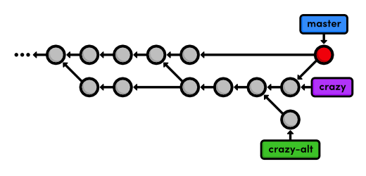
  <br>
  <em>Слияние crazy ветки в master</em>
</div>
<br>

### 12 Очистка тематических веток

Поскольку наш сумасшедший эксперимент был успешно объединен, мы можем избавиться от наших функциональных веток.

```bash
git branch -d crazy
git branch -d crazy-alt
```

Как отмечалось в последнем модуле, команда `git branch -d` не позволяет удалить ветку, содержащую несообщенные изменения. Но мы действительно хотим выбросить альтернативный эксперимент, поэтому мы последуем инструкциям в сообщении об ошибке, чтобы переопределить это поведение:

```bash
git branch -D crazy-alt
```

Поскольку мы никогда не объединяли crazy-alt в master, она потеряна навсегда. Однако ветка crazy все еще доступна через свои коммиты, которые теперь доступны через ветку master. То есть она все еще является частью структуры истории репозитория, хотя мы удалили ссылку на нее.

<div align="center">
  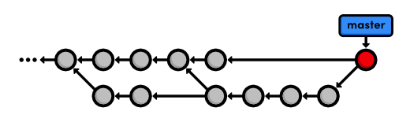
  <br>
  <em>Удаление тематических веток</em>
</div>

Перемещение указателя не отражается в истории проекта. В этом заключается ощутимое отличие перемещения указателя от трёхстороннего слияния. В следующем модуле будет рассмотрено уместное использование того и другого, а также потенциальные проблемы нелинейной истории.
<br>

### 13 Заключение

В этом модуле рассмотрены три наиболее частых способа использования веток Git:

-   Для разработки долгосрочных возможностей (crazy)
-   Для применения быстрых обновлений (news-hotfix)
-   Для записи эволюции проекта (master)

В первых двух случаях нам необходима изолированная среда для тестирования некоторых изменений перед их интеграцией в стабильный код. Чем более вы освоитесь с Git, тем чаще будете создавать практически всё в изолированной тематической ветке с последующим слиянием в стабильную ветку после завершения работы. Таким образом, у вас никогда не будет неработающей версии проекта.

Мы использовали постоянную ветку `master` как основание для всего проекта. По сути, это делает её историческим журналом всего проекта. Помимо `master`, многие программисты часто добавляют вторую постоянную ветку под названием `develop`. Она позволяет использовать `master` для записи действительно стабильных состояний (например, публичных выпусков) и применять `develop` в качестве области подготовки для `master`.

Этот модуль также познакомил нас с трёхсторонним слиянием (`3-way merge`), которое объединяет две ветки с помощью специального коммита. Трёхстороннее слияние и перемотка вперёд (`fast-forward merge`) — это то, что делает ветвление действительно мощным: они позволяют разработчикам обмениваться независимыми обновлениями и интегрировать их с надёжными результатами.

Далее мы узнаем, как очистить историю нашего репозитория. Используя новую команду `Git`, мы сможем лучше управлять коммитами слияния и сделать нашу историю простой для навигации.
<br>

### 14 Краткий справочник (Ветки II)

`git commit -a -m "<message>"`
Сохраняет все проиндексированные файлы и коммитит снимок состояния, используя указанное сообщение.

`git branch -D <branch-name>`
Принудительно удаляет ветку, не слитую с другими (будьте осторожны: она будет утеряна навсегда).
<div style="page-break-after: always;"></div>

# 6 Перебазирование

Давайте начнем этот модуль с глубокого изучения истории нашего проекта. Шесть коммитов, перечисленных ниже, являются частью одной и той же линии рассуждений. Мы даже разработали их в своей собственной ветке feature. Однако они перемежаются коммитами из других веток вместе с излишним коммитом слияния (`b9aelbc`). Другими словами, история нашего репозитория выглядит довольно запутанной:

```bash
ec1b8cb Merge branch 'crazy'
42fef73 Add news item for rainbow
3db8e0l Add 1st news item
7147c03 Link index.html to rainbow.html
6a4ab3b Add CSS stylesheet to rainbow.html
b9aelbc Merge branch 'master' into crazy
ae0e756 Link HTML pages to stylesheet
98cd256d Add CSS stylesheet
~33e25c9 Rename crazy.html to rainbow.html
~6776e0d Add a rainbow to crazy.html
506b09b Revert "Add a crazzy experiment"
~5143ebe7 Add a crazzy experiment
1c310d2 Add navigation links
54650a3 Create blue and orange pages
b650e8b Create index page
```

К счастью, Git включает в себя инструмент, который помогает нам упорядочить наши коммиты: `git rebase`. Перебазирование позволяет нам перемещать ветки, изменяя коммит, на котором они основаны. Концептуально, это то, что позволяет нам делать:

<div align="center">
  
  <br>
  <em>Перебазирование тематической ветки на master</em>
</div>

После перебазирования у тематической ветки появляется новый родительский коммит, который совпадает с коммитом на который указывает master. Вместо того, чтобы объединять ветки с помощью коммита слияния, перебазирование интегрирует тематическую ветку в master путём применения коммитов поверх master. В результате получается безупречно линейная история, которая больше похожа на историю, а не на беспорядочный набор несвязанных правок, показанных выше.

Чтобы изучить возможности перебазирования в Git, нам нужно будет создать тестовый проект, с которым мы будем работать. Затем мы вернёмся назад и перепишем историю с помощью команды `git rebase`.

<div align="center">
  
  <br>
  <em>Скачать репозиторий для этого модуля</em>
</div>

Если вы следовали предыдущему модулю, то у вас уже есть всё необходимое. В противном случае скачайте zip-архив репозитория Git по ссылке выше, распакуйте его и вы будете готовы к работе.
<br>

### 1 Создание раздела "О нас"

Мы начнем с создания страницы «О нас» для сайта. Помните, что всю работу следует выполнять в изолированных ветках, чтобы не вносить случайные изменения в стабильную версию проекта.

```bash
git branch about
git checkout about
```

Следующие несколько шагов разбивают добавление этой функции на несколько небольших коммитов, чтобы мы могли увидеть эффект от `rebase`. Сначала создайте новый каталог в репозитории _my-git-repo_, назвав его `about`. Затем создайте пустой файл _about/index.html_. Добавьте файл в индекс и зафиксируйте снимок состояния.

```bash
git add about
git status
git commit -m "Add empty page in about section"
```

Обратите внимание, что команда `git add` также может добавлять в индекс целые каталоги.
<br>

### 2 Добавление страницы "О нас"

Теперь добавим немного `HTML` в файл _about/index.html_:

```html
<!DOCTYPE html>
<html lang="en">
    <head>
        <title>About Us</title>
        <link rel="stylesheet" href="../style.css" />
        <meta charset="UTF-8" />
    </head>
    <body>
        <h1>About Us</h1>
        <p>We’re a small, colorful website with just two employees:</p>
        <ul>
            <li><a href="me.html">Me. The Developer</a></li>
            <li><a href="mary.html">Mary. The Graphic Designer</a></li>
        </ul>
        <p><a href="../index.html">Return to home page</a></p>
    </body>
</html>
```

Затем добавьте изменения в индекс и зафиксируйте снимок состояния.

```bash
git status
git commit -a -m "Add contents to about page"
```

После нескольких коммитов в этой ветке история будет выглядеть следующим образом:

<div align="center">
  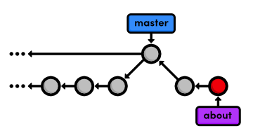
  <br>
  <em>Добавление ветки «about»</em>
</div>
<br>

### 3 Очередное экстренное обновление!

Наш руководитель только что сообщил нам еще одну важную новость! Опять же, мы будем использовать ветку hotfix, чтобы обновить сайт, не затрагивая разработку раздела «about». Убедитесь, что обновления базируются на ветке **master**, а не на ветке **developments**.
<br>

### О ветках:

```bash
git checkout master
git branch news-hotfix
git checkout news-hotfix
git branch
```

Измените раздел **"News"** в файле `index.html` на следующий код:

```html
<h2 style="color: #C00">News</h2>
<ul>
    <li><a href="news-1.html">Blue Is The New Hue</a></li>
    <li><a href="news-2.html">Our New Rainbow</a></li>
    <li><a href="news-2.html">A Red Rebellion</a></li>
</ul>
```

Сохраните снимок состояния:

```bash
git status
git commit -a -m "Add 2nd news item to index page"
```

Затем создайте новую страницу с именем `news-2.html` со следующим содержимым:

```html
<!DOCTYPE html>
<html lang="en">
    <head>
        <title>A Red Rebellion</title>
        <link rel="stylesheet" href="style.css" />
        <meta charset="utf-8" />
    </head>
    <body>
        <h1 style="color: #C03">A Red Rebellion</h1>
        <p>
            Earlier today, several American design firms announced that they
            have completely rejected the use of blue in any commercial ventures.
            They have opted instead for <span style="color: #C03">Red</span>.
        </p>
        <p><a href="index.html">Return to home page</a></p>
    </body>
</html>
```

Подготовьте и зафиксируйте еще один снимок:

```bash
git add news-2.html
git status
git commit -m "Add article for 2nd news item"
```

<br>

### 4 Публикация исправления новостей

Мы готовы слить обновление новостей обратно в мастер.

```bash
git checkout master
git merge news-hotfix
git branch -d news-hotfix
```

Ветка `master` не изменялась с тех пор, как мы создали `news-hotfix`, поэтому Git может выполнить fast-forward слияние. Теперь наш репозиторий выглядит следующим образом.

<div align="center">
  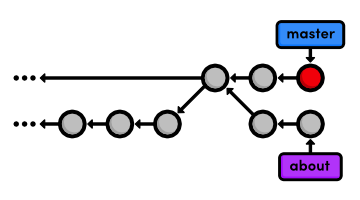
  <br>
  <em>Перемотка master к news-hotfix (fast-forward)</em>
</div>
<br>

### 5 Перебазирование ветки "О нас"

Это возвращает нас в ту же ситуацию, что и перед первым трёхсторонним слиянием. Мы хотим перенести изменения из `master` в функциональную ветку, но на этот раз мы сделаем это с помощью `rebase` вместо `merge`.

```bash
git checkout about
git rebase master
git log --oneline
```

Изначально ветка `about` была основана на коммите `crazy-experiment` при слиянии. `rebase` перенёс всю ветку `about` на вершину ветки `master`, как показано на следующей диаграмме. Также обратите внимание, что, как и команда `git merge`, `git rebase` требует, чтобы вы находились в той ветке, которую хотите переместить.

<div align="center">
  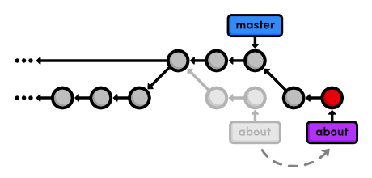
  <br>
  <em>Перебазирование ветки about на master</em>
</div>

После перебазирования `about` является линейным продолжением ветки `master`, что позволяет нам позже выполнить слияние «fast-forward». Перебазирование также позволило нам интегрировать наиболее актуальную версию `master` без коммита слияния.
<br>

### 6 Добавление личной биографии

Теперь, когда наша «горячая правка» новостей завершена, мы можем продолжить работу над разделом «о нас». Создайте файл `about/me.html` со следующим содержимым:

```html
<!DOCTYPE html>
<html lang="en">
    <head>
        <title>About Me</title>
        <link rel="stylesheet" href="../style.css" />
        <meta charset="utf-8" />
    </head>
    <body>
        <h1>About Me</h1>
        <p>I'm a big nerd.</p>
        <h2>Interests</h2>

        <ul>
            <li>Computers</li>
            <li>Mathematics</li>
            <li>Typography</li>
        </ul>

        <p><a href="index.html">Return to about page</a></p>
    </body>
</html>
```

Затем зафиксируйте изменения в репозитории.

```bash
git add about/me.html
git commit -m "Add HTML page for personal bio"
git log --oneline
```

Помните, что благодаря перебазированию `about` находится поверх `master`. Таким образом, все наши коммиты в раздел `about` сгруппированы вместе, чего не было бы в случае слияния вместо перебазирования. Это также устраняет ненужное ветвление в истории нашего проекта.
<br>

### 7 Добавление фиктивной страницы для Мэри

И снова следующие два снимка состояния излишне тривиальны.
Однако мы будем использовать интерактивный `rebase`,
чтобы объединить их в один коммит позже.
Именно так: `git rebase` не только позволяет перемещать ветки,
но и манипулировать отдельными коммитами по своему усмотрению.

Создайте новый пустой файл в разделе `about`: `about/mary.html`.

```Bash
git add about
git status
git commit -m "Add empty HTML page for Mary's bio"
```

<br>

### 8 Ссылка на раздел "О нас"

Затем добавьте ссылку на страницу `about` в файле `index.html`,
чтобы раздел `Navigation` выглядел следующим образом.

```HTML
<h2>Navigation</h2>
<ul>
  <li>
    <a href="about/index.html">About Us</a>
  </li>
  <li style="color: #F90">
    <a href="orange.html">The Orange Page</a>
  </li>
  <li>
    <a href="blue.html">The Blue Page</a>
  </li>
  <li>
    <a href="rainbow.html">The Rainbow Page</a>
  </li>
</ul>
```

Не забудьте зафиксировать изменения:

```Bash
git commit -a -m "Add link to about section in home page"
```

<br>

### 9 Очистка истории коммитов

Прежде чем слить изменения в основную ветку (_master_), мы должны убедиться, что у нас есть чистая и осмысленная история в ветке с новой функциональностью (_feature branch_). Перебазируя изменения интерактивно, мы можем выбрать, какие коммиты будут перенесены в новую базу. Чтобы указать интерактивное перебазирование, добавьте флаг _-i_ к команде _rebase_:

```
git rebase -i master
```

Откроется текстовый редактор со списком всех коммитов, сделанных в ветке _about_, от самых старых к newest. Формат списка точно определяет, как Git будет переносить коммиты в новую базу. Если оставить всё как есть, будет выполнено стандартное перебазирование Git. Но если мы переместим строки, мы сможем изменить порядок применения коммитов.

Кроме того, мы можем заменить команду _pick_ для каждой строки на _edit_, чтобы изменить коммит, или объединить его с другими коммитами. Все доступные команды перечислены в комментариях в верхней части списка перебазирования, но сейчас нам понадобится только команда _squash_. Она позволит объединить несколько мелких коммитов в один осмысленный снимок. Измените свой список так:

```bash
pick 5cf316e Add empty page in about section
squash 964e013 Add contents to about page
pick 89db9ab Add HTML page for personal bio
squash 2bda8e5 Add empty HTML page for Mary's bio squash 915466f Add link to about section in home page
```

Затем запустите перебазирование, сохранив и закрыв редактор. Следующий список подробно описывает процесс перебазирования и рассказывает, что нужно изменить по ходу дела.

1. Git перемещает коммит _5cf316e_ в вершину _master_.
2. Git объединяет снимки _964e013_ и _5cf316e_. Git предложит вам сообщение коммита для объединённого снимка. По умолчанию оно включает сообщения обоих коммитов, но вы можете удалить и упростить его до _Create the about page_. Сохраните и закройте редактор, чтобы продолжить.
3. Git повторяет этот процесс для коммитов _89db9ab_ и _2bda8e5_. Используйте _Begin creating bio pages for the message_.
4. Git добавляет финальный коммит (_915466f_) поверх коммитов, созданных на предыдущих шагах.

Результат всей этой деятельности можно увидеть с помощью _git log --oneline_, а также на диаграмме ниже. Изначально пять коммитов в _about_ были сжаты до трёх, и у двух из них новые сообщения. Также обратите внимание, что у них все разные _ID_ коммитов. Эти новые _ID_ говорят о том, что мы не просто переместили пару коммитов — мы буквально переписали историю репозитория с совершенно новыми коммитами.
<div align="center">
  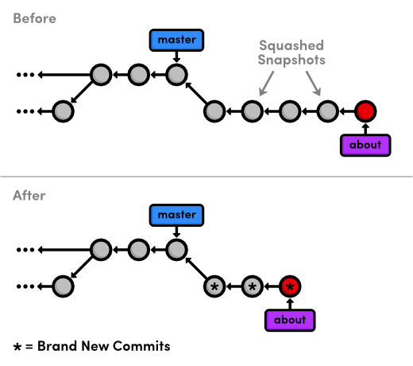
  <br>
  <em>Результаты интерактивного rebase</em>
</div>

Интерактивное перебазирование дает вам полный контроль над историей вашего проекта, но это также может быть очень опасно. Например, если бы вы удалили строку из списка перебазирования, связанный коммит не был бы перенесен в новую базу, и его содержимое было бы навсегда потеряно. В будущем модуле мы также увидим, как переписывание истории может создать проблемы с публичными репозиториями Git.
<br>

### 10 Остановка для изменения коммита

Предыдущий rebase просто остановился, чтобы дать нам возможность отредактировать сообщения для каждого коммита. Мы можем продвинуться на шаг дальше и изменить снимок во время rebase. Начните с запуска другого интерактивного сеанса rebase. Обратите внимание, что он снова будет использовать ветку `master` в качестве новой базы, потому что он выбирает необходимые коммиты из ветки `about`.

```bash
git rebase -i master
```

Укажите команду редактирования для второго коммита, как показано ниже.

```bash
pick 58dec2a Create the about page
edit 6aca9f Begin creating bio pages
pick 51c958c Add link to about section in home page
```

Когда Git начнет перемещать второй коммит на новую базу, он остановится, чтобы дать нам возможность выполнить некоторое "редактирование". Это дает вам возможность изменить подготовленный снимок перед коммитом.

<div align="center">
  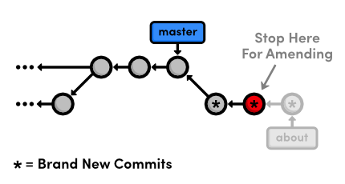
  <br>
  <em>Остановка для исправления коммита</em>
</div>

Мы оставим полезное сообщение для Мэри, с которой мы познакомимся в модуле _Удаленные репозитории_. Откройте файл `about/mary.html` и добавьте следующий текст:

```html
Mary, please update your bio!
```

Сейчас мы находимся между коммитами в процессе rebase, но можем изменить подготовленный снимок точно так же, как мы делали на протяжении всего этого руководства:

```bash
git add about/mary.html
git status
git commit --amend
```

Вы можете использовать сообщение по умолчанию, созданное командой `git commit`. Флаг `--amend` указывает Git заменить существующий коммит на новый снимок, вместо того чтобы создавать новый. Это также очень полезно для исправления преждевременных коммитов, которые часто происходят во время обычной разработки.
<br>

### 11 Продолжение интерактивного перебазирования

Помните, что мы находимся в середине rebase, и Git по-прежнему имеет еще один коммит, который необходимо повторно применить. Сообщите Git, что мы готовы перейти к следующему этапу, используя флаг `--continue`:

```bash
git rebase --continue
git log --oneline
```

Обратите внимание, что история все еще выглядит так же (поскольку мы использовали сообщение коммита по умолчанию выше), но коммит "Begin creating bio pages" содержит другое содержимое, чем до rebase, вместе с новым ID.

Если вы когда-нибудь заблудитесь в середине rebase и будете опасаться продолжать, вы можете использовать флаг `--abort`, чтобы отказаться от него и начать заново с нуля.
<br>

### 12 Публикация раздела "О нас"

Смысл всего этого интерактивного перебазирования заключается в создании осмысленной истории, которую мы можем слить обратно в ветку `master`. И поскольку мы сделали `rebase` относительно вершины `master`, Git сможет выполнить _fast-forward merge_ вместо использования коммита слияния для объединения двух веток.

```bash
git checkout master
git log --oneline
git merge about
git log --oneline
```

Не забудьте удалить устаревшую ветку `about`.

```bash
git branch -d about
```

Наша итоговая история показана на рисунке ниже. Как вы видите, линейная история гораздо легче для понимания, чем переходы _туда-сюда_ слияния из предыдущего модуля. Но с другой стороны, у нас нет ни малейшего представления о том, как мы пришли к нашему текущему состоянию.  
<div align="center">
  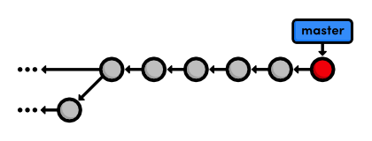
  <br>
  <em>Слияние и удаление ветки about</em>
</div>
<br>

### 13 Заключение

Перебазирование позволяет делать перемотку слияний за счет переноса одной ветки в конец другой. Это эффективно исключает необходимость в коммитах слияния,
в результате чего получается полностью линейная история. Для внешнего наблюдателя будет казаться, что вы создали каждую часть вашего проекта в
аккуратно спланированной последовательности, даже если вы исследовали различные альтернативы или разрабатывали несвязанные возможности параллельно.
Перебазирование дает вам возможность точно выбрать, что именно хранится в ваших репозиториях.

На самом деле это может быть довольно спорной темой в сообществе Git. Некоторые считают, что преимущества, описанные в этом модуле, не стоят
хлопот связанных с переписыванием истории. Они используют более "чистый" подход к Git, говоря, что история должна точно отражать то, что вы сделали,
гарантируя, что никакая информация не будет потеряна. Более того, расширенная конфигурация `git log` может отображать линейную историю из
высоко ветвящегося репозитория.

Однако, другие утверждают, что коммиты слияния должны быть осмысленными. Вместо слияния в произвольных моментах просто для обновления, они
утверждают, что коммиты слияния должны представлять символическое объединение двух веток. В частности, крупные программные проекты
(такие как ядро Linux) обычно выступают за интерактивное перебазирование, чтобы поддерживать репозиторий в чистоте и прямоте.

Использование `git rebase` полностью зависит от вас. Настройка вашего проекта может быть очень полезной, но вряд ли будет стоить хлопот, когда
вы можете добиться почти того же результата используя слияния. В качестве примечания, вы можете использовать следующую команду, чтобы
форсировать коммит слияния, когда Git обычно делает слияние с перемоткой.

```bash
git merge --no-ff <branch-name>
```

В следующем модуле мы немного глубже погрузимся в историю нашего проекта. Мы будем исправлять ошибки с помощью сложных перебазирований и
даже узнаем, как восстановить удаленные коммиты.
<br>

### 14 Краткий справочник (Перебазирование)

`git rebase <new-base>`  
Переместить коммиты из текущей ветки в конец `<new-base>`, где `<new-base>` может быть либо именем ветки, либо ID коммита.

`git rebase -i <new-base>`  
Выполнить интерактивное перебазирование и выбрать действия для каждого коммита.

`git commit --amend`  
Добавить подготовленные изменения к последнему коммиту вместо создания нового.

`git rebase --continue`  
Продолжить перебазирование после изменения коммита.

`git rebase --abort`  
Прервать текущее интерактивное перебазирование и вернуть репозиторий в исходное состояние.

`git merge --no-ff <branch-name>`  
Форсировать создание коммита слияния, даже если Git может выполнить слияние с перемоткой.
<div style="page-break-after: always;"></div>

# 7 Переписывание истории

Предыдущий модуль по перебазированию научил нас тому, как перемещать коммиты и выполнять некоторые базовые редактирования, делая это, но теперь мы собираемся действительно испачкать руки. Мы научимся тому, как расщеплять коммиты, оживлять потерянные снимки и полностью переписывать историю репозитория, чтобы она соответствовала нашим точным спецификациям.

Надеюсь, этот модуль сделает вас гораздо более комфортно с основными компонентами Git, поскольку мы будем инспектировать и редактировать внутреннюю структуру нашего проекта.
<div align="center">
  
  <br>
  <em>Скачайте репозиторий для этого модуля</em>
</div>

Если вы следили за предыдущим модулем, у вас уже есть все, что нужно. В противном случае скачайте заархивированный Git-репозиторий по ссылке выше, разархивируйте его, и вы готовы к работе.
<br>

### 1 Создание красной страницы

Сначала давайте создадим новую ветку и добавим несколько новых HTML-страниц.

```bash
git checkout -b new-pages
git branch
```

Обратите внимание, что мы создали новую ветку и переключились на неё в один шаг, передав флаг `-b` команде `git checkout`.
Затем создайте файл `red.html` и добавьте следующий контент:

```html
<!DOCTYPE html>
<html lang="en">
    <head>
        <meta charset="UTF-8" />
        <title>The Red Page</title>
        <link rel="stylesheet" href="style.css" />
    </head>
    <body>
        <h1 style="color: #C00">The Red Page</h1>
        <p>Red is the color of <span style="color: #C00">passion</span>!</p>
        <p><a href="index.html">Return to home page</a></p>
    </body>
</html>
```

Мы пока отложим коммит этой страницы.
<br>

### 2 Создание желтой страницы

Создайте файл с именем `yellow.html`, который должен выглядеть следующим образом.

```html
<!DOCTYPE html>
<html lang="en">
    <head>
        <title>The Yellow Page</title>
        <link rel="stylesheet" href="style.css" />
        <meta charset="utf-8" />
    </head>
    <body>
        <h1 style="color: #FF0">The Yellow Page</h1>
        <p>Yellow is the color of <span style="color: #FF0">the sun</span>!</p>
        <p><a href="index.html">Return to home page</a></p>
    </body>
</html>
```

<br>

### 3 Ссылка и коммит новых страниц

Далее мы свяжем обе новые страницы с домашней страницей. Добавьте следующие элементы в раздел «Навигация» в `index.html`:

```html
<li style="color: #C00">
    <a href="red.html">The Red Page</a>
</li>
<li style="color: #FF0">
    <a href="yellow.html">The Yellow Page</a>
</li>
```

Затем закоммитьте все эти изменения в одном снимке.

```bash
git add red.html yellow.html index.html
git status
git commit -m "Add new HTML pages"
```

Это пример плохого коммита. Он выполняет несколько несвязанных задач и имеет относительно общий текст коммита. Таким образом, мы не совсем указали, когда уместно коммитить изменения, но общие правила здесь, по сути, те же, что и для создания ветки:

-   Делайте коммит для каждого значимого добавления в ваш проект.
-   Не делайте коммит снимка, если вы не можете придумать для него одно конкретное сообщение.

Это обеспечит, что ваш проект имеет значимую историю коммитов, которая даст вам возможность точно видеть, когда и где была добавлена та или иная функция или была нарушена часть функционала. Однако на практике вы часто будете коммитить несколько изменений в одном снимке, поскольку вы не всегда будете знать, что представляет собой «чётко определённое» дополнение, пока разрабатываете проект. К счастью, Git позволяет вернуться назад и исправить такие проблемные коммиты постфактум.
<br>

### 4 Создание и коммит зеленой страницы

Давайте создадим ещё одну страницу, прежде чем разделить «плохой» коммит. Добавьте следующий HTML-код в файл с именем `green.html`:

```html
<!DOCTYPE html>
<html lang="en">
    <head>
        <title>The Green Page</title>
        <link rel="stylesheet" href="style.css" />
        <meta charset="UTF-8" />
    </head>
    <body>
        <h1 style="color: #0C0">The Green Page</h1>
        <p><span style="color: #0C0">Green</span> is the color of earth.</p>
        <p><a href="index.html">Return to home page</a></p>
    </body>
</html>
```

Добавьте ссылку на `index.html` в разделе «Навигация»:

```html
<li style="color: #0C0">
    <a href="green.html">The Green Page</a>
</li>
```

Наконец, добавьте «зелёную страницу» в индекс и закоммитьте снимок состояния:

```bash
git add green.html index.html
git status
git commit -m "Add green page"
```

<br>

### 5 Начало интерактивного перебазирования

Коммиты, внесённые в нашей ветке `new-pages`, выглядят так:

```bash
4c3027c: Add green page
db96c72: Add new HTML pages
```

Но мы хотим, чтобы они выглядели следующим образом:

```bash
4c3027c: Add green page
9bla64f: Add yellow page
77a1cf1: Add red page
```

Чтобы добиться этого, мы можем использовать тот же метод интерактивного rebase, который рассматривали в предыдущем модуле.  
На этот раз мы фактически создадим новые коммиты в процессе rebase.

```bash
git rebase -i master
```

Измените список rebase на следующий, затем сохраните файл и выйдите из редактора, чтобы начать rebase:

```bash
edit db96c72: Add new HTML pages
pick 4c3027c: Add green page
```

<br>

### 6 Отмена общего коммита

Сначала давайте посмотрим, в каком состоянии мы сейчас находимся, с помощью команды `git log --oneline`:

```
db966c72 Add new HTML pages
7070b0e Add link to about section in home page
...
```

Когда Git встретил команду `edit` в конфигурации команды `rebase`, он остановился и позволил нам отредактировать коммит. В результате зелёный коммит ещё не появился в нашей истории. Это должно быть знакомо вам из предыдущего модуля, где вместо изменения текущего коммита мы полностью его удалим:

```
git reset --mixed HEAD~1
git log --oneline
git status
```

Команда `git reset` перемещает снимок состояния, полученный при последнем коммите, к новому коммиту, а параметр `HEAD~1` указывает ей сбросить состояние к коммиту, который непосредственно предшествует текущему `HEAD` (так же, как и `HEAD~2` относится ко второму коммиту перед `HEAD`). В данном случае `HEAD~1` совпадает с `master`. Воздействие на наш репозиторий можно визуализировать следующим образом:

<div align="center">
  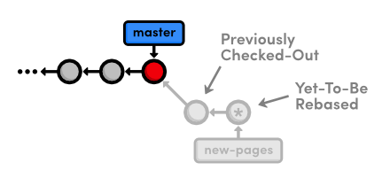
  <br>
  <em>Сброс к HEAD~1</em>
</div>

Вы можете вспомнить из раздела «Отмена изменений», что мы использовали `git reset --hard`, чтобы отменить все незафиксированные изменения в нашем проекте. Флаг `--hard` указывает Git привести рабочий каталог точно к состоянию последнего коммита, что даёт нам желаемый эффект — удаление всех незафиксированных изменений.

Однако в этот раз мы использовали флаг `--mixed`, чтобы сохранить рабочий каталог, содержащий изменения, которые мы хотим разделить. То есть указали `HEAD` переместиться, но при этом рабочий каталог остался неизменным. Разумеется, в результате у нас в репозитории остались незафиксированные изменения. Теперь у нас есть возможность добавить `red.html` и `yellow.html` в разные коммиты.
<br>

### 7 Разделение общего коммита

Давайте начнём с красной страницы. Поскольку мы хотим закоммитить только те изменения, которые касаются красной страницы, нам придётся вручную перейти к ней и удалить ссылку на жёлтую страницу из раздела «Навигация». В `index.html` измените этот раздел так, чтобы он соответствовал следующему:

```html
<h2>Навигация</h2>
<ul>
    <li>
        <a href="about.html">About Us</a>
    </li>
    <li style="color: #F90">
        <a href="orange.html">The Orange Page</a>
    </li>
    <li>
        <a href="blue.html">The Blue Page</a>
    </li>
    <li>
        <a href="rainbow.html">The Rainbow Page</a>
    </li>
    <li style="color: #C00">
        <a href="red.html">The Red Page</a>
    </li>
</ul>
```

Теперь мы можем сгруппировать изменения красной страницы в отдельный коммит.

```bash
git add red.html index.html
git status
git commit -m "Add red page"
```

Далее идёт жёлтая страница. Верните её в раздел «Навигация» в `index.html`:

```html
<li style="color: #FF0">
    <a href="yellow.html">The Yellow Page</a>
</li>
```

И снова добавьте файлы в индекс и закоммитьте снимок.

```bash
git add yellow.html index.html
git status
git commit -m "Add yellow page"
```

Мы успешно разделили содержимое одного коммита на два новых снимка, как показано ниже.

<div align="center">
  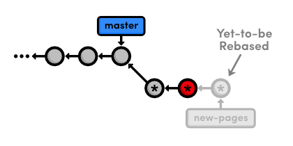
  <br>
  <em>Создание двух новых коммитов во время rebase</em>
</div>

Но не забудьте, что во время rebase нам всё ещё нужно перенести зелёную страницу:

```bash
git rebase --continue
```

В итоге, мы удалили «плохой» коммит из текущей ветки с помощью `git reset`, сохранив нетронутыми содержащиеся в нём HTML-файлы с помощью флага `--mixed`. Затем мы закоммитили их в отдельные снимки с помощью обычных команд `git add` и `git commit`. Важно помнить, что во время rebase вы можете добавлять, удалять и редактировать коммиты по своему усмотрению, и конечный результат будет перенесён на новую базу.
<br>
### 8 Удаление последнего коммита

Далее мы "случайно" удалим коммит с зелёной страницей, чтобы узнать, как извлечь его из внутренних данных репозитория Git.

```bash
git reset --hard HEAD~1
git status
git log --oneline
```

Эта команда перемещает извлечённый коммит назад на один снимок, вместе с указателем на ветку _new-pages_. Обратите внимание, что `git status` сообщает нам, что у нас нет ничего для коммита, поскольку флаг `--hard` удалил изменения в рабочем каталоге. И, конечно же, вывод `git log` больше не содержит зелёный коммит, так как указатель ветки _new-pages_ больше не ссылается на него.

Такое поведение немного отличается от сброса, который мы использовали при интерактивном перебазировании: на этот раз ветка переместилась вместе с новым `HEAD`. Поскольку мы находились на ветке _new-pages_ во время сброса, не было необходимости перемещать указатель ветки. Однако в общем случае команда `git reset` используется для перемещения указателей веток и необязательно для изменения рабочего каталога с помощью одного из своих многочисленных флагов (например, `--mixed` или `--hard`).

Удаление последнего коммита

Коммит, который мы удалили из ветки, теперь является _«висящим коммитом»_. _Висящие коммиты_ — это коммиты, которые недоступны ни из одной ветки, и поэтому им грозит опасность быть потерянными навсегда.

### 9 Открываем Reflog (Журнал Ссылок)

Git использует нечто, называемое reflog (журнал ссылок), для записи каждого изменения, которое вы вносите в свой репозиторий. Давайте посмотрим, что он содержит:

```bash
git reflog
```

Результирующий вывод должен выглядеть примерно так, как показано ниже. В зависимости от вашей версии Git, сообщения могут слегка различаться. Вы можете нажать клавишу Пробел, чтобы прокрутить содержимое, или `q`, чтобы выйти.

```plaintext
9b1a64f HEAD@{0}: reset: moving to HEAD~1
002185c HEAD@{1}: rebase -i (finish): returning to refs/heads/new-pages
002185c HEAD@{2}: rebase -i (pick): Add green page
9b1a64f HEAD@{3}: commit: Add yellow page
77alcfl HEAD@{4}: commit: Add red page
...
7070b0e HEAD@{5}: reset: moving to HEAD~1
```

Приведенный выше список отражает наши последние несколько действий. Например, текущий `HEAD`, обозначенный как `HEAD@{0}`, стал результатом сброса `HEAD` к `HEAD~1`. Четыре действия назад жёлтая страница была добавлена во время нашего rebase, как показано в `HEAD@{3}`.

Reflog — это хронологический список нашей истории, независимо от структуры ветвей репозитория. Это позволяет нам находить потерянные коммиты, которые иначе были бы утеряны в истории проекта.
### 10 Восстановление потерянного коммита

В начале каждой записи reflog вы найдёте идентификатор коммита,
представляющий HEAD после этого действия. Проверьте коммит по
`HEAD@{2}`, в котором должен быть добавлен rebase зелёной страницы
(замените ID ниже на ID из вашего reflog).

```bash
git checkout 002185c
```

Это переводит нас в состояние detached HEAD, что означает, что наш HEAD больше
не находится на конце ветки. Мы фактически находимся в противоположной ситуации
той, когда выполняли откат изменений, проверяя коммит перед вершиной
ветки. Сейчас мы смотрим на коммит после окончания ветки, но при
этом всё равно имеем detached HEAD:
<div align="center">
  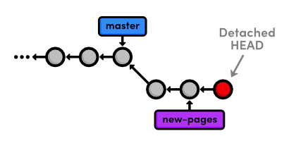
  <br>
  <em>Проверка dangling коммита</em>
</div>

Чтобы превратить наш dangling коммит в полноценную ветку, нам нужно её создать:

```bash
git checkout -b green-page
```

Теперь у нас есть ветка, которую можно слить обратно в проект:

<div align="center">
  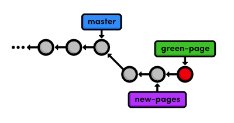
  <br>
  <em>Создание ветки из dangling коммита</em>
</div>

Приведённая выше диаграмма позволяет легко увидеть, что ветка `green-page`
является ответвлением от `new-pages`, но как бы мы это выяснили, если бы
не рисовали состояние нашего репозитория на каждом шагу?
<br>

### 11 Фильтрация истории коммитов

Чтобы просмотреть разницу между ветками, мы можем использовать синтаксис фильтрации журнала Git.

```bash
git log new-pages..green-page
```

Эта команда отобразит все коммиты, содержащиеся в `green-page`, которых нет в ветке `new-pages`. Приведенная выше команда говорит нам, что `green-page` содержит на один снимок больше, чем `new-pages`: наш "висящий" коммит (хотя он больше не является по-настоящему "висящим", поскольку мы создали для него ветку).

Вы также можете использовать этот синтаксис, чтобы ограничить вывод команды `git log`. Например, чтобы отобразить последние 4 коммита в текущей ветке, вы можете использовать:

```bash
git log HEAD~4..HEAD
```

Однако это слишком громоздко для такой обычной задачи, поэтому разработчики Git добавили флаг `-n` как более простой способ ограничить вывод.

```bash
git log -n 4
```

Параметр `-n 4` указывает Git отображать только последние четыре коммита из текущего `HEAD`, что делает его эквивалентным синтаксису `HEAD~4..HEAD`, показанному выше. Аналогично, `-n 3`, `-n 2` и `-n 1` будут отображать три, два и один коммит соответственно. Эта функция становится очень полезной, когда репозиторий разрастается за пределы одного экрана истории.
<br>

### 12 Слияние с восстановленной веткой

Мы восстановили потерянный коммит и теперь готовы слить всё обратно в основную ветку. Перед слиянием давайте посмотрим, что именно мы сливаем:

```bash
git checkout master
git log HEAD..green-page --stat
```

Команда `git log HEAD..green-page` показывает нам только те коммиты в `green-page`, которых нет в `master` (поскольку `master` является текущей веткой, мы можем ссылаться на нее как на `HEAD`). Новый флаг `--stat` включает информацию о том, какие файлы были изменены в каждом коммите. Например, последний коммит сообщает нам, что в файл `green.html` было добавлено 14 строк и 3 строки были добавлены в `index.html`:

```git
commit: 002185c7e1e6674915eb75be2e3ef4a1c52c7fdlb
Author: Ryan <ryan.example@rypress.com>
Date:   Wed Jan 31 06:49:50 2012 -0600

    Add green page

green.html | 14 ++++++++++++++
index.html |  3 +++
2 files changed, 17 insertions(+), 0 deletions(-)
```

Если бы мы не знали, что именно находится в этом новом коммите, вывод журнала сказал бы нам, какие файлы нужно просмотреть. Но поскольку мы сами сделали все эти изменения, мы можем сразу перейти к слиянию.

```bash
git merge green-page
```

На следующей диаграмме показано состояние нашего репозитория после слияния.
<div align="center">
  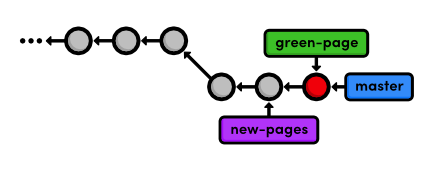
  <br>
  <em>Перемотка указателя основной ветки на ветку green-page</em>
</div>

Обратите внимание, что ветка `green-page` уже содержит всю историю ветки `new-pages`, поэтому мы слили первую вместо последней. Если бы это было не так, Git высказал бы жалобу, когда мы попытались бы запустить следующую команду.

```bash
git branch -d new-pages
```

Мы можем пойти дальше и удалить ветку `green-page`.

```bash
git branch -d green-page
```

<br>
### 13 Заключение

Этот модуль позволил нам детально изучить такие темы, как `rebase`, `reset` и `reflog`. Мы узнали, как разделить старые коммиты на один или несколько новых коммитов, а также как оживить «потерянные» коммиты. Возможно, это дало вам лучшее понимание взаимодействия между рабочим каталогом, областью подготовки, ветками и зафиксированными снимками. Мы также рассмотрели некоторые новые возможности отображения истории коммитов, что станет важным навыком по мере роста нашего проекта.

Мы много работали с советами по работе с ветками в этом модуле. Важно понимать, что Git использует верхушку ветки для представления всей ветки.

То есть ветка на самом деле является указателем на один коммит, а не контейнером для ряда коммитов. Эта идея была неявно отражена на наших диаграммах.

<div align="center">
  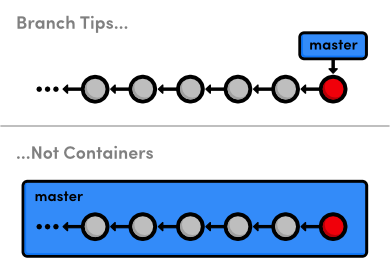
  <br>
  <em>Ветка tips, а не containers</em>
</div>

История представлена родителем каждого коммита (обозначенным стрелками), а не самой веткой. Таким образом, чтобы запросить новую ветку, Git должен создать ссылку на текущий коммит. А чтобы добавить снимок в ветку, нужно просто переместить ссылку ветки на новый коммит. Понимание представления веток в Git должно облегчить понимание слияния, перебазирования и других видов манипуляций с ветками.

Мы еще раз рассмотрим внутреннее представление репозитория Git в последнем модуле этого руководства. Но сейчас мы, наконец, готовы обсудить многопользовательскую разработку, которая, как правило, полностью основана на ветках Git.
<br>

### 14 Краткий справочник (Переписывание истории)

`git reflog`  
Отобразить локальную хронологическую историю репозитория.

`git reset --mixed HEAD~<n>`  
Переместить HEAD назад на $<n>$ коммитов, не изменяя рабочую директорию.

`git reset --hard HEAD~<n>`  
Переместить HEAD назад на $<n>$ коммитов и изменить рабочую директорию в соответствии с этим.

`git log <since>..<until>`  
Отобразить коммиты, доступные из $<until>$, но не из $<since>$. В качестве этих параметров могут выступать идентификаторы коммитов или имена веток.

`git log --stat`  
Включает дополнительную информацию об измененных файлах в вывод команды log.
<div style="page-break-after: always;"></div>

# 8 Удаленные репозитории

Проще говоря, удаленный репозиторий — это не ваш собственный репозиторий. Это может быть другой репозиторий Git в сети вашей компании, в Интернете или даже в вашей локальной файловой системе, но главное, что это отдельный репозиторий, отличный от вашего проекта `my-git-repo`.

Мы уже видели, как ветки могут упорядочить рабочий процесс в одном репозитории, но они также являются механизмом Git для обмена коммитами между репозиториями. Удаленные ветки работают так же, как и локальные ветки, которые мы использовали, с той лишь разницей, что они представляют ветку в чужом репозитории.
<div align="center">
  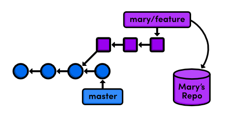
  <br>
  <em>Доступ к тематической ветке из удаленного репозитория</em>
</div>

Это означает, что мы можем адаптировать наши навыки слияния и перебазирования, чтобы сделать Git отличным инструментом для совместной работы. В течение следующих нескольких модулей мы будем изучать различные рабочие процессы с несколькими участниками, притворяясь разными разработчиками, работающими над нашим примерным веб-сайтом.

В нескольких частях этого модуля мы будем притворяться Мэри, графическим дизайнером нашего веб-сайта. Действия Мэри четко обозначены, в том числе ее имя указано в заголовке каждого шага.

<div align="center">
  
  <br>
  <em>Скачайте репозиторий для этого модуля</em>
</div>

Если вы следовали за предыдущим модулем, у вас уже есть все необходимое. В противном случае скачайте заархивированный репозиторий Git по ссылке выше, разархивируйте его, и вы готовы к работе.
<br>

### 1 Клонирование репозитория (Мэри)

Сначала Мэри нужно получить собственную копию репозитория для работы. В модуле "Распределенные рабочие процессы" мы обсудим сетевые удаленные репозитории, но сейчас мы просто сохраним их в локальной файловой системе.

```bash
cd /path/to/my-git-repo
git clone my-git-repo marys-repo
cd marys-repo
```

Первые две строки перемещают командную оболочку в вышеуказанный каталог my-git-repo. Убедитесь, что изменили /path/to/my-git-repo на актуальный путь к вашему репозиторию. Команда `git clone` копирует наш репозиторий в marys-repo, который будет находиться в том же каталоге, что и my-git-repo. Затем мы переходим в репозиторий Мэри, чтобы начать работу от ее имени.

Выполните команду `git log`, чтобы убедиться, что репозиторий Мэри на самом деле является копией исходного репозитория.
<br>

### 2 Настройка репозитория (Мэри)

Сначала Мэри нужно настроить свой репозиторий, чтобы мы знали, кто внес свой вклад в проект.

```bash
git config user.name "Mary"
git config user.email mary.example@rypress.com
```

Вы можете вспомнить из первого модуля, что мы использовали флаг `--global`, чтобы задать конфигурацию для всей установки Git. Но поскольку репозиторий Мэри находится в локальной файловой системе, ей нужна локальная конфигурация.

Используйте текстовый редактор, чтобы открыть файл с названием `config` в каталоге `.git` проекта Мэри (возможно, вам потребуется включить скрытые файлы, чтобы увидеть `.git`). Здесь хранятся локальные конфигурации, и мы видим, что информация Мэри находится в нижней части файла. Обратите внимание, что это переопределяет глобальную конфигурацию, которую мы установили в разделе "Основы".
<br>

### 3 Начало рабочего дня Мэри (Мэри)

Сегодня Мэри будет работать над своей страницей биографии, для чего должна создать отдельную ветку:

```bash
git checkout -b bio-page
```

Мэри может создавать и переключаться между ветками точно так же, как мы делали в нашей копии проекта. Ее репозиторий — это полностью изолированная среда разработки, и она может делать здесь все что угодно, не беспокоясь о том, что происходит в репозитории `my-git-repo`. Как и ветки являются абстракцией для рабочего каталога, подготовленный снимок и история коммитов являются абстракцией для веток.
<br>

### 4 Создать биографическую страницу (Мэри)

Давайте завершим создание страницы биографии Мэри. В `marys-repo` измените `about/mary.html` на:

```html
<!DOCTYPE html>
<html lang="en">
<head>
    <title>About Mary</title>
    <link rel="stylesheet" href="../style.css" meta charset="utf-8" />
</head>
<body>
    <h1>About Mary</h1>
    <p>I'm a graphic designer.</p>

    <h2>Interests</h2>
    <ul>
        <li>Oil Painting</li>
        <li>Web Design</li>
    </ul>

    <p><a href="index.html">Return to about page</a></p>
</html>
```

Опять же, мы разрабатываем это в отдельной ветке как часть лучшей практики: наша основная ветка предназначена только для стабильного, протестированного кода. Подготовьте снимок и зафиксируйте его, а затем взгляните на результат.

```bash
git commit -a -m "Add bio page for Mary"
git log -n 1
```

Поле `Author` в выводе команды `log` должно отражать локальные настройки конфигурации, которые мы сделали для имени и электронной почты Мэри. Помните, что флаг `-n 1` ограничивает вывод истории одним коммитом.
<br>

### 5 Опубликовать биографическую страницу (Мэри)

Теперь мы можем опубликовать страницу биографии, объединив ее с основной веткой.

```bash
git checkout master
```

```bash
git merge bio-page
```

Конечно, это приводит к fast-forward слиянию. В конечном итоге мы
перенесем эти изменения в `my-git-repo`, когда перестанем выдавать себя за Мэри. Вот как выглядит
репозиторий Мэри по сравнению с нашим:
<div align="center">
  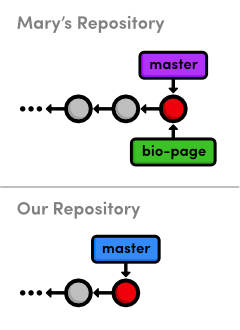
  <br>
  <em>Слияние ветки bio-page Мэри с ее master.</em>
</div>

Обратите внимание, что в обоих репозиториях есть обычные локальные ветки — мы еще не
взаимодействовали между двумя репозиториями, поэтому удаленных веток не видно.  
Прежде чем мы вернемся к `my-git-repo`, давайте посмотрим на удаленные подключения Мэри.
<br>

### 6 Просмотреть удаленные репозитории (Мэри)

Мэри может вывести список соединений с другими репозиториями с помощью
следующей команды.

```
git remote
```

Похоже, у неё есть удалённый репозиторий с именем `origin` (начало, источник).
При клонировании репозитория Git автоматически добавляет удалённый репозиторий
под названием `origin`, указывающий на оригинальный репозиторий, в предположении,
что вы, вероятно, захотите взаимодействовать с ним в дальнейшем. Мы можем
запросить немного больше информации с помощью флага `-v` (подробно, детально):

```
git remote -v
```

Эта команда показывает полный путь к нашему исходному репозиторию, подтверждая,
что `origin` является подключением к `my-git-repo`. Один и тот же путь указан в
качестве «извлечения» (_fetch_) и «отправки» (_push_). Мы скоро узнаем, что означают
эти термины.
<br>

### 7 Вернуться к своему репозиторию (Вы)

Итак, мы закончили быть Мэри и можем вернуться в наш собственный репозиторий.

```
cd ../my-git-repo
```

Обратите внимание, что страница биографии Мэри всё ещё пуста. Очень важно понимать, что этот репозиторий и репозиторий Мэри полностью разделены. Пока она изменяла свою страницу биографии, мы могли делать всевозможные другие вещи в `my-git-repo`. Мы даже могли изменить её страницу биографии, что привело бы к конфликту слияния, когда мы попытаемся извлечь её изменения.
<br>

### 8 Добавить Мэри как удаленный репозиторий (Вы)

Прежде чем мы сможем получить доступ к странице биографии Мэри, нам нужен доступ к её репозиторию. Давайте посмотрим на наш текущий список удалённых репозиториев:

```
git remote
```

У нас их нет (origin никогда не создавался, потому что мы ниоткуда не клонировали). Итак, давайте добавим Мэри в качестве удалённого репозитория.

```
git remote add mary ../marys-repo
git remote -v
```

Теперь мы можем использовать `mary`, чтобы ссылаться на репозиторий Мэри, который находится в `../marys-repo`. Команда `git remote add` используется для создания Git-репозитория для быстрого доступа, и наши подключения можно увидеть на рисунке ниже.
<div align="center">
  
  <br>
  <em>Подключения к удалённым репозиториям</em>
</div>

Теперь, когда наши удалённые репозитории настроены, мы потратим остальную часть модуля на обсуждение удалённых веток.
<br>

### 9 Получить ветки Мэри (Вы)

Как было отмечено ранее, мы можем использовать удаленные ветки, чтобы получить снимки из другого репозитория. Давайте посмотрим на наши текущие удаленные ветки с помощью флага `-r`:

```bash
git branch -r
```

Опять же, у нас их нет. Чтобы заполнить список наших удаленных веток, нам нужно получить ветки из репозитория Мэри:

```bash
git fetch mary
git branch -r
```

Это приведет к получению "местоположения выборки", показанного в `git remote -v`, и загрузит все ветки, найденные там, в наш репозиторий. Полученные ветки показаны ниже.

```bash
mary/bio-page
mary/master
```

Удаленные ветки всегда перечисляются в форме `<имя-удаленного-репозитория>/<имя-ветки>`, чтобы их нельзя было спутать с локальными ветками. Приведенный выше список отражает состояние репозитория Мэри на момент выборки, но они не будут автоматически обновляться, если Мэри продолжит развивать свои ветки.

То есть наши удаленные ветки не являются прямыми ссылками на репозиторий Мэри - это копии ее веток только для чтения, хранящиеся в нашем собственном репозитории. Это означает, что нам придется выполнить еще одну выборку, чтобы получить новые обновления.

<div align="center">
  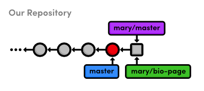
  <br>
  <em>Удаленные ветки Мэри в нашем репозитории</em>
</div>

На рисунке выше показано состояние нашего репозитория. У нас есть доступ к снимкам Мэри (представленным в виде квадратов) и ее веткам, даже несмотря на то, что у нас нет подключения к репозиторию Мэри в режиме реального времени.
<br>

### 10 Проверка удаленной ветки

Давайте извлечем удаленную ветку, чтобы просмотреть изменения Мэри.

```bash
git checkout mary/master
```

Эта команда переводит нас в состояние _detached HEAD_, как и при извлечении "висящего" коммита. Это не должно сильно удивлять, учитывая, что наши удаленные ветки — это копии веток Мэри. При извлечении удаленной ветки наш указатель `HEAD` перестает указывать на вершину локальной ветки, как показано на следующей диаграмме.

<div align="center">
  
  <br>
  <em>Извлечение ветки `master` Мэри</em>
</div>

Мы не можем продолжать разработку, если не находимся на локальной ветке. Чтобы продолжить с `mary/master`, нам нужно либо слить его в нашу собственную локальную ветку `master`, либо создать другую ветку. Мы сделали последнее в разделе "Ветки, часть 1", чтобы построить старый коммит, а в предыдущем модуле — чтобы восстановить "потерянный" коммит. Но прямо сейчас мы просто смотрим на то, что сделала Мэри, поэтому состояние _detached HEAD_ нас не сильно беспокоит.
<br>

### 11 Найти изменения Мэри

Мы можем использовать тот же синтаксис фильтрации журнала, что и в предыдущем модуле, чтобы просмотреть изменения Марии:

```bash
git log master..mary/master --stat
```

Это показывает нам, что Мария добавила в свою ветку master, но также хорошей идеей будет проверить, не добавили ли мы какие-либо новые изменения, которых нет в репозитории Марии:

```bash
git log mary/master..master --stat
```

Это ничего не выведет, поскольку мы не изменяли нашу базу данных с тех пор, как Мария клонировала ее. Другими словами, наша история не расходится — мы просто отстаем от коммита.
<br>

### 12 Применить изменения Мэри

Давайте одобрим изменения Марии и интегрируем их в нашу собственную ветку master.

```bash
git checkout master
git merge mary/master
```

Даже хотя `mary/master` — это удаленная ветка, это все равно приводит к быстрому объединению вперед, потому что существует линейный путь от нашей master до вершины `mary/master`:
<div align="center">
  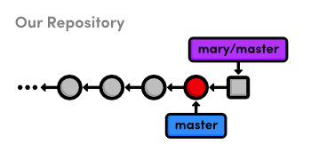
  <br>
  <em>До слияния ветки master Марии в нашу собственную</em>
</div>

После слияния снимки из удаленной ветки Марии становятся частью нашей локальной ветки master. В результате наша master теперь синхронизирована с версией Марии:
<div align="center">
  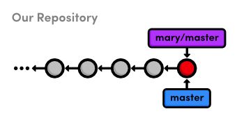
  <br>
  <em>После слияния ветки master Марии в нашу собственную</em>
</div>

Обратите внимание, что мы взаимодействовали только с веткой master Марии, даже хотя у нас был доступ к ее bio-page. Если бы мы не притворялись Марией, мы бы не знали, для чего предназначена эта ветка feature или готова ли она к слиянию. Но поскольку мы обозначили master как стабильную ветку для проекта, было безопасно интегрировать эти обновления (при условии, что Мария также знала об этом соглашении).
<br>

### 13 Отправить фиктивную ветку

Чтобы дополнить команду `git fetch`, мы кратко рассмотрим отправку изменений. Получение данных из репозитория и отправка в него — почти противоположные действия, так как получение импортирует ветки, а отправка экспортирует их в другой репозиторий. Рассмотрим подробнее:

```bash
git branch dummy
git push mary dummy
```

Эта команда создаёт новую ветку с именем `dummy` и отправляет её Мэри. Переключитесь в репозиторий Мэри, чтобы проверить результат:

```bash
cd ../marys-repo
git branch
```

Вы увидите новую ветку `dummy` в списке локальных веток. Как я уже сказал, `git fetch` и `git push` почти противоположны, потому что `git push` создаёт новую локальную ветку в удалённом репозитории, тогда как `git fetch` импортирует коммиты из удалённых веток в локальные.

Теперь представьте себя на месте Мэри. Она работала над своим проектом, когда внезапно у неё появилась новая ветка `dummy`, которая взялась ниоткуда. Очевидно, что отправка веток в чужие репозитории может создать хаос. Поэтому, как правило, **не следует отправлять ветки в репозитории других разработчиков**. Но тогда возникает вопрос: почему вообще существует команда `git push`?

В следующих модулях мы увидим, что `git push` — необходимый инструмент для управления публичными репозиториями. Пока просто запомните: никогда не отправляйте изменения в репозиторий одного из ваших друзей. Давайте избавимся от этих фиктивных веток и вернёмся к нашему репозиторию:

```bash
git branch -d dummy
cd ../my-git-repo
git branch -d dummy
```

<br>

### 14 Отправить новый тег

Важным свойством `git push` является то, что он не отправляет автоматически теги, связанные с определённой веткой. Давайте исследуем это, создав новый тег.

```bash
git tag -a v2.0 -m "An even stabler version of the website"
```

Теперь у нас есть тег `v2.0` в `my-git-repo`, что мы можем увидеть, выполнив команду `git tag`. Теперь давайте попробуем отправить ветку в репозиторий Мэри.

```bash
git push mary master
```

Git сообщит, что её ветка `master` уже актуальна, и её репозиторий останется неизменным. Вместо отправки ветки, содержащей тег, Git требует от нас вручную отправить сам тег:

```bash
git push mary v2.0
```

Теперь вы должны увидеть тег `v2.0` в репозитории Мэри с помощью команды `git tag`. Очень легко забыть отправить новые теги, поэтому, если кажется, что в вашем проекте пропал тег или два, скорее всего, это потому, что вы не отправили их в удалённый репозиторий.
<br>

### 15 Заключение

В этом модуле мы узнали, как можно использовать удалённые ветки для доступа к содержимому чужого репозитория. Удаленные репозитории, перечисленные в git, являются всего лишь закладками для полного пути к другому репозиторию. Мы использовали локальный путь, но вскоре увидим, что Git может использовать протокол SSH для доступа к репозиториям на другом компьютере.

Соглашение об использовании ветки `master` в качестве стабильной ветки позволило нам получать изменения без согласования с Мэри, но в данном случае этого не обязательно. При реализации собственного рабочего процесса Git предоставляет вам большую гибкость в отношении того, когда и откуда следует получать изменения от членов вашей команды. Пока вы чётко определяете соглашения об использовании удалённых репозиториев в своём проекте, вы можете назначать специальные цели или привилегии любой ветке.

Стоит отметить, что удалённые репозитории предназначены для людей, а ветки — для тем. Не создавайте отдельные ветки для каждого из ваших разработчиков — дайте им отдельные репозитории и пометьте их с помощью `git remote add`. Ветки всегда должны быть предназначены для разработки проекта, а не для управления пользователями.

Теперь, когда мы знаем, как Git обменивается информацией между репозиториями, мы можем добавить немного структуры в нашу среду разработки с несколькими пользователями. В следующем модуле будет показано, как настроить и получить доступ к общему центральному репозиторию.
<br>

### 16 Краткий справочник (Удаленные репозитории)

`git clone <remote-path>`
Создать копию удалённого репозитория Git.

`git remote`
Вывести список удалённых репозиториев.

`git remote add <remote-name> <remote-path>`
Добавить удалённый репозиторий.

`git fetch <remote-name>`
Загрузить информацию о ветках из удалённого репозитория, но не сливать с текущей веткой.

`git merge <remote-name>/<branch-name>`
Слить удалённую ветку с текущей веткой.

`git branch -r`
Вывести список удалённых веток.

`git push <remote-name> <branch-name>`
Отправить локальную ветку в удалённый репозиторий.

`git push <remote-name> <tag-name>`
Отправить тег в удалённый репозиторий.
<div style="page-break-after: always;"></div>

# 9 Централизованные рабочие процессы

В предыдущем модуле мы делились информацией напрямую между двумя репозиториями разработчиков: `my-git-repo` и `mary's-repo`. Это хорошо работает для очень маленьких команд, разрабатывающих простые программы, но более крупные проекты требуют более структурированной среды. В этом модуле представлен один из таких методов организации работы: **централизованный рабочий процесс**.

Мы будем использовать третий репозиторий Git в качестве центрального коммуникационного хаба между нами и Мэри. Вместо того, чтобы извлекать изменения напрямую из `mary's-repo` и наоборот, мы будем отправлять и забирать изменения из специального хранилища. После этого модуля наша рабочая схема будет выглядеть следующим образом.
<div align="center">
  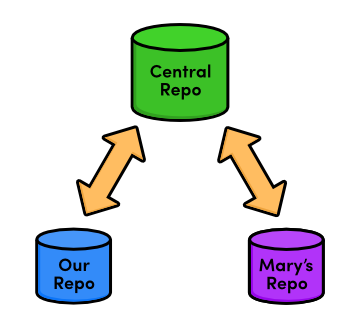
  <br>
  <em>Централизованный рабочий процесс</em>
</div>

Обычно центральный репозиторий хранится на сервере, чтобы обеспечить совместную работу через интернет. К сожалению, настройка сервера может различаться у разных хостинг-провайдеров, что затрудняет создание универсальных пошаговых инструкций. Поэтому мы продолжим изучать работу с удаленными репозиториями, используя локальную файловую систему, как и в предыдущем модуле.

Если у вас есть доступ к серверу, вы можете использовать его для размещения центрального репозитория, который мы собираемся создать. В этом случае вам нужно будет указать пути к репозиторию на сервере через SSH вместо путей, указанных ниже. Если у вас нет такой возможности, просто следуйте инструкциям этого модуля, и мы продолжим изучение работы с Git на основе сетевых репозиториев в следующем модуле.
<div align="center">
  
  <br>
  <em>Скачайте репозитории для этого модуля</em>
</div>

Если вы следовали предыдущему модулю, у вас уже есть все необходимое. В противном случае скачайте zip-архив с репозиториями Git по ссылке выше, разархивируйте их, и вы будете готовы к работе.
<br>

### 1 Создать пустой репозиторий (Центральный)

Сначала давайте создадим наш центральный «коммуникационный узел». Опять же, обязательно замените `/path/to/my-git-repo` на фактический путь к вашему репозиторию. Если вы решили разместить центральный репозиторий на своем сервере, вам следует подключиться к нему по SSH и выполнить команду `git init` в том месте, где вы хотите хранить репозиторий.

```bash
	$ cd /path/to/my-git-repo
	$ cd ..
	$ git init --bare central-repo.git
```

Как и в самом первом модуле, `git init` создает новый репозиторий. Но на этот раз мы использовали флаг `--bare`, чтобы указать Git, что нам не нужен рабочий каталог. Это предотвратит разработку в центральном репозитории, что исключит возможность нарушения окружения другого пользователя с помощью `git push`. Центральный репозиторий предназначен исключительно для хранения данных — это не среда разработки.

Если вы изучите содержимое полученной папки `central-repo.git`, вы заметите, что она содержит точно такие же файлы, как и папка `.git` в нашем проекте `my-git-repo`. Git просто избавился от нашего рабочего каталога. Окончание `.git` в названии директории — это общепринятый способ передачи этого свойства.
<br>

### 2 Обновить удаленные репозитории (Мэри и Вы)

Мы успешно настроили центральный репозиторий, который можно использовать для обмена обновлениями между нами, Мэри и любыми другими разработчиками. Далее нам следует добавить его в качестве удаленного репозитория как для `marys-repo`, так и для `my-git-repo`.

```bash
	$ cd marys-repo
	$ git remote rm origin
	$ git remote add origin ../central-repo.git
```

Теперь для нашего репозитория:

```bash
	$ cd ../my-git-repo
	$ git remote add origin ../central-repo.git
	$ git remote rm mary
```

Обратите внимание, что мы удалили удаленные подключения между Мэри и нашей папкой `my-git-repo` с помощью `git remote rm`. Для остальной части этого модуля мы будем использовать только центральный репозиторий для обмена обновлениями.

Если вы решите разместить центральный репозиторий на сервере, вам нужно будет изменить путь `./central-repo.git` на: `ssh://user@example.com/path/to/central-repo.git`, подставив ваше имя пользователя SSH и расположение сервера вместо `user@example.com` и расположение центрального репозитория вместо `path/to/central-repo.git`.
<br>

### 3 Отправить основную ветку (Вы)

Мы не клонировали центральный репозиторий — мы просто инициализировали его как bare-репозиторий. Это означает, что в нем пока нет истории нашего проекта. Мы можем это исправить, используя команду `git push`, представленную в последнем модуле.

```bash
git push origin master
```

Теперь наш центральный репозиторий содержит всю ветку master, что мы можем проверить следующим образом:

```bash
cd ../central-repo.git
git log
```

Эта команда должна вывести знакомый список истории для ветки master.

Напомним, что `git push` создает локальные ветки в целевом репозитории. Мы говорили, что отправлять изменения в репозиторий коллеги было бы небезопасно, так как это могло бы неожиданно создать новые ветки. Однако создание локальных веток в `central-repo.git` безопасно, поскольку в нем нет рабочей директории, а значит, невозможно нарушить чей-либо рабочий процесс.
<br>

### 4 Добавить новости (Вы)

Давайте посмотрим наш новый централизованный рабочий процесс в действии, зафиксировав еще несколько снимков.

```bash
cd ../my-git-repo
git checkout -b news-item
```

Создайте файл с именем `news-3.html` в `my-git-repo` и добавьте следующий HTML-код:

```html
<!DOCTYPE html>
<html lang="en">
    <head>
        <title>Middle East's Silent Beast</title>
        <link rel="stylesheet" href="style.css" />
        <meta charset="utf-8" />
    </head>
    <body>
        <h1 style="color: #F90">Middle East's Silent Beast</h1>
        <p>
            Late yesterday evening, the Middle East's largest design houses;
            until now, silent on the West's colorful
            <span style="color: #090">disagreement</span> andmdash; announced
            the adoption of <span style="color: #090">Yellow</span> as this
            year's color of choice.
        </p>
        <p><a href="index.html">Return to home page</a></p>
    </body>
</html>
```

Затем добавьте ссылку на раздел "News" в `index.html`, чтобы она выглядела так:

```html
<h2 style="color: #C00">News</h2>
<ul>
    <li><a href="news-1.html">Blue Is The New Hue</a></li>
    <li><a href="news-2.html">Our New Rainbow!</a></li>
    <li><a href="news-2.html">A Red Rebellion</a></li>
    <li><a href="news-3.html">Middle East's Silent Beast</a></li>
</ul>
```

Подготовьте и зафиксируйте снимок.

```bash
git add news-3.html index.html
git status
git commit -m "Add 3rd news item"
```

<br>

### 5 Опубликовать новость (Вы)

Ранее «публикация» означала слияние с локальной основной веткой. Но поскольку мы взаимодействуем только с центральным репозиторием, наша основная ветка снова является приватной. Таким образом, Мэри не сможет напрямую получить содержимое из нашего репозитория.

Вместо этого все обращаются к обновлениям через публичную основную ветку, поэтому «публикация» означает push в центральный репозиторий.

```bash
git checkout master
git merge news-item
git branch -d news-item
git push origin master
```

После слияния с `master`, как мы обычно делаем, `git push` обновит основную ветку (`master`) в центральном репозитории, чтобы она отражала наш локальный `master`. С нашей точки зрения, `push` можно представить следующим образом:
<div align="center">
  
  <br>
  <em>Push-ание master в центральный репозиторий</em>
</div>

Обратите внимание, что это выполняет **ровно то же самое**, что и переход в центральный репозиторий и выполнение `fetch` / fast-forward слияния, за исключением того, что `git push` позволяет нам сделать все изнутри `my-git-repo`. Позже в этом модуле мы рассмотрим некоторые другие удобные функции этой команды.
<br>

### 6 Обновить CSS-стили (Мэри)

Далее давайте снова представим, что мы Мэри, и добавим немного CSS-форматирования (ведь именно она наш графический дизайнер).

```bash
cd ../mary-s-repo
git checkout -b css-edits
```

Добавьте следующее в конец файла _style.css_:

```css
h1 {
    font-size: 32px;
}

h2 {
    font-size: 24px;
}

a:link,
a:visited {
    color: #03c;
}
```

И проиндексируйте снимок и зафиксируйте его.

```bash
git commit -a -m "Add CSS styles for headings and links"
```

<br>

###  7 Обновить другой CSS-стиль (Мэри)

Ой, Мэри забыла добавить форматирование. Добавьте стилизацию для `h3` в файл _style.css_:

```css
h3 {
    font-size: 18px;
    margin-left: 20px;
}
```

И конечно, проиндексируйте и закоммитьте обновления.

```
git commit -a -m "Add CSS styles for 3rd level headings"
```

<br>

### 8 Привести код в порядок перед публикацией (Мэри)

Прежде чем Мэри решит отправить свои обновления в центральный репозиторий, ей нужно убедиться, что у неё чистая история. Это необходимо сделать до публикации, потому что изменить историю после того, как она станет публичной, практически невозможно.

```bash
git rebase -i master
```

Это подчёркивает ещё одно преимущество использования изолированных веток для разработки независимых функций. Мэри не нужно возвращаться и выяснять, какие изменения необходимо перебазировать, поскольку все они находятся в её текущей ветке. Измените конфигурацию `rebase` на следующую:

```bash
pick 681bd1c Add CSS styles for headings and links
squash e8ac688 Add CSS styles for 3rd level headings
```

Когда Git перестанет запрашивать комбинированное сообщение коммита, просто используйте сообщение первого коммита:

```
Add CSS styles for headings and links
```

Подумайте, что произошло бы, если бы Мэри сделала `rebase` после отправки изменений в центральный репозиторий. Она бы переписала коммиты, которые другие разработчики уже могли включить в свои проекты. Для Git переписанные коммиты выглядят как совершенно новые коммиты (поскольку у них разные идентификаторы). Эта ситуация показана ниже.
<div align="center">
  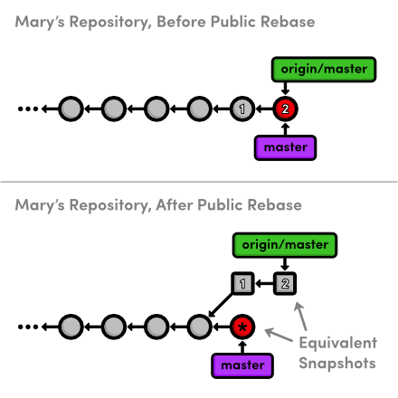
  <br>
  <em>Сжатие публичного коммита</em>
</div>

Коммиты с метками $1$ и $2$ являются публичными коммитами, которые Мэри будет
перебазировать. После этого публичная история остается точно такой же, как и
оригинальная история Мэри, но теперь ее локальная ветка `master` разошлась
с `origin/master`, хотя они представляют один и тот же снимок.

Таким образом, чтобы опубликовать перебазированную ветку `master` в центральном
репозитории, Мэри пришлось бы выполнить слияние с `origin/master`. Это не может
быть быстрым слиянием, и результирующий коммит слияния, скорее всего, запутает
ее коллег и нарушит их рабочий процесс.

Это приводит нас к самому важному правилу, которое следует помнить при
перебазировании: Никогда, никогда не перебазируйте коммиты, которые были
опубликованы в общий репозиторий.

Если вам нужно изменить публичный коммит, используйте команду `git revert`, которую
мы обсуждали в разделе "Отмена изменений". Она создает новый коммит с
необходимыми изменениями вместо перезаписи старых снимков.
<br>

### 9 Опубликовать изменения CSS (Мэри)

Теперь, когда история изменений приведена в порядок, Мэри может опубликовать свои наработки.

```bash
git checkout master
git merge css-edits
git branch -d css-edits
```

Она не должна отправлять ветку `css-edits` на сервер, поскольку она больше не находится в разработке, и другие участники не знают, что она содержит. Однако, если бы мы решили разрабатывать правки CSS вместе и хотели иметь изолированную среду для этого, то публикация этой ветки имела бы смысл.

Мэри все еще нужно отправить свои изменения в центральный репозиторий. Но сначала давайте посмотрим на состояние проекта у всех его участников.
<div align="center">
  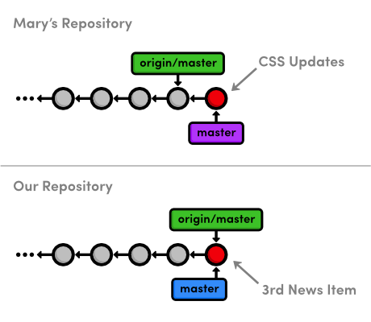
  <br>
  <em>До публикации изменений CSS от Мэри</em>
</div>

Вы можете задаться вопросом, как Мэри сможет обновить свою локальную ветку `master` в центральном репозитории, поскольку с момента ее последнего обновления в нем появились новые изменения. Это обычная ситуация, когда несколько разработчиков работают над проектом одновременно. Давайте посмотрим, как `Git` с этим справляется:

```bash
git push origin master
```

Эта команда выведет подробное сообщение об отклонении. Похоже, что `Git` не позволяет никому отправлять изменения на удаленный сервер, если это не приводит к перемотке вперед (`fast-forward merge`). Это предотвращает потерю коммита `Add 3rd news item`, который был бы перезаписан при обновлении `origin/master` для соответствия `mary/master`.
<br>

### 10 Внести изменения (Мэри)

Мари может решить эту проблему, подтянув изменения из центрального репозитория, прежде чем пытаться запушить свои изменения в CSS. Сначала ей нужна самая последняя версия ветки `origin/master`.

```
git fetch origin
```

Мари может просмотреть коммиты, которые есть в `origin/master`, но отсутствуют в её локальной ветке `master`, используя синтаксис `..`:

```
git log master..origin/master
```

Аналогично, она может просмотреть коммиты, которые есть в её локальной ветке `master`, но отсутствуют в `origin/master`, выполнив:

```
git log origin/master..master
```

Поскольку обе эти команды выводят коммиты, можно сделать вывод, что история Мари разошлась. Это также можно увидеть на диаграмме ниже, где показана обновлённая ветка `origin/master`.
<div align="center">
  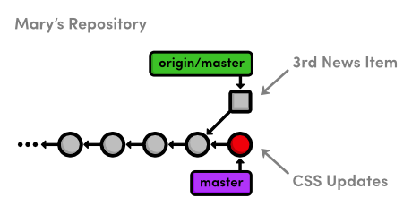
  <br>
  <em>Получение ветки master из центрального репозитория</em>
</div>

Теперь Мэри оказалась в типичной ситуации, когда необходимо подтянуть изменения из другой ветки. Она может либо выполнить слияние, которое нельзя сделать ускоренным перемещением, либо перебазировать свою ветку.
Обычно вы будете перебазировать свои изменения поверх тех, которые находятся в центральном репозитории. Это равносильно тому, как если бы вы сказали: «Я хочу добавить свои изменения к тому, что уже сделали все остальные». Как обсуждалось ранее, перебазирование также устраняет лишние коммиты слияния. По этим причинам Мэри выберет перебазирование.

```
 git rebase origin/master
 git push origin master
```

После перебазирования ветка `master` Мэри содержит все изменения из центрального репозитория,
поэтому она может выполнить ускоренный `push`, чтобы опубликовать свои изменения.
<div align="center">
  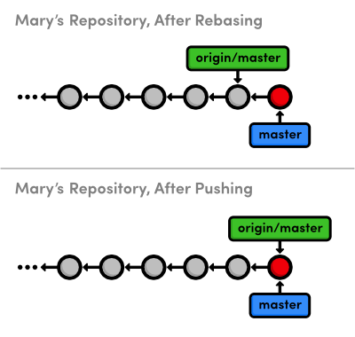
  <br>
  <em>Обновление ветки master в центральном репозитории</em>
</div>
<br>

### 11 Внести изменения (Вы)
Наконец, мы переключимся обратно на наш репозиторий и применим форматирование CSS от Мэри.

```bash
cd ../my-git-repo
git fetch origin
git log master..origin/master --stat
git log origin/master..master --stat
```

Конечно, вторая команда `log` ничего не выведет, так как мы не добавили никаких новых коммитов, пока Мэри вносила изменения в CSS. Обычно хорошей идеей является проверка этого перед попыткой слияния с удаленной веткой. В противном случае вы можете получить несколько лишних коммитов слияния, когда думали, что просто выполняете прямое обновление своей ветки.

```bash
git merge origin/master
```

Наш репозиторий теперь синхронизирован с центральным репозиторием. Обратите внимание, что Мэри, возможно, уже продвинулась дальше и добавила новый контент, о котором мы не знаем. Единственные изменения, о которых нам нужно знать, находятся в `central-repo.git`. Хотя это не имеет большого значения, когда мы работаем с одним другим разработчиком, представьте, что вам приходится отслеживать репозитории десятка разных разработчиков в режиме реального времени. Именно эту проблему призван решить централизованный рабочий процесс совместной работы:  
<div align="center">
  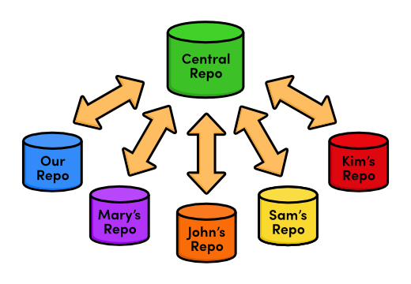
  <br>
  <em>Централизованный рабочий процесс с несколькими разработчиками</em>
</div>

Наличие центрального концентратора связи объединяет всю эту разработку в одном репозитории и гарантирует, что никто не перезапишет изменения другого, как мы обнаружили, пытаясь применить обновления CSS от Мэри.  
<br>

### 12 Заключение

В этом модуле мы ввели еще одно удаленное хранилище, которое служит центральным хранилищем для нашего проекта. Мы также познакомились с пустыми хранилищами, которые являются обычными хранилищами, но без рабочего каталога. Пустые хранилища обеспечивают "безопасное" место для отправки ветвей, если вы не перезаписываете коммиты, которые уже есть в хранилище.

Мы разместили центральное хранилище в нашей локальной файловой системе, рядом с проектами и нашим, и Мэри. Однако в реальности центральные хранилища обычно находятся на удаленном сервере с доступом к Интернету. Это позволяет любому разработчику получить данные из хранилища или отправить изменения в него через Интернет, делая Git мощной платформой для совместной разработки. Наличие центрального хранилища на удаленном сервере также является недорогим и удобным способом резервного копирования проекта.

Далее мы настроим сетевое хранилище с помощью сервиса GitHub. Помимо обеспечения доступа к хранилищу через Интернет, это откроет возможность для другого стандарта совместной работы: интеграционного рабочего процесса.
<br>

### 13 Краткий справочник (Централизованные рабочие процессы)

`git init --bare <repository-name>`  
Создает Git-хранилище без рабочего каталога.

`git remote rm <remote-name>`  
Удаляет указанное удаленное хранилище из списка сохраненных подключений.
<div style="page-break-after: always;"></div>

# 10 Распределенные рабочие процессы

Теперь, когда мы знаем, как делиться информацией через централизованный рабочий процесс, мы можем оценить некоторые недостатки этой модели совместной работы. Хотя может быть удобно разрешать всем отправлять изменения в "официальный" репозиторий, это вызывает некоторые законные проблемы с безопасностью. Это означает, что любой, кто хочет внести свой вклад в контент, должен иметь доступ к проекту.

Это хорошо, если вы работаете только с небольшой командой, но представьте себе ситуацию, когда вы работаете над программным продуктом с открытым исходным кодом и кто-то посторонний нашел ошибку, исправил ее и хочет включить обновление в основной проект. Вы, скорее всего, не захотите давать им доступ к вашему центральному репозиторию, так как они могут начать отправлять все виды случайных снимков, и вы фактически потеряете контроль над проектом.

Но что вы можете сделать? Вы можете попросить участника внести изменения в свой собственный публичный репозиторий. Затем вы можете извлечь исправление ошибки в свой приватный репозиторий, чтобы убедиться, что он не содержит неутвержденного кода. Если вы одобрите их вклад, все, что вам нужно сделать, это объединить их изменения в локальную ветку и отправить ее в основной репозиторий, как мы это делали в предыдущем модуле. Вы стали интегратором, в дополнение к тому, что являетесь обычным разработчиком:
<div align="center">
  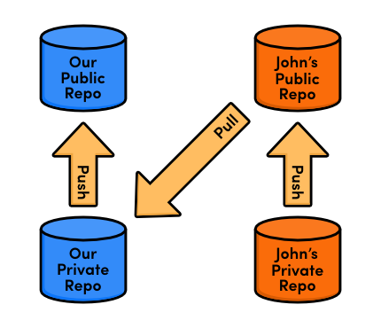
  <br>
  <em>Рабочий процесс интегратора</em>
</div>

В этом модуле мы всесторонне изучим его на собственном опыте, создав бесплатный публичный репозиторий на Bitbucket.org и включив в него вклад от анонимного разработчика по имени Джон.Bitbucket - это провайдер хостинга DVCS, который позволяет очень легко настроить репозиторий Git и начать совместную работу с командой разработчиков.

<div align="center">
  
  <br>
  <em>Скачайте репозитории для этого модуля</em>
</div>

Если вы следовали за материалом с предыдущего модуля, у вас уже есть всё необходимое. В противном случае скачайте заархивированные репозитории Git по ссылке выше, разархивируйте их, и вы готовы к работе.
<br>

### 1 Создать учётную запись Bitbucket

Первая часть этого модуля будет посвящена созданию учётной записи Bitbucket. Откройте ваш браузер и перейдите на Bitbucket.org, затем зарегистрируйте бесплатную учётную запись.
<div align="center">
  
  <br>
  <em>Логотип Bitbucket</em>
</div>
Вы можете выбрать любое имя пользователя для своей учётной записи, но адрес электронной почты должен совпадать с тем, который вы указали при установке Git в разделе «The Basics». Если вам нужно изменить свой email, вы можете выполнить команду  
**another git config --global user.email you@example.com**.
<br>

### 2 Создать публичный репозиторий (Вы)

Чтобы создать наш первый сетевой репозиторий Git, войдите в свою учётную запись Bitbucket и перейдите в раздел **Repositories > Create repository**. Используйте **my-git-repo** в качестве имени репозитория, а в качестве описания можете указать всё, что угодно. Поскольку это всего лишь пример проекта, снимите флажок с поля «частный репозиторий». Выберите **HTML/CSS** в поле «Язык», затем нажмите **Create repository**.
<div align="center">
  
  <br>
  <em>Форма создания нового репозитория в Bitbucket</em>
</div>

По сути, мы только что выполнили команду **git init --bare** на сервере Bitbucket. Теперь мы можем отправлять данные в этот репозиторий и получать их оттуда, как мы делали с **central-repo.git** в предыдущем модуле.

После инициализации Bitbucket предлагает некоторые полезные инструкции, но мы пока не будем следовать им — мы рассмотрим импорт существующего репозитория в следующем разделе.
<div align="center">
  
  <br>
  <em>Инструкции по настройке Bitbucket</em>
</div>
<br>

### 3 Загрузить в публичный репозиторий (Вы)

Прежде чем наполнить этот новый репозиторий содержимым нашего существующего проекта my-git-repo, нам нужно указать наш origin удаленного репозитория на репозиторий Bitbucket. Убедитесь, что вы изменили часть `<username>` на ваше фактическое имя пользователя Bitbucket.

```bash
cd /path/to/my-git-repo
git remote rm origin
git remote add origin https://<username>@bitbucket.org/<username>/my-git-repo.git
```

Полезность удаленных репозиториев теперь должна быть более очевидной, чем в предыдущих модулях, поскольку ввод полного пути к этому репозиторию каждый раз, когда нам нужно взаимодействовать с ним, был бы довольно утомительным.

Чтобы наполнить удаленный репозиторий нашим существующим кодом, мы можем использовать тот же механизм push, что и при централизованном рабочем процессе. Когда будет предложено ввести пароль, используйте тот, с которым вы зарегистрировались.

```bash
git push origin master
```

<br>

### 4 Просмотреть публичный репозиторий (Вы)

Теперь мы должны иметь возможность увидеть наш проект на сайте Bitbucket. Вкладка Source отображает все файлы в проекте, а вкладка Commits содержит всю историю коммитов. Обратите внимание, что структура ветвей репозитория также визуализируется слева от каждого коммита.
<div align="center">
  
  <br>
  <em>Наша история во вкладке Commits в Bitbucket</em>
</div>

Теперь этот репозиторий служит "официальной" копией нашего примера веб-сайта. Мы расскажем всем остальным, чтобы они скачивали отсюда, и будем отправлять все изменения из нашего локального репозитория my-git-repo. Однако важно отметить, что этот статус "официального" репозитория — не более чем соглашение. Поскольку ветка master — это просто еще одна ветка, наш репозиторий Bitbucket является просто еще одним репозиторием с точки зрения Git.

Наличие как публичного, так и приватного репозитория для каждого разработчика значительно упрощает включение вклада третьих сторон, даже если вы никогда не встречались с ними ранее.
<br>

### 5 Клонировать репозиторий (John)

Далее мы представим, что мы Джон, сторонний участник, вносящий вклад в наш веб-сайт. Джон заметил, что у нас нет розовой страницы, и, будучи дружелюбным разработчиком, хочет создать её для нас. Мы бы хотели, чтобы он поучаствовал, но не хотим давать ему прямой доступ к нашему репозиторию — это позволит ему переписать или даже удалить всю нашу работу.

К счастью, Джон знает, как использовать возможности Bitbucket для совместной работы. Он начнёт с клонирования копии нашего публичного репозитория:

```bash
cd /path/to/my-git-repo
..
git clone http://bitbucket.org/<username>/my-git-repo.git
johns-repo
cd johns-repo
```

Теперь у вас должна быть ещё одна копия нашего репозитория под названием johns-repo в том же каталоге, что и my-git-repo. Это частный репозиторий Джона — полностью изолированная среда, где он может безопасно разработать розовую страницу. Давайте быстро настроим его имя и электронную почту:

```bash
git config user.name "John"
git config user.email john.example@rypress.com
```

<br>

### 6 Добавить розовую страницу (John)

Конечно же, Джон должен разрабатывать свои материалы на отдельной ветке для этой функциональности.

```bash
git checkout -b pink-page
```

Помимо того, что это хорошая практика, это облегчает интегратору возможность увидеть, какие коммиты следует включить. Когда Джон закончит, он сообщит нам, где найти его репозиторий и в какой ветке находится новая функциональность. Тогда мы сможем слить его содержимое с минимальными усилиями.

Создайте файл `pink.html` и добавьте следующий код:

```html
<!DOCTYPE html>
<html lang="en">
    <head>
        <title>The Pink Page</title>
        <link rel="stylesheet" href="style.css" />
        <meta charset="utf-8" />
    </head>
    <body>
        <h1 style="color: #F0F">The Pink Page</h1>
        <p>Pink is a <span style="color: #F0F">girly, flirty and fun</span>!</p>
        <p><a href="index.html">Return to home page</a></p>
    </body>
</html>
```

Добавьте розовую страницу в раздел «Навигация» в `index.html`:

```html
<li style="color: #F0F">
    <a href="pink.html">The Pink Page</a>
</li>
```

Затем проиндексируйте и зафиксируйте снимок состояния как обычно.

```bash
git add pink.html index.html
git status
git commit -m "Add pink page"
```

<br>

### 7 Опубликовать розовую страницу (John)

Теперь Джону нужно опубликовать свои изменения в публичном репозитории.
Помните, что мы не хотим, чтобы он отправил свои изменения в наш публичный репозиторий,
который хранится в его внешнем репозитории `origin`. На самом деле, он не может
отправить изменения в `origin`.

По причинам, которые мы обсудим позже, вместо этого он создаст свой собственный
репозиторий на `Bitbucket`, из которого мы сможем извлечь его изменения. В реальном
мире у Джона был бы свой собственный репозиторий на `Bitbucket`, но для удобства мы
просто создадим публичный репозиторий под нашей существующей учетной записью. Еще
раз перейдите на домашнюю страницу `Bitbucket` и нажмите `Репозитории > Создать репозиторий`,
чтобы создать публичный репозиторий Джона. Для поля `Имя` используйте `johns-repo`.
<br>

### Создание нового репозитория

<div align="center">
  
  <br>
  <em>Новая форма репозитория Джона</em>
</div>

В приватном репозитории Джона нам нужно добавить этот репозиторий как внешний с
помощью команды:

```bash
git remote add john-public https://<username>@bitbucket.org/<username>/johns-repo.git
```

Именно здесь Джон опубликует розовую страницу для нашего доступа. Поскольку он
отправляет изменения с использованием `HTTPS`, ему потребуется ввести пароль
от своей учетной записи `Bitbucket` (который на самом деле является паролем вашей
учетной записи).

```bash
git push john-public pink-page
```

Теперь Джону нужно всего лишь сообщить нам имя ветки с новой функциональностью и
прислать ссылку на свой репозиторий, которая будет выглядеть так:

```
http://bitbucket.org/<username>/johns-repo.git
```

Обратите внимание, что Джон использовал другой путь для отправки изменений в свой
публичный репозиторий, чем тот, который мы использовали для извлечения данных из
него. Самое важное различие здесь — это протокол передачи: первый использовал
`https://`, а последний — `http://`. Доступ к репозиторию через `HTTPS` (или `SSH`)
позволяет вам отправлять изменения, но, как мы видели, требует пароль. Это
предотвращает перезапись коммитов неизвестными разработчиками.

С другой стороны, извлечение данных через `HTTP` не требует имени пользователя или
пароля, но отправка изменений таким образом невозможна. Это позволяет любому
извлекать данные из репозитория, не нарушая его безопасность. В рабочем процессе
интегратора другие разработчики получают доступ к вашему репозиторию через `HTTP`,
а вы публикуете изменения через `HTTPS`. Именно поэтому Джон не может отправить
изменения в свой внешний репозиторий `origin`.

Конечно, если вы работаете над частным проектом, анонимный доступ по `HTTP` будет
отключен для этого репозитория.
<br>

### 8 Посмотреть вклад John (Вы)

Итак, с Джоном мы закончили и теперь готовы интегрировать его код в официальный проект. Давайте для начала вернёмся в наш репозиторий и добавим публичный репозиторий Джона в качестве удалённого.

```bash
cd ../my-git-repo
```

```bash
git remote add john http://bitbucket.org/<username>/johns-repo.git
```

Обратите внимание, что нас не интересует содержимое приватного репозитория Джона — всё, что имеет значение, это опубликованные им изменения. Давайте загрузим его ветки и посмотрим, над чем он работал:

```bash
git fetch john
git branch -a
git log master..john/pink-page --stat
```

Всю эту информацию об истории коммитов можно визуализировать следующим образом.
<br>

### Наш репозиторий

<div align="center">
  
  <br>
  <em>До объединения ветки Джона pink-page</em>
</div>

Давайте посмотрим на внесённые им изменения:

```bash
git checkout john/pink-page
```

Откройте файл `pink.html` и проверьте, всё ли с ним в порядке. Помните, что Джон не является доверенным участником команды, и мы не имеем представления о том, что из себя представляет содержимое этого файла. В связи с этим чрезвычайно важно проверить содержимое перед любыми дальнейшими действиями. Никогда не объединяйте без проверки содержимое от стороннего участника.
<br>

### 9 Интегрировать вклад John (Вы)

Предполагая, что мы одобряем исправления Джона, сейчас мы готовы их слить с проектом.

```bash
git checkout master
git merge john/pink-page
```

Обратите внимание, что это в точности тот же способ, которым мы включали исправления Марии в централизованный поток работ, за исключением того, что теперь мы забираем и отправляем изменения в/из разных мест:
<div align="center">
  
  <br>
  <em>Поток работ интегратора c Джоном</em>
</div>

Кроме того, поток работ Джона такой же, как наш: разработка в локальном частном репозитории, затем отправка изменений в публичный. Поток работ интегратора — это просто стандартизированный способ организации взаимодействия — ничего не изменилось в том, как мы ведём разработку локально, и мы используем те же команды Git, что и для последних нескольких модулей.
<br>

### 10 Опубликовать вклад John (Вы)

Мы интегрировали изменения Джона в локальный репозиторий `my-git-repo`, но больше никто не знает, что мы сделали. Пришло время опубликовать нашу ветку `master` снова.

```bash
git push origin master
```

Поскольку мы обозначили наш публичный репозиторий на `Bitbucket` как "официальный" источник для нашего проекта, все (то есть Мэри и Джон) теперь смогут синхронизироваться с ним.
<br>

### 11 Обновить репозиторий Mary (Mary)

Теперь Мэри должна получить изменения из нашего репозитория `Bitbucket`, а не из центрального, как было в предыдущем модуле. Это должно быть довольно просто для нее настроить.

```bash
cd ../marys-repo
git remote rm origin
git remote add origin http://bitbucket.org/<username>/my-git-repo.git
```

Опять же, не забудьте заменить `<username>` на имя пользователя вашей учетной записи `Bitbucket`.
Для краткости мы выполним слепой `merge`, чтобы добавить обновления Джона в репозиторий Мэри (обычно Мэри должна проверить, что она интегрирует, прежде чем делать это).

```bash
git checkout master
git fetch origin
git rebase origin/master
```

Для Мэри не имеет большого значения, что обновления пришли от Джона. Все, что ей нужно знать, это что "официальная" ветка `master` продвинулась вперед, побуждая ее синхронизировать свой частный репозиторий.
<br>

### 12 Обновить репозиторий John (John)

Джону все еще нужно включить розовую страницу в свою основную ветку.
Он не должен выполнять слияние напрямую из своей тематической ветки pink-page,
потому что мы могли бы отредактировать его вклад перед публикацией или включить другие
вместе с ним. Вместо этого он выполнит pull из "официальной" основной ветки:

```bash
cd ../johns-repo
git checkout master
git fetch origin
git rebase origin/master
```

Если бы Джон обновил основную ветку напрямую из своей локальной pink-page,
это могло бы нарушить синхронизацию с основным проектом.
По этой причине процесс интеграции требует, чтобы все получали обновления из
одного официального репозитория, в то время как все они отправляют изменения в свои собственные публичные репозитории:
<div align="center">
  
  <br>
  <em>Рабочий процесс интеграции с множеством разработчиков</em>
</div>

Таким образом, дополнения от одного участника могут быть одобрены, интегрированы
и сделаны доступными для всех, без прерывания работы других участников.
<br>

### 13 Заключение

Используя рабочий процесс интегратора, наш частный процесс разработки в основном остается прежним (разрабатываем тематическую ветку, объединяем ее с $master$, и публикуем ее). Но мы добавили дополнительную задачу: включение изменений от сторонних участников. К счастью, это не требует каких-либо новых навыков — просто доступ к нескольким дополнительным удаленным репозиториям.

Хотя эта схема заставляет нас отслеживать больше удаленных репозиториев, она также намного упрощает работу с большим количеством разработчиков. Вам никогда не придется беспокоиться о безопасности при использовании рабочего процесса интегратора, потому что вы по-прежнему будете единственным, кто имеет доступ к «официальному» репозиторию.

Также есть интересный побочный эффект от этого вида безопасности. Предоставляя каждому разработчику свой собственный публичный репозиторий, рабочий процесс интегратора создает более стабильную среду разработки для проектов с открытым исходным кодом. Это должно привести к тому, что ведущий разработчик перестанет поддерживать «официальный» репозиторий, и любой другой участник сможет взять на себя роль сопровождающего проекта, просто объявив свой публичный репозиторий новым «официальным» проектом. Это является частью того, что делает $Git$ распределенной системой управления версиями: нет единого центрального репозитория, на который $Git$ заставляет всех полагаться.
<div align="center">
  
  <br>
  <em>John/Mary берет на себя сопровождение проекта</em>
</div>

В следующем модуле мы рассмотрим еще более гибкий способ обмена коммитами. Этот низкоуровневый подход также даст нам лучшее понимание того, как $Git$ внутренне управляет нашим содержимым.
<div style="page-break-after: always;"></div>

# 11 Процессы создания патчей

До сих пор все процессы совместной работы, которые мы рассматривали, сильно полагались на ветки. Например, в последнем модуле у разработчика была опубликована целая ветка для слияния с нашим проектом. Однако также возможно напрямую обмениваться информацией на уровне коммитов с помощью _патча_.

Файл патча представляет собой единичный набор изменений (то есть один коммит), который можно применить к любой ветке в произвольном порядке. В этом смысле работа с патчами напоминает интерактивное перебазирование, за исключением того, что патчи можно легко передавать другим разработчикам. Такой способ обмена информацией снижает важность структуры веток проекта и даёт сопровождающему полный контроль над принимаемыми изменениями (по крайней мере, при их включении в проект).

Интеграция на уровне коммитов также даст нам более глубокое понимание того, как Git записывает историю проекта.
<div align="center">
  
  <br>
  <em>Скачайте репозитории для этого модуля</em>
</div>

Если вы следовали предыдущему модулю, у вас уже есть всё необходимое. В противном случае скачайте заархивированные репозитории по ссылке выше, распакуйте их, и вы будете готовы к работе. Если у вас есть учётная запись Bitbucket, также выполните следующие команды для настройки скачанных репозиториев:

```bash
cd /path/to/my-git-repo
git remote add origin https://<username>@bitbucket.org/<username>/my-git-repo.git
cd ../marys-repo
git remote add origin http://bitbucket.org/<username>/my-git-repo.git
```

<br>

### 1 Изменить розовую страницу (Mary)

Давайте снова представим себя на месте Мэри. Ей не понравилась розовая страница, сделанная Джоном, и она хочет её изменить.

```bash
cd /path/to/mary-s-repo
git checkout -b pink-page
```

Создание новой ветки не только обеспечивает Мэри изолированную среду для работы, но и упрощает формирование серии патчей после внесения всех необходимых изменений в розовую страницу. Найдите следующие строки в файле `pink.html`:

```html
<p>Pink is a <span style="color: #F0F">girly</span>,
flirty and fun</span></p>
```

и измените их на следующее:

```html
<p>Only <span style="color: #F0F">real men</span> wear pink!</p>
```

Сохраните и зафиксируйте изменения как обычно.

```bash
git commit -a -m "Change pink to a manly color"
```

Обратите внимание, что локальный процесс разработки Мэри практически не претерпевает изменений. Патчи — как и централизованные и интеграционные рабочие процессы — это просто способ поделиться изменениями между разработчиками. Это мало влияет на основные концепции Git, рассмотренные в первой части этого руководства.
<br>

### 2 Создать патч (Mary)

Мэри может создать патч из нового коммита с помощью команды `git format-patch`.

```bash
git format-patch master
```

Эта команда создает файл с именем `0001-Change-pink-to-a-manly-color.patch`, содержащий достаточно информации для воспроизведения коммита из последнего шага. Параметр `master` указывает Git генерировать патчи для каждого коммита в текущей ветке, которого нет в `master`.

Откройте файл патча в текстовом редакторе. Как видно из адресов в начале файла, это фактически готовое электронное письмо. Это значительно упрощает отправку патчей другим разработчикам. Далее вы увидите следующее:

```diff
index 98e0a1..828dd1a 100644
--- a/pink.html
+++ b/pink.html
@@ -7,8 +7,7 @@
</head>
<body>
    <h1 style="color: #F0F">The Pink Page</h1>
-<p>Pink is a<span style="color: #F0F">girly,
- flirty and fun</span></p>
+<p>Only <span style="color: #F0F">real men</span> wear pink!</p>
<p><a href="index.html">Return to home page</a></p>
</body>
```

Этот уникальный формат называется `diff`, потому что он показывает разницу между двумя версиями файла. В нашем случае он показывает, что произошло с файлом `pink.html` между коммитами `98e0a1` и `828dd1a` (ваш патч будет содержать разные идентификаторы коммитов). Часть `@@ -7,8 +7,7 @@` описывает затронутые строки соответствующих версий файла, а остальной текст показывает измененное содержимое. Строки, начинающиеся с `-`, были удалены в новой версии, а строки, начинающиеся с `+`, были добавлены.

Хотя вам не обязательно знать все тонкости `diff`, чтобы создавать патчи, вам нужно понимать, что один файл патча представляет собой полный коммит. Поскольку это обычный файл (а также электронное письмо), его гораздо проще передать другим, чем ветку Git.

Удалите файл патча на данный момент (мы создадим его позже).
<br>

### 3 Добавить розовый блок (Mary)

Прежде чем приступить к изучению того, как превратить патчи обратно в коммиты, Мэри добавит еще один снимок состояния.

В файле `pink.html` добавьте следующие строки после тега `<meta>`:

```html
<style>
    div {
        width: 300px;
        height: 50px;
    }
</style>
```

А затем добавьте следующий фрагмент `HTML` после фразы _Only real men wear pink!_:

```html
<div style="background-color: #FDF"></div>
```

Добавьте снимок состояния в индекс и закоммитьте его.

```bash
git commit -a -m "Add a pink block of color"
```

Теперь репозиторий Мэри содержит два коммита после вершины `master`:
<div align="center">
  
  <br>
  <em>Добавление двух коммитов в ветку pink-page</em>
</div>
<br>

### 4 Создать патч для всей ветки (Mary)

Мэри может использовать ту же команду, что и раньше, чтобы сгенерировать патчи для всех коммитов в ее ветке `pink-page`.

```bash
git format-patch master
```

Первый патч точно такой же, как тот, который мы уже рассматривали, но у нас также есть новый патч под названием `0002-Add-a-pink-block-of-color.patch`. Обратите внимание, что первая строка сообщения коммита всегда будет использоваться для создания описательного имени файла патча. Вы должны найти следующий дифф во втором патче.

```diff
index 828dd1a.2713b10 100644
--- a/pink.html
+++ b/pink.html
@@ -4,10 +17,00
<title>The Pink Page</title>

+	<link rel="stylesheet" href="style.css" />
+	<meta charset="utf-8" />
+	<style>
+		div {
+			width: 300px;
+			height: 50px;
+		}
+	</style>
+</head>
<body>
+	<h1 style="color: #F0F">The Pink Page</h1>
+	<p>Only <span style="color: #F0F">real men</span> wear pink!</p>
+	<div style="background-color: #F0F"></div>
+	<p><a href="index.html">Return to home page</a></p>
</body>
```

Это тот же формат, что и в первом патче, за исключением отсутствия строк, начинающихся с `-`, что указывает на то, что во втором коммите мы только добавляли `HTML`. Как видите, этот патч на самом деле является просто машинно-читаемым представлением наших действий из предыдущего раздела.
<br>

### 5 Отправить патчи по почте (Mary)

Теперь, когда Мэри подготовила серию патчей, она может отправить их сопровождающему проект (нам). В типичном рабочем процессе с патчами она отправит их по электронной почте, используя один из следующих методов:

-   Копирование и вставка содержимого файлов патчей в почтовый клиент. Если она использует этот метод, Мэри должна убедиться, что её почтовая программа не изменяет пробелы в патче при отправке.
-   Отправка файла патча в виде вложения в обычное электронное письмо.
-   Использование удобной команды `git send-email` с указанием файла или директории файлов для отправки. Например, команда `git send-email .` отправит все патчи из текущей директории. Git также требует специальной настройки для этой команды. Подробности можно найти в официальной документации Git.

Суть в том, что файлы `.patch` должны попасть в Git-репозиторий того, кто хочет добавить их в свой проект. В нашем примере нам просто нужно скопировать патчи в директорию `my-git-repo`, которая представляет нашу локальную версию проекта.
<br>

### 6 Применить патчи (Вы)

Скопируйте два файла патчей из `marys-repo` в `my-git-repo`. Используя новую команду `git am`, мы можем использовать эти патчи, чтобы добавить коммиты Мэри в наш репозиторий.

```bash
cd ../my-git-repo
git checkout -b patch-integration
git am 0001-Change-pink-to-a-manly-color.patch
git log master..HEAD --stat
```

Сначала обратите внимание, что мы выполняем интеграцию в новой тематической ветке. Опять же, это гарантирует, что мы не повредим существующую функциональность и дает нам шанс одобрить изменения. Во-вторых, команда `git am` принимает файл патча и создает из него новый коммит. Вывод команды `log` показывает, что наша ветка для интеграции содержит обновление Мэри вместе с информацией об авторе.

Давайте повторим процесс для второго коммита.

```bash
git am 0002-Add-a-pink-block-of-color.patch
git log master..HEAD --stat
```

Команда `git am` настроена на чтение из так называемого "стандартного ввода", а символ `<` — это способ превратить содержимое файла в стандартный ввод. Поскольку это действительно больше относится к операционной системе, вы можете просто рассматривать этот синтаксис как причуду синтаксиса команды `git am`.

После применения этого патча наша ветка интеграции теперь выглядит точно так же, как ветка `pink-page` Мэри. Мы применили патчи Мэри в том же порядке, что и она, но это не обязательно должно было быть так. Вся идея патчей заключается в том, что они позволяют вам изолировать коммит и перемещать его по своему усмотрению.
<br>

### 7 Интегрировать патчи (Вы)

Опять мы оказываемся в привычной ситуации, когда необходимо интегрировать тематическую ветку в стабильную основную ветку.

```bash
git checkout master
git merge patch-integration
git branch -d patch-integration
git clean -f
git push origin master
```

Обновления Мэри теперь полностью интегрированы в наш локальный репозиторий, поэтому мы можем избавиться от файлов патчей с помощью команды `git clean`. Это также подходящий момент, чтобы внести изменения в публичный репозиторий, чтобы другие разработчики могли получить доступ к самой актуальной версии проекта.
<br>

### 8 Обновить репозиторий Mary (Mary)

Мэри может возникнуть соблазн напрямую слить свою ветку `pink-page` в основную ветку, но это было бы ошибкой. Её основная ветка должна отслеживать основную ветку "официального" репозитория, как обсуждалось в предыдущем модуле.

```bash
cd ../marys-repo
git checkout master
git fetch origin
```

```bash
git rebase origin/master
git branch -D pink-page
git clean -f
```

Патчи — это удобный способ делиться коммитами между разработчиками, но workflow с патчами по-прежнему требует "официального" репозитория, который содержит все изменения. Что произошло бы, если бы Мэри не отправляла свои патчи нам? Мы могли бы применить несколько разных патчей в другом порядке. Использование ветки `pink-page` Мэри для обновления её основной ветки полностью проигнорировало бы все эти обновления.

Учитывая всё это, наш окончательный workflow с патчами выглядит следующим образом.
<div align="center">
  
  <br>
  <em>Поток создания патчей</em>
</div>
<br>

### 9 Заключение

В то время как удалённые репозитории - это способ делиться целыми ветками, патчи - это способ отправить отдельные коммиты другому разработчику. Имейте в виду, что патчи обычно отправляются только сопровождающему проекта, который затем включает их в «официальный» проект для всех. Было бы невозможно для всех обмениваться информацией, используя только патчи, как будто они применяли их в одном и том же порядке. В конечном итоге история проекта у всех будет совершенно разной.

Во многих отношениях патчи - это более простой способ принимать изменения, чем интеграционный рабочий процесс из предыдущего модуля. Только сопровождающий проект нуждается в публичном репозитории, и ему никогда не придётся отслеживать репозиторий кого-либо другого. С точки зрения сопровождающего патчи также обеспечивают ту же безопасность, что и интеграционный рабочий процесс: он по-прежнему не будет давать кому-либо доступ к своему «официальному» репозиторию. Но теперь ему не нужно будет отслеживать удалённые репозитории всех остальных.

Как программист, вы, скорее всего, будете использовать патчи, когда захотите исправить ошибку в чужом проекте. Исправив её, вы можете отправить им патч полученного коммита. Для такого рода одноразовых исправлений гораздо удобнее сгенерировать патч, чем создавать публичный репозиторий Git.

На этом мы завершаем обсуждение стандартных рабочих процессов Git. Будем надеяться, что у вас теперь есть хорошее представление о том, как Git может лучше управлять вашими личными и профессиональными программными проектами, используя централизованный, интеграционный или основанный на патчах рабочий процесс. В следующем модуле мы перейдём к практическим командам Git и представим вам ряд практических команд Git.
<br>

### 10 Краткий справочник (Процессы создания патчей)

`git format-patch <название-ветки>`  
Создаёт патч для каждого коммита, содержащегося в текущей ветке, но отсутствующего в `<названии-ветки>`. Вместо `<названия-ветки>` также можно указать ID коммита.

`git am <файл-патча>`  
Применяет патч к текущей ветке.
<div style="page-break-after: always;"></div>

# 12 Советы и хитрости

Этот модуль представляет собой широкий обзор полезных утилит Git. Мы отойдем от теоретических аспектов Git и сосредоточимся на общих задачах, таких как подготовка проекта к выпуску и восстановление репозитория. Работая с этим модулем, ваша цель не должна заключаться в том, чтобы освоить все эти разнообразные инструменты, а скорее в понимании, почему они были созданы и когда они могут пригодиться.  
<div align="center">
  
  <br>
  <em>Скачайте репозитории для этого модуля</em>
</div>

Если вы следовали предыдущему модулю, у вас уже есть все необходимое. В противном случае скачайте заархивированные репозитории Git по ссылке выше, разархивируйте их, и вы готовы начать.  
<br>

### 1 Архивировать репозиторий

Сначала давайте экспортируем наш репозиторий в ZIP-архив. Выполните следующую команду в вашей локальной копии `my-git-repo`:

```bash
git archive master --format=zip --output=../website-12-10-2012.zip
```

Или, для пользователей Unix, которые предпочитают tar-архив:

```bash
git archive master --format=tar --output=../website-12-10-2012.tar
```

Эта команда берет текущую ветку `master` и помещает все ее файлы в ZIP-архив (или `tarball`), опуская директорию `.git`. Удаление директории `.git` убирает всю информацию о контроле версий, и у вас остается один снимок вашего проекта.

Вы можете отправить полученный архив клиенту для проверки, даже если на его машине не установлен Git. Это также простой способ создать независимые от Git резервные копии важных версий, что всегда является хорошей идеей.
<br>

### 2 Создать пакет репозитория

Аналогично команде `git archive`, команда `git bundle` превращает репозиторий в один единственный файл. Однако в данном случае файл сохраняет информацию о версиях всего проекта. Попробуйте выполнить следующую команду:

```bash
git bundle create ../repo.bundle master
```

Это похоже на то, как будто мы только что отправили ветку `master` на удаленный репозиторий, с той лишь разницей, что вместо удаленного репозитория данные содержатся в файле. Мы можем даже клонировать этот файл с помощью уже знакомой команды `git clone`:

```bash
cd ..
git clone repo.bundle repo-copy -b master
cd repo-copy
git log
cd ../my-git-repo
```

Вывод команды `git log` должен показать вам всю историю нашей ветки `master`, а `repo.bundle` также будет выступать в качестве удаленного репозитория-источника для нового репозитория. Это точно такое же поведение, которое мы наблюдали при клонировании "обычного" репозитория `Git`.

Архивы являются отличным способом создания резервных копий целых репозиториев Git (а не просто изолированного снимка состояния, как в случае с `git archive`). Они также позволяют обмениваться изменениями без подключения к сети. Например, если вы не хотите настраивать SSH-аккаунты на частном сервере Git, вы можете создать архив репозитория, записать его на внешний накопитель и передать его вашему коллеге. Конечно, для активно ведущихся проектов этот способ может оказаться довольно утомительным.

Нам больше не нужен файл `repo.bundle` и папка `repo-copy`, поэтому давайте удалим их прямо сейчас.
<br>

### 3 Игнорировать файл

Помните, что Git не отслеживает файлы автоматически, поскольку мы не хотим записывать сгенерированные файлы, такие как двоичные файлы C или скомпилированные модули Python. Но видеть эти файлы в списке «Untracked files» при выполнении команды `git status` может запутать в больших проектах, поэтому в Git можно игнорировать контент с помощью специального текстового файла с названием `.gitignore`. Любой файл или директория, указанные в `.gitignore`, будут скрыты от Git.

Давайте посмотрим, как это работает. Создайте файл с названием `notes.txt`, чтобы сохранить некоторые личные (приватные) комментарии о проекте. Добавьте какой-нибудь текст в этот файл и сохраните его, а затем выполните следующую команду.

```bash
git status
```

Как и ожидалось, эта команда отобразит `notes.txt` в разделе «Untracked files». Далее создайте файл с названием `.gitignore` в директории `my-git-repo` и добавьте в него следующий текст. Пользователи Windows могут создать файл, начав ввод с точки при выполнении команды `touch .gitignore` в Git Bash (также убедитесь, что в вашем файловом менеджере разрешено отображать скрытые файлы).

```bash
notes.txt
```

Выполните еще раз `git status`, и вы увидите, что файл `notes.txt` больше не отображается в разделе «Untracked files», но `.gitignore` отображается. Это обычный файл для проектов на Git, поэтому давайте добавим его в репозиторий.

```bash
git add .gitignore
git commit -m "Add .gitignore file"
git status
```

Вы также можете указать целые директории в `.gitignore` или использовать символ `*` (подстановочный знак), чтобы игнорировать файлы с определенным расширением. Например, следующий код является типичным содержимым файла `.gitignore` для простого проекта на C. Он указывает Git игнорировать все файлы с расширениями `.o`, `.out` и `.exe` в репозитории.

```bash
*.o
*.out
*.exe
```

<br>

### 4 Сохранить незакоммиченные изменения

Далее мы briefly рассмотрим сохранение изменений (stash), которое удобно "удаляет" несохраненные изменения. Откройте файл style.css и измените элемент h1 на:

```css
h1 {
    font-size: 32px;
    font-family: 'Times New Roman', serif;
}
```

Теперь скажем, что нам нужно сделать срочный исправление для нашего проекта. Мы не хотим сохранять незаконченную функцию, и мы также не хотим потерять наши текущие изменения CSS. Решением является временное удаление этих изменений с помощью команды git stash:

```bash
git status
git stash
git status
```

Перед сохранением изменений файл style.css был указан как "измененный, но не сохранен". Команда git stash скрыла эти изменения, предоставив нам чистый рабочий каталог. Теперь мы можем переключиться на новую ветку для важных обновлений — не сохраняя бессмысленный снимок для сохранения нашего текущего состояния.

Допустим, мы завершили срочное обновление и готовы продолжить работу над нашими изменениями CSS. Мы можем восстановить сохраненное содержимое с помощью следующей команды:

```bash
git stash apply
```

Файл style.css теперь выглядит так же, как и до сохранения изменений, и мы можем продолжить разработку, как будто нас не прерывали. В то время как патчи представляют собой сохраненный снимок, сохранение представляет собой набор несохраненных изменений. Он временно сохраняет несохраненные изменения, а затем выполняет сброс git --hard, чтобы предоставить нам чистый рабочий каталог. Это также означает, что сохранения могут быть применены к любой ветке, а не только к той, из которой она была создана.

Помимо временного хранения несохраненных изменений, это также делает сохранение простым способом передачи изменений между ветками. Например, если вы когда-нибудь обнаружите, что разрабатываете в неправильной ветке, вы можете сохранить все свои изменения, переключиться на правильную ветку и затем выполнить команду git stash apply.

Давайте отменим эти обновления CSS, прежде чем двигаться дальше:

```bash
git reset --hard
```

<br>

### 5 Вникнуть во внутренние механизмы Git

По-видимому, наиболее полезными опциями конфигурации в $Git$ являются его хуки. _Хук_ - это скрипт, который $Git$ выполняет каждый раз, когда происходит определенное событие в репозитории. В этом разделе мы более детально рассмотрим хуки $Git$, автоматически публикуя обновление нашего веб-сайта каждый раз, когда кто-то отправляет изменения в центральный репозиторий `central-repo.git`.

В директории `central-repo.git` откройте директорию `hooks` и переименуйте файл `post-update.sample` в `post-update`. После удаления расширения `.sample` этот скрипт будет выполняться всякий раз, когда любая ветка будет отправлена в `central-repo.git`. Замените содержимое `post-update` по умолчанию на следующее:

```bash
#!/bin/sh

# Вывод удобного сообщения
echo "Publishing master branch!" >&2

# Удаление старой директории 'my-website' (если необходимо)
rm -rf ../my-website

# Создание новой директории 'my-website'
mkdir ../my-website

# Архивация ветки 'master'
git archive master --format=tar --output=./my-website.tar

# Распаковка архива в директорию 'my-website'
tar -xf ./my-website.tar -C ../my-website

exit 0
```

Хотя работа с _shell-скриптами_ выходит за рамки данного руководства, большинство команд из приведенного листинга должны быть вам знакомы. Вкратце, этот новый скрипт `post-update` создает архив ветки `master`, а затем экспортирует его в директорию с именем `my-website`. Это и есть наш "живой" веб-сайт.

Мы можем увидеть этот скрипт в действии, отправив ветку в репозиторий `central-repo.git`:

```bash
git push ../central-repo.git master
```

После того как центральный репозиторий получает новую ветку `master`, выполняется наш скрипт `post-update`. Вы должны увидеть сообщение `Publishing master branch!`, выведенное скриптом, вместе с новой папкой `my-website` в той же директории. Вы можете открыть файл `index.html` в веб-браузере, чтобы убедиться, что он содержит файлы из нашей ветки `master`, а также промежуточный файл `.tar`, созданный хуком.

Это простой, не оптимизированный пример, но хуки $Git$ невероятно гибкие. Каждый из файлов `.sample` в директории `hooks` представляет собой разное событие, на которое вы можете подписаться, и для каждого из них вы можете сделать что угодно: автоматизировать создание и публикацию релизов, обеспечить соблюдение коммитной политики, обеспечить сборку проекта, публикацию веб-сайтов (что означает загрузку по $FTP$) и так далее. Хуки также можно настраивать для каждого репозитория отдельно, что означает, что вы можете запускать различные скрипты в вашем локальном репозитории, отличные от тех, что находятся в вашем центральном репозитории.

Для получения более подробного описания доступных хуков, пожалуйста, обратитесь к официальной документации $Git$.
<br>

### 6 Просмотреть различия между коммитами

До сих пор мы использовали `git log --stat`, чтобы просмотреть изменения, внесенные новыми коммитами. Однако это не показывает нам, какие строки были изменены в любом данном файле. Для этого уровня детализации нам нужен `git diff` . Давайте взглянем на обновления от коммита «Add a pink block of color»:

```bash
git diff HEAD~2..HEAD~1
```

Это выведет разницу между коммитом «Add a pink block of color» (`HEAD~1`) и предыдущим (`HEAD~2`):

```diff
index 828ddla..2713b10 100644
--- a/pink.html
+++ b/pink.html
@@ -4,10 +4,17 @@
 <link rel='stylesheet' href='style.css' />
 <meta charset='utf-8' />
 <style>
-  div {
-    width: 300px;
-    height: 50px;
-  }
+   div {
+     width: 300px;
+     height: 50px;
+   }
 </style>
 </head>
 <body>
 <h1 style='color: #00F'>The Pink Page</h1>
 <p>Only <span style='color: #00F'>real men</span> wear <b>pink</b></p>
 <div style='background-color: #00F'></div>
 <p><a href='index.html'>Return to home page</a></p>
 </body>
</html>
```

Это различие практически идентично патчам, которые мы создавали в предыдущем модуле, и оно точно показывает, что было добавлено для перехода от `HEAD~2` к `HEAD~1`. Команда `git diff` невероятно полезна для поиска вклада других разработчиков. Например, мы могли бы использовать следующий код, чтобы просмотреть различия между веткой pink-page от Джона и нашей основной веткой прежде чем объединять ее в проект в Распределенных рабочих процессах.

```bash
git diff master..john/pink-page
```

Эта гибкая команда также может сгенерировать подробный просмотр наших несохраненных изменений. Откройте `blue.html`, внесите любые изменения и сохраните файл. Затем запустите `git diff` без аргументов:

```bash
git diff
```

И, на всякий случай, если мы забыли, что было добавлено в область сохранения, мы можем использовать флаг `--cached`, чтобы сгенерировать разницу между сохраненным снимком и последним коммитом:

```bash
git add blue.html
git diff --cached
```

Простой `git diff` не выведет ничего после того, как `blue.html` был добавлен в область сохранения, но изменения теперь видны через флаг `--cached`. Это три основные конфигурации команды `git diff`.
<br>

### 7 Сброс и проверка файлов

Мы использовали `git reset` и `git checkout` много раз на протяжении всего учебника; однако до сих пор мы видели их работу только с ветками и коммитами. Вы также можете сбросить и проверить отдельные файлы, что слегка изменяет поведение обеих команд.

Команда `git reset`, к которой мы привыкли, перемещает указатель текущей ветки на новый коммит и опционально обновляет рабочий каталог, чтобы он соответствовал. Но когда мы передаём путь к файлу, `git reset` обновляет область подготовки, чтобы она соответствовала данному коммиту, вместо рабочего каталога, и не перемещает указатель текущей ветки. Это означает, что мы можем удалить `blue.html` из снимка области подготовки с помощью следующей команды.

```bash
git reset HEAD blue.html
git status
```

Это делает файл `blue.html` в области подготовки соответствующим версии, хранящейся в `HEAD`, но оставляет рабочий каталог неизменным. В результате область подготовки соответствует последнему коммиту, а рабочий каталог содержит изменённый файл `blue.html`. Другими словами, этот тип `git reset` может быть использован для отмены добавления файла.
<div align="center">
  
  <br>
  <em>Использование git reset с путём к файлу</em>
</div>

Давайте продвинемся на шаг дальше с помощью `git checkout`. Команда `git checkout`, которую мы использовали до этого, обновляет рабочий каталог и переключает ветки. Если мы добавим путь к файлу в `git checkout`, это сузит его действие только до указанного файла и не обновит указатель ветки. Это означает, что мы можем «извлечь» самую последнюю версию `blue.html` с помощью следующей команды.

```bash
git checkout HEAD blue.html
git status
```

Теперь наш файл `blue.html` выглядит точно так же, как версия, хранящаяся в `HEAD`, и у нас есть чистый рабочий каталог. Передача пути к файлу в `git checkout` возвращает этот файл к указанному коммиту.
<div align="center">
  
  <br>
  <em>Использование git checkout с путём к файлу</em>
</div>

Чтобы суммировать поведение `git reset` и `git checkout` при указании пути к файлу, обе команды принимают зафиксированный снимок в качестве точки отсчета и делают файл в области подготовки или рабочем каталоге соответствующим этой точке отсчета соответственно.
<br>

### 8 Псевдонимы и другие настройки

Печатать `git checkout` каждый раз, когда вы хотите увидеть новую ветку в последних десяти модулях, было немного многословно. К счастью, Git позволяет создавать псевдонимы, которые являются сокращениями для других команд. Давайте создадим несколько псевдонимов для наших наиболее распространенных команд:

```bash
git config --global alias.co checkout
git config --global alias.ci commit
git config --global alias.br branch
```

Теперь мы можем использовать `git co` вместо `git checkout`, `git ci` вместо `git commit` и `git br` для вывода списка веток. Мы даже можем использовать `git br <имя-ветки>` для создания новой ветки.

Git хранит эти псевдонимы в глобальном файле конфигурации, аналогично локальному файлу конфигурации, который мы рассмотрели в репозитории Мэри (`marys-repo/.git/config`). По умолчанию глобальные конфигурации находятся в `~/.gitconfig`, где символ `~` представляет ваш домашний каталог. Этот файл должен напоминать следующий:

```bash
[user]
  name = Ryan
  email = ryan.example@rypress.com

[alias]
  co = checkout
  ci = commit
  br = branch
```

Конечно, ваши настройки должны отражать имя и электронную почту, которые вы вводили в разделе «Основы». Как вы видите, все наши новые псевдонимы также хранятся в `.gitconfig`. Давайте добавим еще несколько полезных конфигураций, изменив этот файл напрямую. Добавьте следующее в `.gitconfig`.

```bash
[color]
  status = always

[core]
  editor = gvim
```

Это гарантирует, что Git раскрашивает вывод `git status` и что он использует текстовый редактор gvim для создания сообщений коммита. Чтобы использовать другой редактор, просто замените `gvim` на команду, которая открывает ваш редактор. Например, пользователи Emacs будут использовать `emacs`, а пользователи Notepad — `notepad.exe`.

Git включает в себя длинный список параметров конфигурации, все из которых можно найти в официальном руководстве. Обратите внимание, что хранение ваших глобальных конфигураций в текстовом файле значительно упрощает перенос ваших настроек в новую установку Git: просто скопируйте `~/.gitconfig` на вашу новую машину.
<br>

### 9 Заключение

В этом модуле мы научились экспортировать снимки, создавать резервные копии репозиториев, игнорировать файлы, сохранять временные изменения, использовать внутренние возможности Git, генерировать различия, сбрасывать отдельные файлы и создавать более короткие псевдонимы для общих команд. Хотя невозможно охватить все функции Git, я надеюсь, что благодаря этому практическому руководству, поддерживающему такие функции, у вас теперь есть более четкое представление о многочисленных возможностях Git.

Со всеми этими удобными функциями легко увлечься и перестать замечать идеальную рабочую последовательность, теряя из виду основную цель Git. Помните, что по мере добавления новых команд в ваш арсенал Git всегда будет проще разрабатывать программный проект — и никогда не будет сложнее. Если вы обнаружите, что Git приносит больше вреда, чем пользы, не бойтесь отказаться от некоторых продвинутых функций и вернуться к основам.

Финальный модуль станет долгим путем к тому, чтобы вы осознали всю мощь системы контроля версий Git. Мы изучим внутреннюю базу данных Git вручную, создавая снимки. Вооружившись этими базовыми знаниями, вы будете более подготовлены к тому, чтобы углубиться в реальность управления проектами на основе Git.
<br>

### 10 Краткий справочник (Советы и хитрости)

`git archive <branch-name> --format=zip -- output=<file>`
    Экспортировать один снимок в ZIP-архив под именем `<file>`.

`git bundle create <file> <branch-name>`
    Экспортировать всю ветку вместе с историей в указанный файл.

`git clone repo.bundle <repo-dir> -b <branch-name>`
    Воссоздать проект из связанного репозитория и переключиться на `<branch-name>`.

`git stash`
    Временно сохранить изменения, чтобы создать чистый рабочий каталог.

`git stash apply`
    Применить сохраненные изменения к рабочему каталогу.

`git diff <commit-id>..<commit-id>`
    Просмотреть разницу между двумя коммитами.

`git diff`
    Просмотреть разницу между рабочим каталогом и областью подготовки.

`git diff --cached`
    Просмотреть разницу между областью подготовки и последним коммитом.

`git reset HEAD <file>`
    Отменить подготовку файла, не изменяя рабочий каталог и не перемещая текущую ветку.

`git checkout <commit-id> <file>`
    Вернуть отдельный файл к состоянию, соответствующему указанному коммиту, без переключения веток.

`git config --global alias.<alias-name> <git-command>`
    Создать сокращенную команду и сохранить её в глобальном файле конфигурации.
<div style="page-break-after: always;"></div>

# 13 Низкоуровневые механизмы

В разделе «Переписывание истории» я рассказывал о внутреннем представлении репозитория Git. Возможно, я немного ввёл вас в заблуждение. Хотя reflog, интерактивное перебазирование и сброс, возможно, являются более сложными функциями Git, они по-прежнему считаются частью _фасада_, как и любая другая команда, которую мы рассмотрели. В этом модуле мы рассмотрим _сантехнику_ Git — команды низкого уровня, которые дают нам доступ к истинному внутреннему представлению проекта.

Если вы не занимаетесь редактированием исходного кода Git, вам, скорее всего, никогда не придётся использовать представленные ниже команды сантехники. Но ручное управление репозиторием даст вам детальное понимание того, как Git на самом деле хранит ваши данные, и вы уйдете с гораздо лучшим пониманием методов, которые мы будем использовать на протяжении всего этого руководства. В свою очередь, эти знания сделают знакомые команды фасада ещё более мощными.

Мы начнём с проверки базы данных объектов Git, а затем вручную создадим снимок состояния, используя только низкоуровневый интерфейс Git, и зафиксируем его.
<div align="center">
  
  <br>
  <em>Скачайте репозиторий для этого модуля</em>
</div>

Если вы следовали предыдущему модулю, значит у вас уже есть всё, что нужно. В противном случае скачайте заархивированный репозиторий Git по ссылке выше, разархивируйте его, и вы готовы приступить к работе.
<br>

### 1 Изучение подробностей коммита

Сначала давайте подробнее рассмотрим наш последний коммит с помощью команды `git cat-file`:

```bash
git cat-file commit HEAD
```

Параметр `commit` сообщает Git, что мы хотим увидеть объект коммита, а `HEAD`, как мы уже знаем, относится к самому последнему коммиту.
Эта команда выведет следующее (хотя ваши идентификаторы и информация о пользователе будут другими):

```
tree 552acd444696ccb1c3afe68a55ae8b20ece2b0e6
parent 6a1d380780a83ef5495237777c5e8d01b7b9ba2a
author Ryan <ryan.example@rypress.com> 1326496982 -0600
committer Ryan <ryan.example@rypress.com> 1326496982 -0600

Add .gitignore file
```

Это полное представление коммита: дерево, родитель, данные о пользователе и сообщение коммита. Информация о пользователе и сообщение коммита довольно просты, но мы еще не видели значений дерева и родителя.

Объект дерева — это представление снимков в Git, о которых мы говорили с начала этого руководства. Они фиксируют состояние директории на определенный момент времени без учета времени или автора. Чтобы составить целостную историю проекта, Git связывает деревья вместе. Каждое из них упаковывается в объект коммита и указывает на родителя, который является другим коммитом. Следуя по цепочке родителей каждого коммита, можно пройти всю историю проекта.
<div align="center">
  
  <br>
  <em>Объекты коммита и дерева</em>
</div>

Обратите внимание, что каждый коммит ссылается на один и только один объект дерева. Из вывода команды `git cat-file` мы также можем сделать вывод, что деревья используют контрольные суммы SHA-1 для своих идентификаторов. Так будет со всеми внутренними объектами Git.
<br>

### 2 Изучение дерева

Далее попробуем изучить дерево, используя ту же команду `git cat-file`. Убедитесь, что заменили `552acd4` на ID вашего дерева из предыдущего шага.

```bash
git cat-file tree 552acd4
```

К сожалению, деревья содержат двоичные данные, которые выглядят нечитаемо в своём сыром виде. Поэтому Git предлагает другую полезную базовую команду:

```bash
git ls-tree 552acd4
```

Это выведет содержимое дерева, похожее на список директорий:

```
100644 blob 99ed0d431c5a19f147da3cb8421b55660044049  .gitignore
040000 tree ab4947cb27eb8731f7a54660565afedaef4544d  about
100644 blob cefba651557el3566a4fc07c7f2ab8124bd7     blue.html
100644 blob cb01ae23932df9704fdc5e077bb3c1184e1a6f69  green.html
100644 blob e993e5fa85a436bb3b650b68018e81f8e886a24   index.html
100644 blob 2a6dedee35cc59a83b1a97d80b0bb7963e828e9   news-1.html
100644 blob 0171687fc1b23aa56c254c6486cdebaeffd7d1     news-2.html
```

Изучив вывод выше, можно предположить, что «blob» представляют файлы в нашем репозитории, тогда как деревья представляют папки. Проверьте дерево с помощью другой команды `git ls-tree`, чтобы убедиться, так ли это на самом деле. Вы должны увидеть содержимое каждой папки.

Таким образом, объекты `blob` — это то, как Git хранит наши файлы данных, объекты `tree` объединяют `blob` и другие деревья в список директорий, а затем объекты `commit` связывают деревья в историю проекта. Это единственные типы объектов, которые Git должен реализовать почти все команды `porcelain`, которые мы используем. Их взаимосвязь можно суммировать следующим образом:
<div align="center">
  
  <br>
  <em>Объекты коммита, дерева и бинарных данных</em>
</div>
<br>

### 3 Изучение BLOB-объекта

Давайте взглянем на BLOB-объект, связанный с `blue.html` (убедитесь, что вы изменили в выводе дерева следующее значение ID на значение рядом с `blue.html`).

```bash
git cat-file blob cefb5a6
```

Эта команда должна отобразить все содержимое файла `blue.html`, подтверждая, что BLOB-объекты на самом деле представляют собой обычные файлы данных. Обратите внимание, что BLOB-объекты содержат исключительно содержимое: в приведенном выше выводе отсутствует упоминание имени файла. То есть имя файла `blue.html` хранится в дереве, содержащем BLOB-объект, но не в самом BLOB-объекте.

Вы можете вспомнить из раздела "Основы", что контрольная сумма SHA-1 гарантирует, что содержимое объекта никогда не будет повреждено без ведома Git. Контрольные суммы работают путем генерации уникальной символьной последовательности на основе содержимого объекта. Это не только служит идентификатором, но также гарантирует, что объект не будет беззвучно поврежден (измененное содержимое приведет к генерации другого ID).

Когда речь идет о BLOB-объектах, это имеет дополнительное преимущество. Поскольку два BLOB-объекта с одинаковыми данными будут иметь одинаковый ID, Git должен использовать BLOB-объекты совместно в нескольких деревьях. Например, наш файл `blue.html` не изменился с момента его создания, поэтому в нашем репозитории будет только один ассоциированный с ним BLOB-объект, и все последующие деревья будут ссылаться на него. Не создавая дубликаты BLOB-объектов для каждого объекта дерева, Git значительно уменьшает размер репозитория. Учитывая это, мы можем пересмотреть нашу диаграмму объектов Git следующим образом.
<div align="center">
  
  <br>
  <em>Коммит, дерево и общие объекты blob-объекты</em>
</div>
<br>

### 4 Изучаем тег

Четвертый и последний тип объекта Git — это объект-тег. Мы можем использовать ту же команду `git cat-file`, чтобы показать подробности тега.

```bash
git cat-file tag v2.0
```

Эта команда выведет ID коммита, связанного с `v2.0`, вместе с именем тега, автором, датой создания и сообщением. Прямая связь между тегами и коммитами дает нам окончательную диаграмму объектов Git:
<div align="center">
  
  <br>
  <em>Объекты фиксации (Commit), дерева (tree), BLOB-объекты (blob) и тегов (tag)</em>
</div>
<br>

### 5 Изучение внутреннего представления веток в Git

Теперь у нас есть все необходимые инструменты для полноценного изучения того, как Git представляет ветки. Используя флаг `-t`, мы можем определить, какой тип объекта Git использует для веток.

```bash
git cat-file -t master
```

Верно, ветка — это всего лишь ссылка на объект коммита, который мы можем просмотреть с помощью обычной команды `git cat-file`.

```bash
git cat-file commit master
```

Эта команда выведет ту же самую информацию, что и наш исходный `git cat-file commit HEAD`. Похоже, что и ветка `master`, и `HEAD` являются просто ссылками на объект коммита.

Используя текстовый редактор, откройте файл `.git/refs/heads/master`. Вы найдете в нем хэш коммита самого последнего коммита, который можно просмотреть с помощью команды `git log -n 1`. Этот единственный файл — это все, что Git нужно для поддержания ветки `master`; вся остальная информация экстраполируется через взаимосвязи объектов коммитов, описанные выше.

Ссылка `HEAD`, с другой стороны, хранится в `.git/HEAD`. В отличие от вершин веток, `HEAD` не является прямой ссылкой на коммит. Вместо этого он ссылается на ветку, которую Git использует, чтобы определить, какой коммит сейчас извлечен. Помните, что состояние `detached HEAD` возникает, когда `HEAD` не совпадает с вершиной какой-либо ветки. По сути, это означает для Git, что `.git/HEAD` не содержит локальной ветки. Попробуйте извлечь старый коммит:

```bash
git checkout HEAD~1
```

Теперь `.git/HEAD` должен содержать идентификатор коммита вместо ветки. Это говорит Git о том, что мы находимся в состоянии `detached HEAD`. Независимо от того, в каком состоянии вы находитесь, команда `git checkout` всегда записывает извлеченную ссылку в `.git/HEAD`.

Давайте вернемся к нашей ветке `master`, прежде чем двигаться дальше:

```bash
git checkout master
```

<br>

### 6 Изучение базы данных объектов

Хотя у нас есть базовое понимание взаимодействия объектов в Git, мы еще не исследовали, где Git хранит все эти объекты. В вашем репозитории my-git-repo откройте папку `.git/objects`. Это и есть база данных объектов Git.

Каждый объект, независимо от типа, хранится в виде файла, используя его SHA-1 контрольную сумму в качестве имени файла (вроде бы). Вместо того, чтобы хранить все объекты в одной папке, они разделены с использованием первых двух символов их ID в качестве имени директории, в результате чего база данных объектов выглядит примерно так:

<div align="center">
  
  <br>
  <em></em>
</div>
К примеру, объект со следующим ID:

```bash
7a52bb852729f89bffa74134ee3de48e5146105
```

хранится в папке с именем `7a`, используя оставшиеся символы (`52bb8...`) в качестве имени файла. Это дает нам ID объекта, но прежде чем мы сможем просмотреть содержимое в базе данных объектов, нам нужно знать, что это за объект. Опять же, мы можем использовать флаг `-t`:

```bash
git cat-file -t 7a52bb8
```

Разумеется, замените ID объекта на объект из вашей базы данных (не забудьте объединить имя папки с именем файла, чтобы получить полный ID). Это выведет тип коммита, который мы можем передать в обычный вызов `git cat-file`.

```bash
git cat-file blob 7a52bb8
```

Мой объект был blob (бинарный объект), но у вас он может быть другим. Если это tree (дерево), не забудьте использовать `git ls-tree`, чтобы превратить эти некрасивые бинарные данные в красивый список директорий.
<br>

### 7 Сбор мусора

По мере роста вашего репозитория Git может автоматически переносить ваши файлы объектов в более компактную форму, известную как "pack-файл". Вы можете принудительно выполнить сжатие с помощью команды для сбора мусора, но будьте осторожны: эта команда необратима. Если вы хотите изучить содержимое папки `.git/objects`, вам следует сделать это до выполнения следующей команды. Обычная функциональность Git не будет затронута.

```bash
git gc
```

Эта команда сжимает отдельные файлы объектов в более быстрый и меньший файл и удаляет потерянные коммиты (например, из удалённой, неслитой ветки).

Конечно, все те же идентификаторы объектов по-прежнему будут работать с `git cat-file`, и все фарфоровые команды останутся без изменений. Команда `git gc` изменяет только механизм хранения Git, а не содержимое репозитория. Время от времени выполнять `git gc` обычно хорошая идея, поскольку это помогает поддерживать ваш репозиторий в оптимальном состоянии.
<br>

### 8 Добавление файлов в индекс

До сих пор мы обсуждали низкоуровневое представление коммитов в Git.
Остальная часть этого модуля будет посвящена использованию более "механических" команд для ручной подготовки и коммита нового снимка состояния. Это даст нам представление о том, как Git управляет рабочим каталогом и областью подготовки.

Создайте новый файл с именем `news-4.html` в `my-git-repo` и добавьте в него следующий HTML-код:

```html
<!DOCTYPE html>
<html lang="en">
    <head>
        <link rel="stylesheet" href="style.css" />
        <meta charset="UTF-8" />
    </head>
    <body>
        <h1 style="color: #A0C">Indigo Invasion</h1>
        <p>
            Last week, a coalition of Asian designers, artists, and advertisers
            announced the official color of Asia:
            <span style="color: #A0C">Indigo</span>.
        </p>
        <p><a href="index.html">Return to home page</a></p>
    </body>
</html>
```

Затем обновите секцию "News" в файле `index.html`, чтобы она соответствовала следующему примеру:

```html
<h2 style="color: #C00">News</h2>
<ul>
    <li><a href="news-1.html">Blue Is The New Hue</a></li>
    <li><a href="rainbow.html">Our New Rainbow</a></li>
    <li><a href="news-2.html">Red Rebellion</a></li>
    <li><a href="news-3.html">Middle East's Silent Beast</a></li>
    <li><a href="news-4.html">Indigo Invasion</a></li>
</ul>
```

Вместо команды `git add` мы будем использовать низкоуровневую команду `git update-index` для добавления файлов в область подготовки. Индекс — это термин Git для подготовленного снимка состояния.

```bash
git status
git update-index index.html
git update-index news-4.html
```

Последняя команда вызовет ошибку — Git не позволит добавить новый файл в индекс без явного указания, что это новый файл:

```bash
git update-index --add news-4.html
git status
```

Мы только что переместили рабочий каталог в индекс, что означает, что у нас есть снимок состояния, готовый к коммиту. Однако процесс не будет столь же простым, как простая команда `git commit`.
<br>

### 9 Сохранение индекса в базе данных

Помните, что все коммиты ссылаются на объект дерева, который представляет собой снимок состояния для этого коммита. Поэтому перед созданием объекта коммита нам нужно добавить наш индекс (подготовленное к коммиту дерево) в базу данных объектов Git. Мы можем сделать это с помощью следующей команды.

```bash
git write-tree
```

Эта команда создаёт объект дерева из индекса и сохраняет его в `.git/objects`. Она выведет `ID` результирующего дерева (у вас он может быть другим).

```bash
5f44809ed995e5b861acf30922ab814ceaaafd6
```

Вы можете изучить ваш новый снимок с помощью команды `git ls-tree`. Имейте в виду, что единственными новыми объектами-blob созданными для этого коммита были `index.html` и `news-4.html`. Остальная часть дерева содержит ссылки на существующие blob-объекты.

```bash
git ls-tree 5f44809
```

Итак, у нас есть объект дерева, но нам ещё предстоит добавить его в историю проекта.
<br>

### 10 Создание объекта коммита

Чтобы закоммитить новый объект дерева, нам нужно вручную выяснить идентификатор родительского коммита.

```
git log --oneline -n 1
```

Эта команда выведет следующую строку, хотя идентификатор коммита будет другим. Мы будем использовать этот идентификатор, чтобы указать родителя нашего нового объекта коммита.

```
3329762 Add .gitignore file
```

Команда `git commit-tree` создает объект коммита из дерева и родительского идентификатора, в то время как информация об авторе берется из переменной среды, настроенной с помощью Git. Убедитесь, что изменили `5f44809` на идентификатор вашего дерева, а `3329762` на идентификатор вашего самого последнего коммита.

```
git commit-tree 5f44809 -p 3329762
```

Эта команда будет ожидать дополнительного ввода: сообщения коммита. Введите `Add 4th news item` и нажмите `Enter`, чтобы создать сообщение коммита, затем `Ctrl-Z` и `Enter` для `Windows` или `Ctrl-D` для `Unix`, чтобы указать конец ввода. Как и команда `git write-tree`, она выведет идентификатор результирующего объекта коммита.

```
c51dc1b3515f9f8e80536a7acb3d17d0400b0b5
```

Теперь вы сможете найти этот коммит в `.git/objects`, но ни `HEAD`, ни ветки не были обновлены, чтобы включить этот коммит. На данный момент это "висящий" коммит. К счастью для нас, мы знаем, где Git хранит информацию о ветках.
<div align="center">
  
  <br>
  <em>Создание некорректного коммита</em>
</div>
<br>

### 11 Обновление HEAD

Поскольку мы не находимся в состоянии detached HEAD, HEAD является ссылкой на ветку. Поэтому, чтобы обновить HEAD, нам нужно переместить указатель основной ветки на новый объект коммита. Используя текстовый редактор, замените содержимое файла `.git/refs/heads/master` на результат команды `git commit-tree` из предыдущего шага.

Если этот файл кажется исчезнувшим, не волнуйтесь! Это просто означает, что команда `git gc` упаковала все ссылки наших веток в один файл. Вместо `.git/refs/heads/master` откройте файл `.git/packed-refs`, найдите строку с `refs/heads/master` и измените идентификатор слева от неё.

Теперь, когда наша основная ветка указывает на новый коммит, мы должны увидеть файл `news-4.html` в истории проекта.

`git log -n 2`

Последние четыре раздела объясняют всё, что происходит за кулисами при выполнении команды `git commit -a -m "Some Message"`. Разве вы не рады, что вам больше не придётся использовать низкоуровневые команды Git?
<div align="center">
  
  <br>
  <em>Ручное обновление главной ветки (master)</em>
</div>
<br>

### 12 Заключение

После изучения этого модуля у вас должно было сформироваться четкое понимание базы данных объектов, лежащей в основе почти каждой команды Git. Мы рассмотрели коммиты, деревья, блобы, теги и ветки, а также создали объект коммита с нуля. Все это было призвано дать вам более глубокое понимание команд porcelain в Git, и теперь вы должны чувствовать себя готовыми адаптировать Git практически к любой задаче, которую вы можете потребовать от системы контроля версий.

По мере того, как вы применяете эти навыки в реальных проектах, помните, что Git — это просто инструмент для отслеживания ваших файлов, а не универсальное решение для управления программными проектами. Никакое количество глубоких знаний о Git не сможет компенсировать бессистемный набор соглашений внутри команды разработчиков.

Таким образом, наше путешествие в мир контроля версий на основе Git завершается. Этот учебник был призван подготовить вас к реалиям разработки программного обеспечения с использованием распределенных систем — не превращая вас в эксперта по Git за одну ночь. Вы должны быть в состоянии управлять своими собственными проектами Git, сотрудничать с другими пользователями Git и, что, пожалуй, наиболее важно, точно понимать, какую именно информацию пытается передать другая часть документации Git.

Теперь ваша задача — взять эти навыки и применить их в новых проектах, разобраться в сложных историях коммитов, с которыми вы никогда раньше не сталкивались, поговорить с другими разработчиками об их рабочих процессах Git и потратить время на то, чтобы действительно попробовать все те сценарии «интересно, что бы произошло, если бы…». Удачи!

По вопросам, комментариям или предложениям, пожалуйста, свяжитесь с нами.
<br>

### 13 Краткий справочник (Низкоуровневые механизмы)

`git cat-file <тип> <идентификатор объекта>`  
Отобразить указанный объект, где `<тип>` — это один из commit, tree, blob или tag.

`git cat-file -t <идентификатор объекта>`  
Вывести тип указанного объекта.

`git ls-tree <идентификатор дерева>`  
Отобразить "красивую" версию указанного объекта дерева.

`git gc`  
Выполнить сборку мусора в базе данных объектов.

`git update-index [--add] <файл>`  
Добавить указанный файл в индекс, используя необязательный флаг `--add` для обозначения нового неотслеживаемого файла.

`git write-tree`  
Создать дерево из индекса и сохранить его в базе данных объектов. Возвращает идентификатор нового объекта дерева.

`git commit-tree <идентификатор дерева> -p <идентификатор родителя>`  
Создать новый объект коммита из указанного объекта дерева и родительского коммита. Возвращает идентификатор нового объекта коммита.


